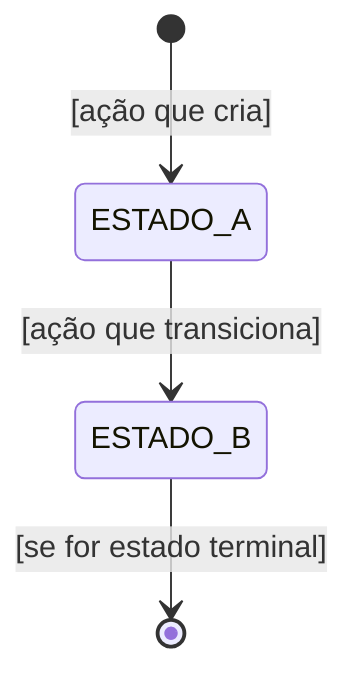

# Template: Documentação de Módulo (Português)

Use este template para gerar a documentação de cada módulo.
Preencha todas as seções. Não omita nenhuma — se uma seção não se aplica, explique por quê.

---

````markdown
# [Nome Legível do Módulo]

> **Contexto:** [Nome do Bounded Context] | **Atualizado em:** [data] | **Versão ADR baseline:** [ex: ADR-0051]

[Parágrafo de 2–4 linhas descrevendo o propósito do módulo em linguagem de negócio.
O que ele gerencia? Qual problema resolve? Quem usa? Sem jargões técnicos.]

---

## Visão Geral

### O que este módulo faz

[Descrição em prosa, 3–6 linhas. Foque no valor de negócio, não na implementação.]

### O que este módulo NÃO faz

[Liste explicitamente as responsabilidades que estão FORA deste módulo e onde elas vivem.
Isso evita confusão sobre limites do sistema.]

### Módulos com os quais se relaciona

| Módulo | Tipo de relação      | Como se comunica       |
| ------ | -------------------- | ---------------------- |
| [Nome] | Consome eventos de   | Evento: `[NomeEvento]` |
| [Nome] | Publica eventos para | Evento: `[NomeEvento]` |
| [Nome] | Usa dados de         | Shared Kernel / ACL    |

---

## Modelo de Domínio

### Agregados

#### [Nome do Agregado]

[1–2 linhas descrevendo o que este agregado representa no negócio.]

**Estados possíveis:**

| Estado     | Descrição                                                    |
| ---------- | ------------------------------------------------------------ |
| `ESTADO_A` | [O que significa estar neste estado em linguagem de negócio] |
| `ESTADO_B` | [O que significa estar neste estado em linguagem de negócio] |

**Transições de estado:**


````

**Regras de invariante:**

- [Regra 1 em linguagem natural — ex: "Um cliente não pode ter mais de uma assinatura ativa ao mesmo tempo"]
- [Regra 2]

**Operações disponíveis:**

| Operação           | O que faz   | Quando pode ser chamada | Possíveis erros                  |
| ------------------ | ----------- | ----------------------- | -------------------------------- |
| `nomeDaOperacao()` | [descrição] | [pré-condições]         | `CODIGO_ERRO_1`, `CODIGO_ERRO_2` |

---

### Value Objects

| Value Object | O que representa | Regras de validação |
| ------------ | ---------------- | ------------------- |
| `[Nome]`     | [descrição]      | [regras]            |

---

### Erros de Domínio

| Código                     | Significado         | Quando ocorre         |
| -------------------------- | ------------------- | --------------------- |
| `CONTEXTO_ENTIDADE_MOTIVO` | [explicação humana] | [situação de negócio] |

---

## Funcionalidades e Casos de Uso

> Esta seção descreve **tudo que o sistema permite fazer** neste módulo.

### [Nome da Funcionalidade em Linguagem de Negócio]

**O que é:** [1–2 linhas explicando o que esta funcionalidade representa para o usuário/negócio]

**Quem pode usar:** [ex: Profissional autenticado / Admin / Sistema interno]

**Como funciona (passo a passo):**

1. [Passo 1 — o que o sistema verifica/faz]
2. [Passo 2]
3. [Passo 3 — o que muda no estado do sistema]
4. [Passo 4 — quais notificações/eventos são disparados]

**Regras de negócio aplicadas:**

- ✅ [Regra que deve ser verdadeira para prosseguir]
- ❌ [O que causa falha e qual erro é retornado]

**Resultado esperado:** [O que o usuário/sistema recebe como resposta]

**Efeitos colaterais:** [Eventos publicados, e-mails disparados, outros módulos notificados]

---

## [Repita a seção acima para cada funcionalidade/use case do módulo]

## Regras de Negócio Consolidadas

> Lista completa de todas as regras de negócio deste módulo, com referência ao ADR que as define.

| #   | Regra                                              | Onde é aplicada   | ADR      |
| --- | -------------------------------------------------- | ----------------- | -------- |
| 1   | [Descrição clara da regra em linguagem de negócio] | Agregado `[Nome]` | ADR-XXXX |
| 2   | [Regra]                                            | Use Case `[Nome]` | ADR-XXXX |

---

## Eventos de Domínio

### Eventos Publicados por este Módulo

| Evento         | Quando é publicado    | O que contém        | Quem consome                |
| -------------- | --------------------- | ------------------- | --------------------------- |
| `[NomeEvento]` | [situação de negócio] | [campos principais] | [módulo/serviço consumidor] |

### Eventos Consumidos por este Módulo

| Evento         | De qual módulo | O que faz ao receber |
| -------------- | -------------- | -------------------- |
| `[NomeEvento]` | [módulo]       | [ação realizada]     |

---

## API / Interface

> Como outros sistemas (frontend, outros serviços) interagem com este módulo.

### [Nome do Endpoint/Operação]

- **Tipo:** REST POST / REST GET / GraphQL Mutation / GraphQL Query
- **Caminho:** `/api/v1/[recurso]`
- **Autenticação:** [Ex: Bearer token obrigatório / API Key / Pública]
- **Autorização:** [Ex: Apenas profissionais com plano ativo / Apenas admin]

**Dados de entrada:**

```
[campo]: [tipo] — [descrição e regras de validação]
[campo]: [tipo] — [obrigatório/opcional, restrições]
```

**Dados de saída (sucesso):**

```
[campo]: [tipo] — [descrição]
```

**Possíveis erros:**
| Código HTTP | Código de erro | Quando ocorre |
|-------------|---------------|---------------|
| 400 | `CODIGO_ERRO` | [situação] |
| 403 | `CODIGO_ERRO` | [situação] |
| 404 | `CODIGO_ERRO` | [situação] |

---

## Infraestrutura e Persistência

### Dados armazenados

| Tabela/Coleção  | O que armazena | Campos principais   |
| --------------- | -------------- | ------------------- |
| `[nome_tabela]` | [descrição]    | [campos relevantes] |

### Integrações externas

| Serviço            | Para que é usado | ADR de referência |
| ------------------ | ---------------- | ----------------- |
| [Stripe, S3, etc.] | [uso]            | ADR-XXXX          |

---

## Conformidade com ADRs

| ADR                                  | Status      | Observações |
| ------------------------------------ | ----------- | ----------- |
| ADR-0009 (Pureza de Agregados)       | ✅ Conforme |             |
| ADR-0022 (BANNED terminal)           | ✅ Conforme |             |
| ADR-0047 (UseCase dispatcha eventos) | ✅ Conforme |             |
| ADR-0051 (DomainResult<T>)           | ✅ Conforme |             |
| [ADR específico do módulo]           | ✅ Conforme |             |

---

## Gaps e Melhorias Identificadas

> Itens identificados durante a análise que precisam de atenção futura.

| #   | Tipo             | Descrição   | Prioridade |
| --- | ---------------- | ----------- | ---------- |
| 1   | 🔵 Teste ausente | [descrição] | Baixa      |
| 2   | 🟡 Melhoria      | [descrição] | Média      |

_Se não houver gaps, escreva: "Nenhum gap identificado nesta análise."_

---

## Histórico de Atualizações

| Data   | O que mudou                 |
| ------ | --------------------------- |
| [data] | Documentação inicial gerada |

```

```
