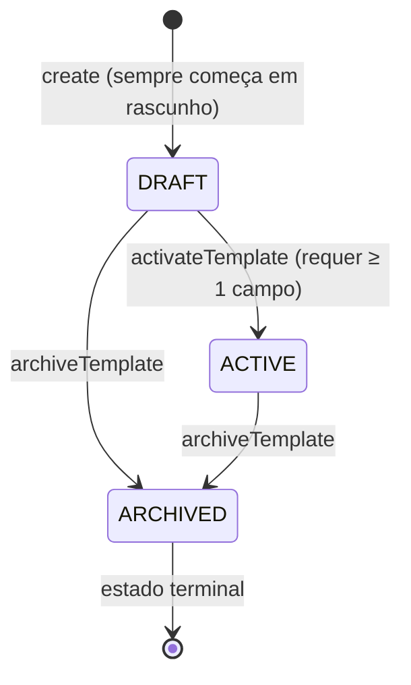

# Módulo de Avaliações (Assessments)

> **Contexto:** Assessments | **Atualizado em:** 2026-02-28 | **Versão ADR baseline:** ADR-0051

O módulo de Avaliações gerencia o ciclo completo de **avaliações físicas** na plataforma FitTrack: desde a criação dos formulários de avaliação (templates) pelo profissional, até o registro dos dados coletados durante a execução de uma avaliação com um cliente. Ele também fornece comparação estrutural entre avaliações distintas, permitindo acompanhar a evolução dos indicadores físicos do cliente ao longo do tempo. Toda informação registrada neste módulo é classificada como **dado de saúde de Categoria A** (maior sensibilidade, conforme ADR-0037).

---

## Visão Geral

### O que este módulo faz

O módulo de Avaliações é responsável por duas preocupações centrais: (1) **definição de formulários de avaliação** — o profissional cria templates reutilizáveis com campos tipados (peso, percentual de gordura, notas textuais, opções de seleção etc.) e os ativa para uso; e (2) **registro de respostas de avaliação** — após uma Execução de tipo `PHYSIOLOGICAL_ASSESSMENT` ser confirmada no módulo de Scheduling/Executions, o profissional registra os valores coletados campo a campo neste módulo. As respostas são imutáveis após o registro, espelhando a filosofia de imutabilidade das Execuções (ADR-0005). Uma funcionalidade adicional compara duas respostas distintas do mesmo profissional, calculando deltas numéricos e identificando campos adicionados ou removidos entre avaliações.

### O que este módulo NÃO faz

- **Não executa avaliações**: a confirmação de que uma avaliação ocorreu (o *fato* da entrega) é responsabilidade do módulo de Executions/Scheduling.
- **Não prescreve avaliações a clientes**: a prescrição é feita no módulo de Deliverables, que cria um `Deliverable` do tipo `PHYSIOLOGICAL_ASSESSMENT` com um snapshot imutável dos campos do template.
- **Não interpreta clinicamente os dados**: a plataforma registra valores, mas não faz diagnósticos nem recomendações clínicas (ADR-0028 §4).
- **Não modifica respostas já registradas**: correções são feitas criando uma nova avaliação (nova Execução + nova Resposta).
- **Não gerencia agendamento**: datas e horários de avaliação são domínio do módulo de Scheduling.
- **Não gerencia pagamentos ou AccessGrants**: esses tópicos pertencem aos módulos de Billing e AccessGrants.

### Módulos com os quais se relaciona

| Módulo           | Tipo de relação    | Como se comunica                                                               |
| ---------------- | ------------------ | ------------------------------------------------------------------------------ |
| Executions       | Consulta dados de  | Porta `IExecutionPort` (ACL) — verifica se Execução está `CONFIRMED`           |
| Deliverables     | Consulta dados de  | Porta `IDeliverablePort` (ACL) — lê snapshot de campos do Deliverable          |
| Scheduling       | Upstream (indiret) | Scheduling confirma Execuções; Assessments age sobre Execuções já confirmadas  |

> **ACL** = Anti-Corruption Layer — o módulo consome dados de outros contextos por interfaces de porta, nunca acoplando diretamente aos seus modelos internos.

---

## Modelo de Domínio

### Agregados

#### AssessmentTemplate

Representa o **formulário de avaliação reutilizável** criado por um profissional. Define quais campos serão preenchidos durante uma avaliação física (ex: peso, altura, percentual de gordura). Um template deve ser ativado antes de poder ser prescrito a clientes. Uma vez ativado, seus campos são bloqueados — o snapshot imutável é embutido no Deliverable no momento da prescrição (ADR-0011).

**Estados possíveis:**

| Estado     | Descrição                                                                                      |
| ---------- | ---------------------------------------------------------------------------------------------- |
| `DRAFT`    | Template em edição. Campos podem ser adicionados e removidos livremente.                       |
| `ACTIVE`   | Template ativado e disponível para prescrição. Campos imutáveis.                               |
| `ARCHIVED` | Template aposentado permanentemente. Não pode mais ser prescrito. Estado **terminal** (final). |

**Transições de estado:**



**Regras de invariante:**

- Um template deve ter **ao menos um campo** para ser ativado. Templates vazios não produzem conteúdo avaliável.
- Campos só podem ser **adicionados ou removidos** enquanto o template estiver em `DRAFT`. Após a ativação, a lista de campos é congelada.
- O **`contentVersion`** começa em 1 e é incrementado a cada adição ou remoção de campo enquanto em `DRAFT`. Serve como rastreador de mudanças antes da ativação.
- Uma vez `ARCHIVED`, o template não pode voltar a nenhum outro estado. O arquivamento é irreversível.
- O `professionalProfileId` é **imutável** — um template pertence sempre ao mesmo profissional.
- O `logicalDay` (data de criação no calendário) é computado uma única vez na criação a partir do `createdAtUtc` e do `timezoneUsed`, e nunca é recomputado (ADR-0010).

**Operações disponíveis:**

| Operação             | O que faz                                                              | Quando pode ser chamada           | Possíveis erros                                                            |
| -------------------- | ---------------------------------------------------------------------- | --------------------------------- | -------------------------------------------------------------------------- |
| `addField()`         | Adiciona um campo ao final da lista; incrementa `contentVersion`.      | Somente no estado `DRAFT`         | `ASSESSMENT.TEMPLATE_NOT_DRAFT`                                            |
| `removeField()`      | Remove um campo por ID; reindexia os demais; incrementa `contentVersion`. | Somente no estado `DRAFT`      | `ASSESSMENT.TEMPLATE_NOT_DRAFT`, `ASSESSMENT.TEMPLATE_FIELD_NOT_FOUND`     |
| `activateTemplate()` | Transiciona `DRAFT → ACTIVE`; bloqueia os campos.                      | Somente no estado `DRAFT`         | `ASSESSMENT.INVALID_TEMPLATE_TRANSITION`, `ASSESSMENT.EMPTY_TEMPLATE_FIELDS` |
| `archiveTemplate()`  | Transiciona `DRAFT` ou `ACTIVE → ARCHIVED` (terminal).                 | `DRAFT` ou `ACTIVE`               | `ASSESSMENT.INVALID_TEMPLATE_TRANSITION`                                   |
| `findField()`        | Retorna um campo pelo ID, ou `undefined` se não existir.               | Qualquer estado                   | —                                                                          |

---

#### AssessmentResponse

Representa o **registro imutável dos dados coletados** durante uma avaliação física confirmada. Uma vez criada, uma `AssessmentResponse` não pode ser modificada nem excluída. Correções são feitas criando uma nova avaliação (nova Execução + novo registro de resposta). Esse comportamento espelha a filosofia de imutabilidade das Execuções (ADR-0005).

> **Nota sobre dados de saúde:** todos os valores de campo armazenados neste agregado são dados de saúde de **Categoria A** (ADR-0037 §1) — a maior classificação de sensibilidade. Esses valores nunca devem aparecer em logs, mensagens de erro, entradas de auditoria ou cache.

**Estados possíveis:**

Este agregado não possui ciclo de vida com estados. É **imutável desde a criação** — não há transições de estado.

**Regras de invariante:**

- Deve haver **ao menos uma resposta de campo**. Registros vazios não são permitidos.
- **Não pode haver duplicatas** de `fieldId` nas respostas. Cada campo pode ser respondido uma única vez.
- O `professionalProfileId`, `clientId`, `executionId`, `deliverableId`, `logicalDay` e `timezoneUsed` são **denormalizados** da Execução no momento da criação e jamais recomputados.
- O `logicalDay` é reconstituted diretamente da Execução (não recomputado a partir de `createdAtUtc`) — garantindo consistência temporal com o registro original.

**Operações disponíveis:**

| Operação                  | O que faz                                                                          | Quando pode ser chamada                     | Possíveis erros                                           |
| ------------------------- | ---------------------------------------------------------------------------------- | ------------------------------------------- | --------------------------------------------------------- |
| `AssessmentResponse.create()` | Cria o registro com as respostas validadas.                                    | Uma vez (factory imutável)                  | `ASSESSMENT.INVALID_RESPONSE`, `ASSESSMENT.DUPLICATE_FIELD_RESPONSE` |
| `findResponseForField()`  | Retorna a resposta de um campo específico, ou `undefined` se não foi respondido.   | Qualquer momento após criação               | —                                                         |

---

### Entidades

#### AssessmentTemplateField

Entidade subordinada de `AssessmentTemplate`. Representa um **campo individual do formulário** de avaliação — ex: "Peso corporal (kg)", "Percentual de gordura (%)", "Condição geral (Bom/Regular/Ruim)".

| Propriedade  | Tipo                             | Descrição                                                                             |
| ------------ | -------------------------------- | ------------------------------------------------------------------------------------- |
| `label`      | `TemplateFieldLabel`             | Nome exibido do campo. 1–100 caracteres.                                              |
| `fieldType`  | `TemplateFieldType`              | Tipo de dado: NUMBER, TEXT, BOOLEAN ou SELECT.                                        |
| `unit`       | `string \| null`                 | Unidade de medida (ex: "kg", "%"). Válido apenas para campos `NUMBER`.                |
| `required`   | `boolean`                        | Se `true`, o campo deve ser respondido obrigatoriamente no registro da avaliação.     |
| `options`    | `string[] \| null`               | Opções de seleção. Obrigatório para `SELECT` (mínimo 2 opções), nulo para os demais. |
| `orderIndex` | `number`                         | Posição na lista de campos. Reindexado automaticamente ao remover campos.             |

#### AssessmentFieldResponse

Entidade subordinada de `AssessmentResponse`. Representa a **resposta a um campo específico** do formulário durante uma avaliação. Imutável após criação.

| Propriedade | Tipo         | Descrição                                                       |
| ----------- | ------------ | --------------------------------------------------------------- |
| `fieldId`   | `string`     | ID do campo respondido (referência ao `AssessmentTemplateField`). |
| `value`     | `FieldValue` | Valor registrado (union tipada: número, texto, booleano ou seleção). |

---

### Value Objects

| Value Object              | O que representa                                                            | Regras de validação                                                                                 |
| ------------------------- | --------------------------------------------------------------------------- | --------------------------------------------------------------------------------------------------- |
| `AssessmentTemplateTitle` | Nome legível do template de avaliação                                       | 1 a 120 caracteres; espaços extras removidos (trim). Erro: `ASSESSMENT.INVALID_TEMPLATE`.          |
| `TemplateFieldLabel`      | Nome exibido de um campo do formulário                                      | 1 a 100 caracteres; espaços extras removidos (trim). Erro: `ASSESSMENT.INVALID_TEMPLATE`.          |
| `FieldValue`              | Valor tipado de uma resposta de campo (union discriminada por `kind`)       | Quatro variantes: `NumberFieldValue` (number), `TextFieldValue` (string), `BooleanFieldValue` (boolean), `SelectFieldValue` (string de opção selecionada). Sem wrapper de ValueObject — union discriminada simples. |

**Utilitário `fieldValueMatchesType()`:** verifica se o tipo de um `FieldValue` é compatível com o `TemplateFieldType` declarado no campo. Usado pela camada de aplicação antes de criar a resposta.

---

### Enumerações

#### `AssessmentTemplateStatus`

| Valor      | Significado                                            |
| ---------- | ------------------------------------------------------ |
| `DRAFT`    | Template em edição — campos podem ser modificados.     |
| `ACTIVE`   | Template pronto para uso — campos congelados.          |
| `ARCHIVED` | Template aposentado — terminal, não pode ser revertido. |

#### `TemplateFieldType`

| Valor     | Significado                                                     | Restrições                                  |
| --------- | --------------------------------------------------------------- | ------------------------------------------- |
| `NUMBER`  | Campo numérico (ex: peso, altura, percentual de gordura)        | Pode ter `unit`; não pode ter `options`.    |
| `TEXT`    | Campo de texto livre                                            | Sem `unit`; sem `options`.                  |
| `BOOLEAN` | Campo de sim/não                                                | Sem `unit`; sem `options`.                  |
| `SELECT`  | Campo de múltipla escolha com opções predefinidas               | Sem `unit`; requer `options` com ≥ 2 itens. |

---

### Erros de Domínio

| Código de constante                         | Valor de string                                       | Quando ocorre                                                                      |
| ------------------------------------------- | ----------------------------------------------------- | ---------------------------------------------------------------------------------- |
| `INVALID_ASSESSMENT_TEMPLATE`               | `ASSESSMENT.INVALID_TEMPLATE`                         | Título ou label de campo inválido (fora do intervalo permitido).                  |
| `INVALID_ASSESSMENT_TEMPLATE_TRANSITION`    | `ASSESSMENT.INVALID_TEMPLATE_TRANSITION`              | Tentativa de transição inválida (ex: ativar template já ARCHIVED).                |
| `ASSESSMENT_TEMPLATE_NOT_FOUND`             | `ASSESSMENT.TEMPLATE_NOT_FOUND`                       | Template não encontrado para o profissional informado.                             |
| `ASSESSMENT_TEMPLATE_NOT_DRAFT`             | `ASSESSMENT.TEMPLATE_NOT_DRAFT`                       | Operação de edição (addField/removeField) tentada fora do estado DRAFT.           |
| `ASSESSMENT_TEMPLATE_NOT_ACTIVE`            | `ASSESSMENT.TEMPLATE_NOT_ACTIVE`                      | Referência a template para prescrição quando ele não está ACTIVE.                 |
| `EMPTY_TEMPLATE_FIELDS`                     | `ASSESSMENT.EMPTY_TEMPLATE_FIELDS`                    | Tentativa de ativar template sem nenhum campo definido.                           |
| `TEMPLATE_FIELD_NOT_FOUND`                  | `ASSESSMENT.TEMPLATE_FIELD_NOT_FOUND`                 | Campo referenciado não existe no template ou na resposta de avaliação.            |
| `ASSESSMENT_RESPONSE_NOT_FOUND`             | `ASSESSMENT.RESPONSE_NOT_FOUND`                       | Resposta de avaliação não encontrada para o profissional informado.               |
| `INVALID_ASSESSMENT_RESPONSE`               | `ASSESSMENT.INVALID_RESPONSE`                         | Resposta com zero campos preenchidos, ou campo obrigatório sem resposta.          |
| `DUPLICATE_FIELD_RESPONSE`                  | `ASSESSMENT.DUPLICATE_FIELD_RESPONSE`                 | Duas respostas para o mesmo `fieldId` na mesma avaliação.                         |
| `FIELD_VALUE_TYPE_MISMATCH`                 | `ASSESSMENT.FIELD_VALUE_TYPE_MISMATCH`                | Tipo do valor enviado não corresponde ao tipo declarado no campo do template.     |
| `EXECUTION_NOT_CONFIRMED`                   | `ASSESSMENT.EXECUTION_NOT_CONFIRMED`                  | Execução referenciada não está no status `CONFIRMED`, ou pertence a outro profissional, ou não existe. |
| `DELIVERABLE_NOT_PHYSIOLOGICAL_ASSESSMENT`  | `ASSESSMENT.DELIVERABLE_NOT_PHYSIOLOGICAL_ASSESSMENT` | Deliverable associado à Execução não é do tipo `PHYSIOLOGICAL_ASSESSMENT`, ou não foi encontrado. |

> **ADR-0025 — Isolamento de tenant:** erros de "não encontrado" (`*_NOT_FOUND`) cobrem tanto a ausência real do recurso quanto tentativas de acesso a recursos de outro profissional. Isso evita vazamento de informação sobre existência de dados de outros tenants.

---

## Funcionalidades e Casos de Uso

> Esta seção descreve **tudo que o sistema permite fazer** neste módulo.

---

### Criar Template de Avaliação

**O que é:** Permite que um profissional crie um novo formulário de avaliação físca em modo rascunho, pronto para receber campos.

**Quem pode usar:** Profissional autenticado.

**Como funciona (passo a passo):**

1. Valida o `professionalProfileId` (deve ser UUID válido).
2. Cria o `AssessmentTemplateTitle` a partir do título informado (1–120 chars).
3. Cria o `UTCDateTime` a partir de `createdAtUtc` (deve ser string ISO 8601 UTC).
4. Computa o `LogicalDay` a partir de `createdAtUtc` + `timezoneUsed` (ADR-0010) — a data no calendário do profissional.
5. Chama `AssessmentTemplate.create()` — template nasce no estado `DRAFT` com `contentVersion = 1` e campos vazios.
6. Persiste o template via `IAssessmentTemplateRepository.save()`.

**Regras de negócio aplicadas:**

- ✅ O título deve ter entre 1 e 120 caracteres.
- ✅ O `createdAtUtc` deve ser um instante UTC válido.
- ✅ O `timezoneUsed` deve ser um timezone IANA válido.
- ❌ Título inválido retorna `ASSESSMENT.INVALID_TEMPLATE`.

**Resultado esperado:** ID do template criado, título, status `DRAFT`, `logicalDay` computado.

**Efeitos colaterais:** Nenhum. Nenhum evento de domínio publicado (decisão Q8 do MVP — sem consumidores cross-context identificados para criação de templates).

---

### Adicionar Campo ao Template

**O que é:** Permite que o profissional adicione um campo de coleta de dados ao template enquanto ele está em rascunho.

**Quem pode usar:** Profissional autenticado, dono do template.

**Como funciona (passo a passo):**

1. Carrega o template por ID e `professionalProfileId` via repositório.
2. Valida que o template existe (404 se não encontrado ou pertence a outro profissional).
3. Cria o `TemplateFieldLabel` a partir do label informado (1–100 chars).
4. Valida regras de negócio por tipo de campo:
   - Campos `SELECT` devem ter ao menos 2 opções definidas.
   - Campos não-`NUMBER` não devem ter `unit`.
   - Campos não-`SELECT` não devem ter `options`.
5. Chama `template.addField()` — campo é adicionado ao final da lista; `contentVersion` é incrementado.
6. Persiste o template atualizado.

**Regras de negócio aplicadas:**

- ✅ Template deve estar em `DRAFT`.
- ✅ Label deve ter 1–100 caracteres.
- ✅ Campos `SELECT` devem ter ≥ 2 opções.
- ✅ `unit` só é válido para campos `NUMBER`.
- ✅ `options` só é válido para campos `SELECT`.
- ❌ Template não em DRAFT retorna `ASSESSMENT.TEMPLATE_NOT_DRAFT`.
- ❌ Label inválido retorna `ASSESSMENT.INVALID_TEMPLATE`.

**Resultado esperado:** Dados do campo criado (ID, label, tipo, unit, required, options, orderIndex).

**Efeitos colaterais:** `contentVersion` do template incrementado.

---

### Remover Campo do Template

**O que é:** Permite que o profissional remova um campo do template enquanto ele está em rascunho. Os demais campos são reindexados automaticamente.

**Quem pode usar:** Profissional autenticado, dono do template.

**Como funciona (passo a passo):**

1. Carrega o template por ID e `professionalProfileId`.
2. Chama `template.removeField(fieldId)` — remove o campo da lista e reindexia os demais para manter `orderIndex` contíguo.
3. `contentVersion` é incrementado.
4. Persiste o template atualizado.

**Regras de negócio aplicadas:**

- ✅ Template deve estar em `DRAFT`.
- ✅ O campo deve existir no template.
- ❌ Template fora do `DRAFT` retorna `ASSESSMENT.TEMPLATE_NOT_DRAFT`.
- ❌ Campo não encontrado retorna `ASSESSMENT.TEMPLATE_FIELD_NOT_FOUND`.

**Resultado esperado:** Confirmação de remoção.

**Efeitos colaterais:** `contentVersion` incrementado; `orderIndex` dos demais campos reajustado.

---

### Ativar Template de Avaliação

**O que é:** Finaliza a edição do template e o disponibiliza para prescrição a clientes. Uma vez ativado, os campos são imutáveis — tornando-se o "snapshot" que será embutido nos Deliverables.

**Quem pode usar:** Profissional autenticado, dono do template.

**Como funciona (passo a passo):**

1. Carrega o template por ID e `professionalProfileId`.
2. Chama `template.activateTemplate()` — valida que há ao menos 1 campo, transiciona para `ACTIVE`, registra `activatedAtUtc`.
3. Persiste o template atualizado.

**Regras de negócio aplicadas:**

- ✅ Template deve estar em `DRAFT`.
- ✅ Template deve ter ao menos 1 campo definido.
- ❌ Template já `ACTIVE` ou `ARCHIVED` retorna `ASSESSMENT.INVALID_TEMPLATE_TRANSITION`.
- ❌ Template sem campos retorna `ASSESSMENT.EMPTY_TEMPLATE_FIELDS`.

**Resultado esperado:** Status atualizado para `ACTIVE`, `activatedAtUtc` preenchido.

**Efeitos colaterais:** Campos bloqueados para edição. Nenhum evento de domínio publicado.

---

### Arquivar Template de Avaliação

**O que é:** Aposenta permanentemente um template, impedindo novas prescrições. Templates já prescritos (Deliverables existentes) não são afetados — seus snapshots são imutáveis (ADR-0011).

**Quem pode usar:** Profissional autenticado, dono do template.

**Como funciona (passo a passo):**

1. Carrega o template por ID e `professionalProfileId`.
2. Chama `template.archiveTemplate()` — transiciona para `ARCHIVED`, registra `archivedAtUtc`.
3. Persiste o template atualizado.

**Regras de negócio aplicadas:**

- ✅ Template deve estar em `DRAFT` ou `ACTIVE`.
- ❌ Template já `ARCHIVED` retorna `ASSESSMENT.INVALID_TEMPLATE_TRANSITION`.

**Resultado esperado:** Status atualizado para `ARCHIVED`, `archivedAtUtc` preenchido.

**Efeitos colaterais:** Template não pode mais ser prescrito. Deliverables existentes com snapshot deste template permanecem válidos e inalterados.

---

### Registrar Resposta de Avaliação

**O que é:** Registra os dados coletados durante uma avaliação física confirmada. Este é o caso de uso mais complexo do módulo — orquestra validações cross-context (Execução + Deliverable) antes de persistir os dados de saúde do cliente.

**Quem pode usar:** Profissional autenticado, dono da Execução.

**Como funciona (passo a passo):**

1. **Carrega a Execução** via porta `IExecutionPort.findById()` — se não encontrada ou não pertence ao profissional, retorna erro de "não confirmada" (ADR-0025: sem vazamento de existência).
2. **Verifica status `CONFIRMED`** — a Execução deve estar confirmada para que os dados possam ser registrados.
3. **Carrega o Deliverable** via porta `IDeliverablePort.findById()` — se não encontrado, retorna erro de "não é avaliação fisiológica".
4. **Verifica tipo `PHYSIOLOGICAL_ASSESSMENT`** — apenas Deliverables deste tipo aceitam respostas de avaliação.
5. **Valida cada `fieldId`** nas respostas enviadas — todos devem existir no snapshot de campos do Deliverable.
6. **Valida tipos de valor** — o `kind` de cada `FieldValue` deve corresponder ao `fieldType` do campo no snapshot (ex: campo `NUMBER` exige `NumberFieldValue`).
7. **Verifica campos obrigatórios** — todos os campos marcados como `required` no snapshot devem ter uma resposta.
8. **Cria o `UTCDateTime`** a partir de `createdAtUtc` (deve ser UTC puro, sem offset de timezone).
9. **Reconstitui o `LogicalDay`** diretamente do `logicalDay` da Execução — nunca recomputado (ADR-0010).
10. **Cria o `AssessmentResponse`** via factory — valida ≥ 1 resposta e ausência de duplicatas de `fieldId`.
11. **Persiste** via `IAssessmentResponseRepository.save()` (idempotente por `executionId`).

**Regras de negócio aplicadas:**

- ✅ Execução deve existir e pertencer ao profissional informado.
- ✅ Execução deve estar no status `CONFIRMED`.
- ✅ Deliverable associado deve ser do tipo `PHYSIOLOGICAL_ASSESSMENT`.
- ✅ Cada `fieldId` nas respostas deve existir no snapshot de campos do Deliverable.
- ✅ O tipo de cada valor (`kind`) deve corresponder ao `fieldType` declarado no campo.
- ✅ Todos os campos `required` do Deliverable devem ter resposta.
- ✅ `createdAtUtc` deve ser UTC válido (sem offset de fuso horário).
- ✅ Ao menos uma resposta de campo deve ser fornecida.
- ✅ Sem duplicatas de `fieldId` nas respostas.
- ❌ Execução não encontrada/não confirmada/de outro profissional → `ASSESSMENT.EXECUTION_NOT_CONFIRMED`.
- ❌ Deliverable não encontrado ou tipo errado → `ASSESSMENT.DELIVERABLE_NOT_PHYSIOLOGICAL_ASSESSMENT`.
- ❌ Campo referenciado não existe no snapshot → `ASSESSMENT.TEMPLATE_FIELD_NOT_FOUND`.
- ❌ Tipo de valor incompatível → `ASSESSMENT.FIELD_VALUE_TYPE_MISMATCH`.
- ❌ Campo obrigatório sem resposta → `ASSESSMENT.INVALID_RESPONSE`.
- ❌ `fieldId` duplicado nas respostas → `ASSESSMENT.DUPLICATE_FIELD_RESPONSE`.

**Resultado esperado:** ID da resposta criada, `executionId`, `deliverableId`, `professionalProfileId`, `clientId`, `logicalDay`, `timezoneUsed`, `responseCount`, lista de respostas com `fieldId` e valor.

**Efeitos colaterais:** Nenhum evento de domínio publicado. A `AssessmentResponse` é imutável após criação.

---

### Buscar Resposta de Avaliação por ID

**O que é:** Retorna uma resposta de avaliação específica pelo seu ID, garantindo isolamento de tenant.

**Quem pode usar:** Profissional autenticado.

**Como funciona (passo a passo):**

1. Busca a `AssessmentResponse` por ID e `professionalProfileId` via repositório.
2. Se não encontrada ou pertence a outro profissional, retorna erro.
3. Retorna os dados da resposta.

**Regras de negócio aplicadas:**

- ✅ Resposta deve existir e pertencer ao profissional (ADR-0025).
- ❌ Não encontrada ou de outro profissional → `ASSESSMENT.RESPONSE_NOT_FOUND`.

**Resultado esperado:** Dados completos da `AssessmentResponse`.

**Efeitos colaterais:** Nenhum.

---

### Listar Respostas de Avaliação de um Cliente

**O que é:** Retorna todas as respostas de avaliação de um cliente específico, com filtro opcional por Deliverable. Ordenadas pela data mais recente primeiro.

**Quem pode usar:** Profissional autenticado.

**Como funciona (passo a passo):**

1. Se `deliverableId` for informado, busca via `findAllByDeliverableAndClient(deliverableId, clientId, professionalProfileId)`.
2. Caso contrário, busca via `findAllByClient(clientId, professionalProfileId)`.
3. Resultados são ordenados por `logicalDay` descendente (mais recente primeiro).

**Regras de negócio aplicadas:**

- ✅ Isolamento de tenant: apenas respostas do `professionalProfileId` informado são retornadas.
- ✅ Isolamento de cliente: apenas respostas do `clientId` informado são retornadas.

**Resultado esperado:** Lista de respostas de avaliação (pode ser vazia).

**Efeitos colaterais:** Nenhum.

---

### Comparar Respostas de Avaliação

**O que é:** Compara dois registros de avaliação lado a lado — uma avaliação de referência (baseline) e uma avaliação atual (current) — produzindo uma análise estrutural com os deltas dos valores numéricos e identificação de campos novos ou removidos. **A plataforma fornece os dados estruturados, mas não interpreta clinicamente os resultados** (ADR-0028 §4).

**Quem pode usar:** Profissional autenticado, dono de ambas as respostas.

**Como funciona (passo a passo):**

1. Carrega a resposta de referência (`baselineResponseId`) por ID e `professionalProfileId`.
2. Carrega a resposta atual (`currentResponseId`) por ID e `professionalProfileId`.
3. Computa a **interseção de campos** (campos presentes em ambas as respostas) → `fieldComparisons`.
4. Para cada campo compartilhado:
   - Extrai os valores de baseline e current.
   - Calcula `numericDelta` (diferença `current - baseline`) apenas para campos `NUMBER`; `null` para demais tipos.
   - Define `changed = true` se os valores forem diferentes.
5. Identifica `newFieldIds` — campos presentes em `current` mas ausentes em `baseline`.
6. Identifica `removedFieldIds` — campos presentes em `baseline` mas ausentes em `current`.
7. Ordena `fieldComparisons` por `fieldId` alfabeticamente para resultado determinístico.

**Regras de negócio aplicadas:**

- ✅ Ambas as respostas devem existir e pertencer ao profissional (ADR-0025).
- ❌ Resposta não encontrada ou de outro profissional → `ASSESSMENT.RESPONSE_NOT_FOUND`.

**Resultado esperado:**
- `baselineResponseId`, `currentResponseId`
- `baselineLogicalDay`, `currentLogicalDay` (datas das avaliações comparadas)
- `fieldComparisons[]`: lista de `{ fieldId, baseline, current, numericDelta, changed }`
- `newFieldIds[]`: campos novos na avaliação atual
- `removedFieldIds[]`: campos presentes na referência mas ausentes na atual

**Efeitos colaterais:** Nenhum. Este é um serviço de leitura pura — não persiste dados nem emite eventos.

---

## Regras de Negócio Consolidadas

| #  | Regra                                                                                                               | Onde é aplicada              | ADR        |
| -- | ------------------------------------------------------------------------------------------------------------------- | ---------------------------- | ---------- |
| 1  | Um template de avaliação começa sempre no estado `DRAFT`.                                                           | `AssessmentTemplate.create()` | ADR-0008  |
| 2  | Campos só podem ser adicionados ou removidos enquanto o template está em `DRAFT`.                                    | `AssessmentTemplate.addField()`, `removeField()` | ADR-0011 |
| 3  | Um template deve ter ao menos 1 campo para ser ativado.                                                             | `AssessmentTemplate.activateTemplate()` | ADR-0044 |
| 4  | O estado `ARCHIVED` é terminal — não há transição de saída.                                                         | `AssessmentTemplate.archiveTemplate()` | ADR-0008 |
| 5  | O `contentVersion` do template é incrementado a cada adição ou remoção de campo em `DRAFT`.                         | `AssessmentTemplate`         | ADR-0011   |
| 6  | Campos `SELECT` exigem ao menos 2 opções predefinidas.                                                              | `AddTemplateField` (use case) | ADR-0044  |
| 7  | `unit` só é válido para campos `NUMBER`; `options` só é válido para campos `SELECT`.                                | `AddTemplateField` (use case) | —          |
| 8  | Respostas de avaliação só podem ser registradas para Execuções no status `CONFIRMED`.                               | `RecordAssessmentResponse`   | ADR-0005   |
| 9  | O `deliverableId` referenciado deve ser de tipo `PHYSIOLOGICAL_ASSESSMENT`.                                         | `RecordAssessmentResponse`   | ADR-0044   |
| 10 | Cada `fieldId` nas respostas deve existir no snapshot de campos do Deliverable.                                     | `RecordAssessmentResponse`   | ADR-0011   |
| 11 | O tipo de valor (`kind`) de cada resposta deve corresponder ao `fieldType` do campo.                                | `RecordAssessmentResponse`   | ADR-0044   |
| 12 | Todos os campos marcados como `required` no snapshot devem ser respondidos.                                         | `RecordAssessmentResponse`   | ADR-0044   |
| 13 | Uma `AssessmentResponse` deve ter ao menos uma resposta de campo.                                                   | `AssessmentResponse.create()` | —         |
| 14 | Sem duplicatas de `fieldId` na mesma `AssessmentResponse`.                                                          | `AssessmentResponse.create()` | —         |
| 15 | `AssessmentResponse` é imutável após criação. Correções criam novo registro.                                        | `AssessmentResponse`         | ADR-0005   |
| 16 | O `logicalDay` da resposta é reconstituted diretamente da Execução, nunca recomputado.                              | `RecordAssessmentResponse`   | ADR-0010   |
| 17 | `createdAtUtc` deve ser UTC puro, sem offset de fuso horário.                                                       | `RecordAssessmentResponse`   | ADR-0010   |
| 18 | Todo acesso a templates e respostas é escopado por `professionalProfileId` (isolamento de tenant).                  | Todos os use cases           | ADR-0025   |
| 19 | Erros de "não encontrado" cobrem tanto ausência real quanto acesso cross-tenant, sem vazar existência.              | Todos os use cases           | ADR-0025   |
| 20 | Valores de campo em respostas são dados de saúde Categoria A — não devem aparecer em logs ou mensagens de erro.     | Camadas de persistência e API | ADR-0037  |
| 21 | A plataforma não interpreta clinicamente os resultados de comparação de avaliações.                                 | `CompareAssessmentResponses` | ADR-0028   |

---

## Eventos de Domínio

### Eventos Publicados por este Módulo

**Nenhum evento de domínio é publicado neste módulo no MVP.**

> **Decisão Q8 (ADR-0009 §5):** Após análise, nenhum consumidor cross-context foi identificado para eventos de `AssessmentTemplate` ou `AssessmentResponse` no MVP. O evento `ExecutionRecorded` (emitido pelo módulo de Executions) já é suficiente para auditoria, integração e métricas. Caso consumidores sejam identificados no futuro, um evento `AssessmentResponseRecorded` deve ser adicionado conforme ADR-0009.

### Eventos Consumidos por este Módulo

**Nenhum evento de domínio é consumido por este módulo.**

A integração com o contexto de Executions é feita de forma síncrona via porta `IExecutionPort` (consulta direta), não por eventos assíncronos.

---

## Portas da Application Layer (Integrações Cross-Context)

O módulo de Assessments depende de dois contextos externos para registrar respostas de avaliação. Essas dependências são abstraídas por interfaces de porta (Anti-Corruption Layers — ACL), garantindo que o módulo nunca acopla diretamente nos modelos internos dos outros contextos.

### `IExecutionPort`

Consulta o status de uma Execução no contexto de Scheduling/Executions.

```
findById(executionId: string): Promise<ExecutionView | null>
```

**`ExecutionView`** (visão de leitura retornada pela porta):

| Campo                  | Tipo     | Descrição                                             |
| ---------------------- | -------- | ----------------------------------------------------- |
| `id`                   | `string` | ID da Execução.                                       |
| `status`               | `string` | Status atual (`CONFIRMED`, `PENDING`, `CANCELLED`...) |
| `deliverableId`        | `string` | ID do Deliverable associado.                          |
| `professionalProfileId`| `string` | Profissional responsável.                             |
| `clientId`             | `string` | Cliente que realizou a avaliação.                     |
| `logicalDay`           | `string` | Data da execução no calendário do cliente (YYYY-MM-DD). |
| `timezoneUsed`         | `string` | Timezone IANA usado para computar `logicalDay`.       |

### `IDeliverablePort`

Consulta os dados de um Deliverable (incluindo o snapshot de campos do template) no contexto de Deliverables.

```
findById(deliverableId: string): Promise<DeliverableView | null>
```

**`DeliverableView`** (visão de leitura retornada pela porta):

| Campo                  | Tipo                      | Descrição                                              |
| ---------------------- | ------------------------- | ------------------------------------------------------ |
| `id`                   | `string`                  | ID do Deliverable.                                     |
| `type`                 | `string`                  | Tipo (`PHYSIOLOGICAL_ASSESSMENT`, etc.)                |
| `professionalProfileId`| `string`                  | Profissional que prescreveu.                           |
| `templateFields`       | `TemplateFieldSnapshot[]` | Snapshot imutável dos campos do template (ADR-0011).   |

**`TemplateFieldSnapshot`:**

| Campo      | Tipo              | Descrição                                              |
| ---------- | ----------------- | ------------------------------------------------------ |
| `id`       | `string`          | ID do campo.                                           |
| `label`    | `string`          | Nome do campo.                                         |
| `fieldType`| `TemplateFieldType` | Tipo de dado esperado.                               |
| `unit`     | `string \| null`  | Unidade de medida (apenas campos NUMBER).              |
| `required` | `boolean`         | Se o campo é obrigatório.                              |
| `options`  | `string[] \| null`| Opções (apenas campos SELECT).                        |

---

## Interfaces de Repositório

### `IAssessmentTemplateRepository`

| Método                              | Descrição                                                                          |
| ----------------------------------- | ---------------------------------------------------------------------------------- |
| `save(template)`                    | Persiste um template (criação ou atualização). Idempotente.                        |
| `findById(id, professionalProfileId)` | Busca template por ID, escopado ao profissional (ADR-0025). Retorna `null` se não encontrado ou de outro tenant. |
| `findAllByProfessional(professionalProfileId)` | Lista todos os templates do profissional.                               |

### `IAssessmentResponseRepository`

| Método                                             | Descrição                                                                               |
| -------------------------------------------------- | --------------------------------------------------------------------------------------- |
| `save(response)`                                   | Persiste uma resposta. Idempotente por `executionId` — evita duplicação de registros.   |
| `findById(id, professionalProfileId)`              | Busca resposta por ID, escopado ao profissional. Retorna `null` se não encontrado.      |
| `findByExecutionId(executionId, professionalProfileId)` | Busca a resposta associada a uma Execução específica.                              |
| `findAllByClient(clientId, professionalProfileId)` | Lista todas as respostas de avaliação de um cliente.                                    |
| `findAllByDeliverableAndClient(deliverableId, clientId, professionalProfileId)` | Lista respostas filtradas por Deliverable e cliente.    |

---

## Conformidade com ADRs

| ADR                                                        | Status      | Observações                                                                               |
| ---------------------------------------------------------- | ----------- | ----------------------------------------------------------------------------------------- |
| ADR-0003 (Um agregado por transação)                       | ✅ Conforme | Cada use case persiste apenas um agregado por operação.                                   |
| ADR-0005 (Imutabilidade de Execuções)                      | ✅ Conforme | `AssessmentResponse` segue a mesma filosofia: imutável após criação.                      |
| ADR-0006 (Optimistic locking)                              | ✅ Conforme | `version` carregado pela base `AggregateRoot`.                                            |
| ADR-0008 (Lifecycle states)                                | ✅ Conforme | `AssessmentTemplateStatus` segue o padrão DRAFT→ACTIVE→ARCHIVED.                         |
| ADR-0009 (Domain events)                                   | ✅ Conforme | Nenhum evento publicado — decisão Q8 documentada (sem consumidores no MVP).               |
| ADR-0010 (Temporal policy — logicalDay, UTC)               | ✅ Conforme | `logicalDay` computado uma vez; `createdAtUtc` em UTC puro; `logicalDay` da resposta extraído da Execução. |
| ADR-0011 (Snapshot semantics)                              | ✅ Conforme | Fields bloqueados após ativação; respostas referenciam snapshot do Deliverable, não o template ao vivo. |
| ADR-0025 (Tenant isolation)                                | ✅ Conforme | Todos os repositórios e ports escoopados por `professionalProfileId`; NOT_FOUND cobre cross-tenant. |
| ADR-0028 (Sem interpretação clínica)                       | ✅ Conforme | `CompareAssessmentResponses` retorna deltas estruturais; a plataforma não interpreta clinicamente. |
| ADR-0037 (LGPD / PII e dados sensíveis)                    | ✅ Conforme | Valores de campo são Categoria A (saúde); enforcement na persistência e API, não no domínio. |
| ADR-0044 (Deliverable types)                               | ✅ Conforme | Apenas `PHYSIOLOGICAL_ASSESSMENT` aceita respostas; outros tipos rejeitados com erro específico. |
| ADR-0047 (Aggregate root definition)                       | ✅ Conforme | `AssessmentTemplate` e `AssessmentResponse` como raízes; entidades subordinadas sem repositório próprio. |
| ADR-0051 (DomainResult<T>)                                 | ✅ Conforme | Todos os métodos de domínio e use cases retornam `DomainResult<T>` (Either pattern), nunca lançam exceção. |

---

## Gaps e Melhorias Identificadas

Nenhum gap identificado nesta análise. O módulo passou por auditoria de conformidade com ADRs (`adr-check`) e todos os fixes foram aplicados antes desta documentação ser gerada.

---

## Histórico de Atualizações

| Data       | O que mudou                                                                      |
| ---------- | -------------------------------------------------------------------------------- |
| 2026-02-28 | Documentação inicial gerada após auditoria `adr-check` com fixes aplicados.     |
