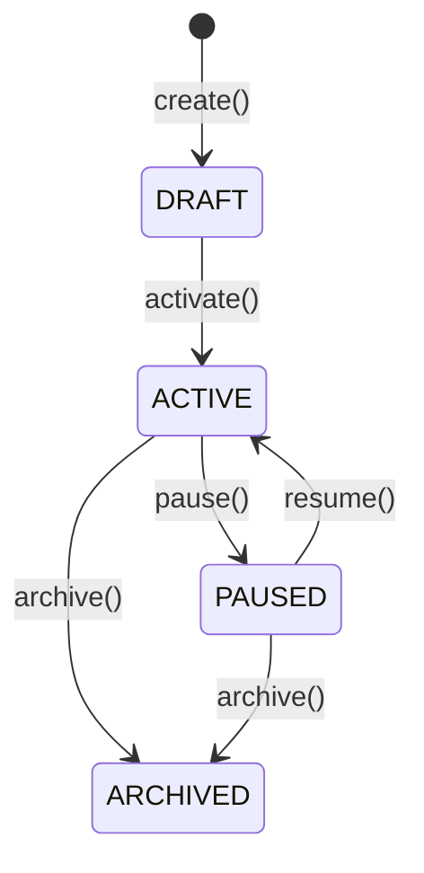
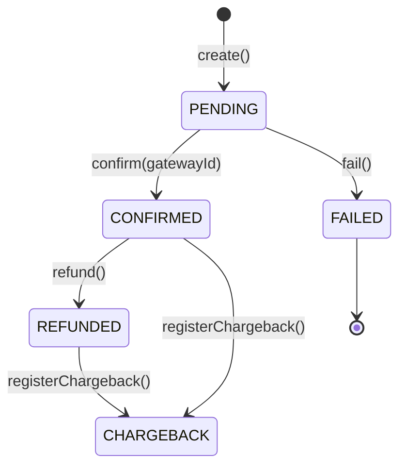
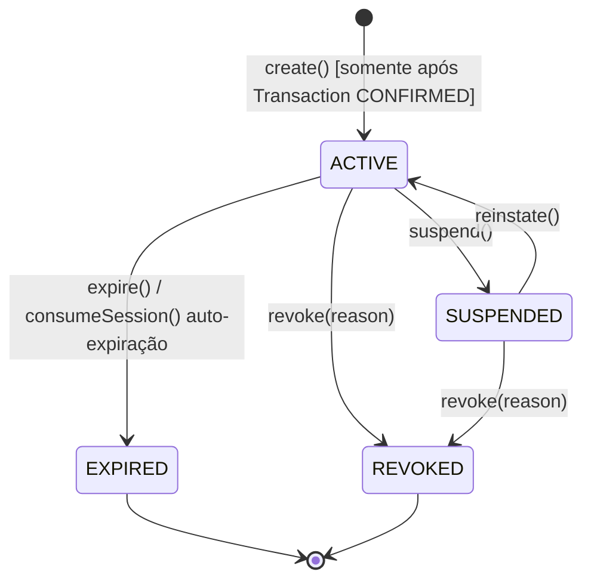

# Billing — Módulo de Faturamento e Controle de Acesso

> **Contexto:** Billing | **Atualizado em:** 2026-02-25 | **Versão ADR baseline:** ADR-0051

O módulo Billing é o coração financeiro da plataforma FitTrack. Ele gerencia toda a cadeia comercial entre profissional e cliente: desde a criação de um pacote de serviço até a confirmação do pagamento e a concessão do direito de acesso às sessões de treino. Qualquer operação financeira — compra, reembolso, chargeback ou suspensão de acesso por risco — passa obrigatoriamente por este módulo.

---

## Visão Geral

### O que este módulo faz

O Billing cuida de três responsabilidades encadeadas: primeiro, permite que profissionais criem e publiquem planos de serviço (pacotes com preço, duração e número de sessões). Depois, registra e confirma pagamentos, calculando automaticamente o split de receita entre plataforma e profissional. Por fim, emite a **Concessão de Acesso** — o token que autoriza o cliente a realizar sessões de treino — somente após o pagamento ser confirmado, garantindo o princípio *subscription-first*. O módulo também gerencia todo o ciclo de vida desse token: suspensão por risco, reativação, revogação por chargeback e expiração natural.

### O que este módulo NÃO faz

- Não processa pagamentos diretamente — delega ao gateway externo (Stripe ou equivalente)
- Não armazena dados de cartão ou métodos de pagamento — responsabilidade exclusiva do gateway
- Não cria nem modifica registros de Execução (sessões de treino) — responsabilidade do contexto Execution
- Não gerencia identidades, perfis de profissionais ou clientes — responsabilidade do contexto Identity
- Não envia notificações — responsabilidade do contexto Notification (ADR-0048)
- Não avalia o risco do profissional — recebe essa decisão via evento do contexto Risk

### Módulos com os quais se relaciona

| Módulo | Tipo de relação | Como se comunica |
|--------|-----------------|-----------------|
| Identity | Usa dados de | Referência por ID string (`professionalProfileId`, `clientId`) — ADR-0047 |
| Execution | Publica eventos para | `AccessGrantCreated`, `AccessGrantRevoked` — contexto Execution valida AccessGrant antes de criar sessão |
| Risk | Consome eventos de | `ProfessionalSuspended` / `ProfessionalReinstated` → dispara `SuspendAccessGrant` / `ReinstateAccessGrant` |
| Notification | Publica eventos para | `PurchaseCompleted`, `PaymentFailed`, `PaymentRefunded`, `ChargebackRegistered` |
| Products | Integração futura | AccessGrant com `source=PRODUCT_PURCHASE` para produtos avulsos (ADR-0050 — não implementado) |

---

## Modelo de Domínio

### Agregados

#### ServicePlan (Plano de Serviço)

Representa uma oferta comercializável criada por um profissional de fitness. Define o que está sendo vendido: preço, duração do acesso e quantidade máxima de sessões incluídas.

**Estados possíveis:**

| Estado | Descrição |
|--------|-----------|
| `DRAFT` | Plano em rascunho — visível apenas para o profissional, não pode ser comprado |
| `ACTIVE` | Plano publicado — disponível para compra pelos clientes |
| `PAUSED` | Plano temporariamente suspenso — compras bloqueadas, mas assinaturas existentes continuam ativas |
| `ARCHIVED` | Plano encerrado definitivamente — compras bloqueadas, assinaturas existentes continuam até expirar |
| `DELETED` | Plano deletado logicamente — reservado para limpeza futura, sem use case implementado |

**Transições de estado:**

**Regras de invariante:**

- Um plano só pode ser comprado quando está em `ACTIVE` — qualquer outro estado bloqueia a compra
- Pausar ou arquivar um plano **não revoga** as concessões de acesso já emitidas; clientes com acesso ativo continuam tendo acesso
- O nome deve ter entre 1 e 120 caracteres (espaços nas pontas são removidos automaticamente)
- O preço deve ser maior que zero, expresso sempre em centavos inteiros (ex: R$ 99,90 → `9990`)
- A duração deve ser um número inteiro positivo de dias
- O número de sessões (`sessionAllotment`), se informado, deve ser um inteiro positivo; `null` significa sessões ilimitadas

**Operações disponíveis:**

| Operação | O que faz | Quando pode ser chamada | Possíveis erros |
|----------|-----------|------------------------|-----------------|
| `ServicePlan.create(props)` | Cria plano em DRAFT | Sempre | `BILLING.INVALID_SERVICE_PLAN` |
| `activate()` | DRAFT → ACTIVE | Somente em DRAFT | `BILLING.INVALID_SERVICE_PLAN_TRANSITION` |
| `pause()` | ACTIVE → PAUSED | Somente em ACTIVE | `BILLING.INVALID_SERVICE_PLAN_TRANSITION` |
| `resume()` | PAUSED → ACTIVE | Somente em PAUSED | `BILLING.INVALID_SERVICE_PLAN_TRANSITION` |
| `archive()` | ACTIVE\|PAUSED → ARCHIVED | Em ACTIVE ou PAUSED | `BILLING.INVALID_SERVICE_PLAN_TRANSITION` |
| `isPurchasable()` | Retorna `true` se ACTIVE | Consulta (sem efeito) | — |

---

#### Transaction (Transação)

Representa um pagamento entre um cliente e um profissional através da plataforma. Carrega o split de receita — quanto vai para a plataforma e quanto vai para o profissional — calculado e congelado no momento em que a compra é iniciada.

**Estados possíveis:**

| Estado | Descrição |
|--------|-----------|
| `PENDING` | Aguardando confirmação do gateway de pagamento |
| `CONFIRMED` | Pagamento confirmado — AccessGrant foi emitido |
| `FAILED` | Pagamento falhou (estado terminal) |
| `REFUNDED` | Reembolso processado — AccessGrant permanece ativo até expirar naturalmente |
| `CHARGEBACK` | Disputa de chargeback recebida — AccessGrant foi revogado imediatamente |

**Transições de estado:**

**Regras de invariante:**

- Toda transação nasce em `PENDING` — nunca é criada já confirmada
- As transições são sempre unidirecionais; não existe "desfazer" de um status já aplicado
- Todos os valores financeiros são obrigatoriamente centavos inteiros — ponto flutuante é proibido (ADR-0004)
- O split de taxa da plataforma é calculado na criação e nunca recalculado depois (ADR-0019)
- Um chargeback jamais apaga ou modifica registros históricos de sessões realizadas (ADR-0005, ADR-0020)

**Operações disponíveis:**

| Operação | O que faz | Quando pode ser chamada | Possíveis erros |
|----------|-----------|------------------------|-----------------|
| `Transaction.create(props)` | Cria transação em PENDING | Sempre | — |
| `confirm(gatewayId)` | PENDING → CONFIRMED | Somente em PENDING | `BILLING.INVALID_TRANSACTION_TRANSITION` |
| `fail()` | PENDING → FAILED | Somente em PENDING | `BILLING.INVALID_TRANSACTION_TRANSITION` |
| `refund()` | CONFIRMED → REFUNDED | Somente em CONFIRMED | `BILLING.INVALID_TRANSACTION_TRANSITION` |
| `registerChargeback()` | CONFIRMED\|REFUNDED → CHARGEBACK | Em CONFIRMED ou REFUNDED | `BILLING.INVALID_TRANSACTION_TRANSITION` |

---

#### AccessGrant (Concessão de Acesso)

É o "bilhete de entrada" do cliente: prova que um pagamento válido foi recebido e autoriza a criação de registros de Execução (sessões de treino). Sem um AccessGrant ativo, o cliente não pode realizar sessões.

**Estados possíveis:**

| Estado | Descrição |
|--------|-----------|
| `ACTIVE` | Acesso liberado — cliente pode realizar sessões |
| `SUSPENDED` | Acesso temporariamente bloqueado por ação operacional (risco do profissional) |
| `EXPIRED` | Acesso encerrado naturalmente — período vencido ou sessões esgotadas (terminal) |
| `REVOKED` | Acesso revogado por chargeback ou ação administrativa (terminal) |

**Transições de estado:**

**Regras de invariante:**

- Criado **exclusivamente** após a confirmação do pagamento — nunca antes (ADR-0017)
- `EXPIRED` e `REVOKED` são estados terminais — não existe nenhuma transição de saída
- A revogação bloqueia apenas acesso **futuro**; registros históricos de sessões são preservados para sempre (ADR-0005)
- Os campos `id`, `clientId`, `professionalProfileId`, `servicePlanId`, `transactionId`, `sessionAllotment`, `validFrom`, `validUntil` e `createdAtUtc` são imutáveis após a criação (ADR-0046)
- `consumeSession()` incrementa o contador de sessões usadas e auto-expira o grant se o limite for atingido
- A validade é verificada por 5 critérios obrigatórios antes de qualquer sessão: status ACTIVE, `clientId` correto, `professionalProfileId` correto, `validUntil` não expirado, `sessionAllotment` não esgotado (ADR-0046)

**Operações disponíveis:**

| Operação | O que faz | Quando pode ser chamada | Possíveis erros |
|----------|-----------|------------------------|-----------------|
| `AccessGrant.create(props)` | Cria grant em ACTIVE | Somente após Transaction CONFIRMED | — |
| `suspend()` | ACTIVE → SUSPENDED | Somente em ACTIVE | `BILLING.INVALID_ACCESS_GRANT_TRANSITION` |
| `reinstate()` | SUSPENDED → ACTIVE | Somente em SUSPENDED | `BILLING.INVALID_ACCESS_GRANT_TRANSITION` |
| `revoke(reason)` | ACTIVE\|SUSPENDED → REVOKED | Em ACTIVE ou SUSPENDED | `BILLING.INVALID_ACCESS_GRANT_TRANSITION` |
| `expire()` | ACTIVE → EXPIRED | Somente em ACTIVE | `BILLING.INVALID_ACCESS_GRANT_TRANSITION` |
| `consumeSession()` | Incrementa sessões usadas; auto-expira se atingir limite | Somente em ACTIVE | `BILLING.INVALID_ACCESS_GRANT_TRANSITION` |
| `isValid()` | Retorna `true` se ACTIVE | Consulta (sem efeito) | — |
| `hasSessionsRemaining()` | Retorna `true` se há sessões disponíveis | Consulta (sem efeito) | — |

---

### Value Objects

| Value Object | O que representa | Regras de validação |
|--------------|-----------------|---------------------|
| `PlatformFee` | Split de receita da transação entre plataforma e profissional | Percentual em basis points (inteiro de 0 a 10000). Cálculo: `floor(total × fee / 10000)`. Todos os valores em centavos inteiros. O arredondamento por piso favorece o profissional. |
| `Money` *(de @fittrack/core)* | Valor monetário com moeda | Valor deve ser inteiro não-negativo em centavos. Moeda deve ser código ISO 4217 válido. |

**Exemplo concreto do cálculo de PlatformFee:**

> Transação de **R$ 99,90** (9.990 centavos) com taxa de **10%** (1.000 basis points):
> - `platformAmount` = floor(9990 × 1000 / 10000) = floor(999,0) = **999 centavos** (R$ 9,99)
> - `professionalAmount` = 9990 − 999 = **8.991 centavos** (R$ 89,91)

---

### Erros de Domínio

Todos os erros seguem o padrão `BILLING.[ENTIDADE]_[MOTIVO]` e implementam `DomainError` com código tipado. Nenhuma operação de domínio lança exceção — todas retornam `DomainResult<T>` (ADR-0051).

| Código | Classe | Quando ocorre |
|--------|--------|---------------|
| `BILLING.INVALID_SERVICE_PLAN` | `InvalidServicePlanError` | Dados inválidos na criação do plano (nome fora do tamanho, preço zero, duração não-inteira) |
| `BILLING.INVALID_SERVICE_PLAN_TRANSITION` | `InvalidServicePlanTransitionError` | Tentativa de transição de estado inválida no ServicePlan |
| `BILLING.INVALID_TRANSACTION_TRANSITION` | `InvalidTransactionTransitionError` | Tentativa de transição de estado inválida na Transaction |
| `BILLING.INVALID_ACCESS_GRANT_TRANSITION` | `InvalidAccessGrantTransitionError` | Tentativa de transição de estado inválida no AccessGrant |
| `BILLING.INVALID_PLATFORM_FEE` | `InvalidPlatformFeeError` | Percentual de taxa fora do intervalo 0–10000 ou não-inteiro |
| `BILLING.SERVICE_PLAN_NOT_FOUND` | `ServicePlanNotFoundError` | Plano não encontrado — inclui acesso cross-tenant (retorna NOT_FOUND, jamais FORBIDDEN) |
| `BILLING.SERVICE_PLAN_NOT_ACTIVE` | `ServicePlanNotActiveError` | Tentativa de compra de plano que não está em ACTIVE |
| `BILLING.TRANSACTION_NOT_FOUND` | `TransactionNotFoundError` | Transação não encontrada — inclui acesso cross-tenant |
| `BILLING.TRANSACTION_NOT_CONFIRMED` | `TransactionNotConfirmedError` | Operação exige transação em CONFIRMED |
| `BILLING.ACCESS_GRANT_NOT_FOUND` | `AccessGrantNotFoundError` | AccessGrant não encontrado — inclui acesso cross-tenant |
| `BILLING.ACCESS_GRANT_EXPIRED` | `AccessGrantExpiredError` | AccessGrant já expirou |
| `BILLING.ACCESS_GRANT_SUSPENDED` | `AccessGrantSuspendedError` | AccessGrant está suspenso |
| `BILLING.ACCESS_GRANT_REVOKED` | `AccessGrantRevokedError` | AccessGrant foi revogado |

---

## Funcionalidades e Casos de Uso

> Esta seção descreve **tudo que o sistema permite fazer** neste módulo.

---

### Criar Plano de Serviço

**O que é:** Permite que um profissional defina e registre um novo pacote de atendimento — um produto que seus clientes poderão comprar.

**Quem pode usar:** Profissional autenticado.

**Como funciona (passo a passo):**

1. Valida que `professionalProfileId` é um UUID válido
2. Cria o value object `Money` a partir de `priceAmount` + `priceCurrency`
3. Valida que o `type` é um valor aceito (`RECURRING`, `ONE_TIME` ou `TRIAL`)
4. Cria o agregado `ServicePlan` validando nome (1–120 chars), preço (> 0), duração (inteiro positivo) e sessões (inteiro positivo ou nulo)
5. Persiste o plano no repositório

**Regras de negócio aplicadas:**

- ✅ Plano sempre nasce em DRAFT — não pode ser comprado até ser ativado
- ✅ Nome entre 1 e 120 caracteres (espaços nas pontas são removidos)
- ✅ Preço em centavos inteiros, obrigatoriamente maior que zero
- ❌ Nome fora do tamanho → `BILLING.INVALID_SERVICE_PLAN`
- ❌ Preço zero ou negativo → `BILLING.INVALID_SERVICE_PLAN`
- ❌ Tipo inválido → `BILLING.INVALID_SERVICE_PLAN`

**Resultado esperado:** ID do plano, dados completos e status `DRAFT`.

**Efeitos colaterais:** Nenhum evento de domínio publicado na criação (plano em DRAFT ainda não é relevante para outros contextos).

---

### Ativar Plano de Serviço

**O que é:** Torna um plano comprável pelos clientes, transitando-o de DRAFT para ACTIVE.

**Quem pode usar:** Profissional dono do plano.

**Como funciona (passo a passo):**

1. Valida UUID do plano
2. Busca o plano no repositório
3. Executa a transição `activate()` — valida que o plano está em DRAFT
4. Registra `activatedAtUtc` com o momento exato da ativação
5. Persiste a alteração

**Regras de negócio aplicadas:**

- ✅ Somente planos em DRAFT podem ser ativados
- ❌ Plano em qualquer outro estado → `BILLING.INVALID_SERVICE_PLAN_TRANSITION`
- ❌ Plano não encontrado → `BILLING.SERVICE_PLAN_NOT_FOUND`

**Resultado esperado:** ID do plano, status `ACTIVE`, `activatedAtUtc`.

**Efeitos colaterais:** Publica o evento `ServicePlanActivated` — o contexto de Notification pode usar isso para avisar o profissional.

---

### Arquivar Plano de Serviço

**O que é:** Encerra definitivamente a venda de um plano, sem afetar quem já tem acesso.

**Quem pode usar:** Profissional dono do plano.

**Como funciona (passo a passo):**

1. Valida UUID do plano
2. Busca o plano no repositório
3. Executa a transição `archive()` — válida se em ACTIVE ou PAUSED
4. Registra `archivedAtUtc`
5. Persiste a alteração

**Regras de negócio aplicadas:**

- ✅ Arquivar não cancela AccessGrants existentes — clientes com acesso ativo continuam
- ✅ Aceita tanto ACTIVE quanto PAUSED como estado de origem
- ❌ Plano em DRAFT ou já ARCHIVED → `BILLING.INVALID_SERVICE_PLAN_TRANSITION`
- ❌ Plano não encontrado → `BILLING.SERVICE_PLAN_NOT_FOUND`

**Resultado esperado:** ID do plano, status `ARCHIVED`, `archivedAtUtc`.

**Efeitos colaterais:** Publica o evento `ServicePlanArchived`.

---

### Iniciar Compra

**O que é:** Primeira etapa do fluxo de compra — reserva o valor e cria um registro de intenção de pagamento. Nenhum acesso é concedido ainda.

**Quem pode usar:** Cliente autenticado.

**Como funciona (passo a passo):**

1. Valida os três UUIDs de entrada (`clientId`, `professionalProfileId`, `servicePlanId`)
2. Busca o plano e verifica se está em ACTIVE via `isPurchasable()`
3. Calcula o split de taxa da plataforma com `PlatformFee.create(plano.price, feePercentage)`
4. Cria o agregado `Transaction` em PENDING com o split congelado
5. Persiste a transação

**Regras de negócio aplicadas:**

- ✅ O split de taxa é calculado **agora** e nunca recalculado depois — protege contra mudanças tarifárias futuras
- ✅ Nenhum AccessGrant é criado nesta etapa (*subscription-first*)
- ❌ Plano não está em ACTIVE → `BILLING.SERVICE_PLAN_NOT_ACTIVE`
- ❌ Plano não encontrado → `BILLING.SERVICE_PLAN_NOT_FOUND`
- ❌ Percentual de taxa inválido → `BILLING.INVALID_PLATFORM_FEE`

**Resultado esperado:** ID da transação, valores, split de taxa detalhado (`platformFeeCents`, `professionalAmountCents`), status `PENDING`.

**Efeitos colaterais:** Nenhum evento publicado — a transação ainda não foi confirmada.

---

### Confirmar Pagamento

**O que é:** O gateway confirma que o dinheiro foi recebido. Esta etapa cria o AccessGrant e libera o acesso do cliente às sessões.

**Quem pode usar:** Sistema interno (webhook do gateway de pagamento).

**Como funciona (passo a passo):**

1. Valida UUID da transação
2. Busca a transação e executa `confirm(gatewayTransactionId)` — PENDING → CONFIRMED
3. Busca o plano de serviço referenciado (para ler `durationDays` e `sessionAllotment`)
4. Calcula `validFrom` (agora em UTC) e `validUntil` (agora + `durationDays` dias)
5. Cria o `AccessGrant` em ACTIVE com os dados do plano
6. Persiste transação e AccessGrant

**Regras de negócio aplicadas:**

- ✅ **Subscription-first:** AccessGrant só é emitido após a confirmação — jamais antes (ADR-0017)
- ✅ `validUntil` é calculado pela duração do plano em dias UTC
- ❌ Transação não está em PENDING → `BILLING.INVALID_TRANSACTION_TRANSITION`
- ❌ Transação não encontrada → `BILLING.TRANSACTION_NOT_FOUND`
- ❌ Plano não encontrado → `BILLING.SERVICE_PLAN_NOT_FOUND`

**Resultado esperado:** IDs da transação e do AccessGrant, status `CONFIRMED`/`ACTIVE`, período de validade.

**Efeitos colaterais:** Publica `PurchaseCompleted` e `AccessGrantCreated` — o contexto Notification envia confirmação ao cliente e ao profissional.

> ⚠️ **Nota técnica:** Este use case modifica dois agregados na mesma operação de banco (Transaction + AccessGrant). Há um TODO documentado no código para separar via evento `PurchaseCompleted` + outbox quando a infraestrutura estiver disponível (ADR-0003).

---

### Reembolsar Pagamento

**O que é:** Processa um reembolso voluntário com a política PERIOD_PRESERVE — o cliente mantém acesso até o período ou as sessões expirarem naturalmente.

**Quem pode usar:** Profissional autenticado dono da transação.

**Como funciona (passo a passo):**

1. Valida UUID da transação
2. Busca a transação e aplica isolamento de tenant — se não pertencer ao profissional autenticado, retorna NOT_FOUND
3. Executa `refund()` — CONFIRMED → REFUNDED
4. Persiste a alteração

**Regras de negócio aplicadas:**

- ✅ **Política PERIOD_PRESERVE (ADR-0020):** O AccessGrant continua ACTIVE — o cliente não perde o acesso
- ✅ Registros históricos de sessões realizadas são preservados para sempre (ADR-0005)
- ✅ É menos destrutivo que um chargeback — escolha do próprio profissional
- ❌ Transação não está em CONFIRMED → `BILLING.INVALID_TRANSACTION_TRANSITION`
- ❌ Transação não encontrada ou cross-tenant → `BILLING.TRANSACTION_NOT_FOUND` (nunca FORBIDDEN — ADR-0025)

**Resultado esperado:** ID da transação, status `REFUNDED`, `refundedAtUtc`.

**Efeitos colaterais:** Publica `PaymentRefunded` — Notification pode informar o cliente.

---

### Registrar Chargeback

**O que é:** Registra uma disputa de chargeback recebida do gateway. É a operação mais impactante do módulo — revoga imediatamente o acesso do cliente.

**Quem pode usar:** Sistema interno (webhook do gateway de pagamento).

**Como funciona (passo a passo):**

1. Valida UUID da transação
2. Busca a transação e executa `registerChargeback()` — CONFIRMED ou REFUNDED → CHARGEBACK
3. Busca o AccessGrant vinculado àquela transação
4. Executa `revoke("CHARGEBACK")` no AccessGrant — ACTIVE ou SUSPENDED → REVOKED
5. Persiste transação e AccessGrant

**Regras de negócio aplicadas:**

- ✅ Revogação bloqueia apenas acesso **futuro** — sessões já realizadas ficam no histórico para sempre (ADR-0005)
- ✅ Aceita tanto CONFIRMED quanto REFUNDED como estado de origem da transação
- ❌ Transação não em CONFIRMED ou REFUNDED → `BILLING.INVALID_TRANSACTION_TRANSITION`
- ❌ Transação não encontrada → `BILLING.TRANSACTION_NOT_FOUND`
- ❌ AccessGrant não encontrado → `BILLING.ACCESS_GRANT_NOT_FOUND`

**Resultado esperado:** IDs da transação e do AccessGrant, status `CHARGEBACK`/`REVOKED`, `revokedAtUtc`.

**Efeitos colaterais:** Publica `ChargebackRegistered` e `AccessGrantRevoked` — Notification alerta profissional e equipe de risco.

> ⚠️ **Nota técnica:** Modifica dois agregados na mesma operação. TODO para separar via evento `ChargebackRegistered` + outbox (ADR-0003).

---

### Suspender Concessão de Acesso

**O que é:** Bloqueia temporariamente o acesso de um cliente. Acionado quando o profissional é movido para a lista de monitoramento de risco (WATCHLIST).

**Quem pode usar:** Operador da plataforma (ação manual obrigatória — ADR-0022 proíbe suspensão automática).

**Como funciona (passo a passo):**

1. Valida UUID do AccessGrant
2. Busca o AccessGrant e aplica isolamento de tenant — se não pertencer ao profissional do operador, retorna NOT_FOUND
3. Executa `suspend()` — ACTIVE → SUSPENDED
4. Persiste a alteração

**Regras de negócio aplicadas:**

- ✅ Suspensão é **temporária** — pode ser revertida por `ReinstateAccessGrant`
- ✅ Ação sempre disparada por operador humano, nunca por automação (ADR-0022)
- ❌ AccessGrant não em ACTIVE → `BILLING.INVALID_ACCESS_GRANT_TRANSITION`
- ❌ AccessGrant não encontrado ou cross-tenant → `BILLING.ACCESS_GRANT_NOT_FOUND` (nunca FORBIDDEN — ADR-0025)

**Resultado esperado:** ID do AccessGrant, status `SUSPENDED`, `suspendedAtUtc`.

**Efeitos colaterais:** Publica `AccessGrantSuspended` — Notification pode informar o cliente sobre a interrupção temporária.

---

### Reinstalar Concessão de Acesso

**O que é:** Reativa o acesso de um cliente que estava suspenso. Acionado quando o profissional sai da lista de monitoramento e volta ao status normal.

**Quem pode usar:** Operador da plataforma.

**Como funciona (passo a passo):**

1. Valida UUID do AccessGrant
2. Busca o AccessGrant e aplica isolamento de tenant
3. Executa `reinstate()` — SUSPENDED → ACTIVE
4. Persiste a alteração

**Regras de negócio aplicadas:**

- ✅ Somente grants em SUSPENDED podem ser reinstalados
- ✅ Profissionais em estado BANNED não têm grants reinstalados — BANNED é terminal e irreversível (ADR-0022)
- ❌ AccessGrant não em SUSPENDED → `BILLING.INVALID_ACCESS_GRANT_TRANSITION`
- ❌ AccessGrant não encontrado ou cross-tenant → `BILLING.ACCESS_GRANT_NOT_FOUND`

**Resultado esperado:** ID do AccessGrant, status `ACTIVE`.

**Efeitos colaterais:** Publica `AccessGrantReinstated` — Notification informa o cliente que o acesso foi restaurado.

---

## Regras de Negócio Consolidadas

> Lista completa de todas as regras de negócio deste módulo, com referência ao ADR que as define.

| # | Regra | Onde é aplicada | ADR |
|---|-------|-----------------|-----|
| 1 | Valores financeiros sempre em centavos inteiros — ponto flutuante é proibido | `Transaction`, `PlatformFee`, `ServicePlan` | ADR-0004 |
| 2 | Registros de Execução são imutáveis — jamais deletados ou modificados por reembolso ou chargeback | `RefundPayment`, `RegisterChargeback` | ADR-0005 |
| 3 | Agregados são máquinas de estado puras — sem coletar eventos, sem side effects | Todos os agregados | ADR-0009 |
| 4 | ServicePlan só é comprável quando em ACTIVE | `InitiatePurchase`, `ServicePlan.isPurchasable()` | ADR-0015 |
| 5 | Pausar ou arquivar plano não revoga AccessGrants existentes | `ServicePlan.pause()`, `archive()` | ADR-0015 |
| 6 | AccessGrant só é criado após confirmação de pagamento (*subscription-first*) | `ConfirmPayment` | ADR-0017 |
| 7 | Split de taxa da plataforma calculado e congelado na criação da transação | `InitiatePurchase`, `PlatformFee` | ADR-0019 |
| 8 | Reembolso preserva o período de acesso (política PERIOD_PRESERVE) | `RefundPayment` | ADR-0020 |
| 9 | Chargeback revoga o AccessGrant mas preserva sessões históricas | `RegisterChargeback` | ADR-0020 |
| 10 | Estado BANNED é terminal e irreversível — nenhuma transição de saída existe | `ReinstateAccessGrant` (guarda) | ADR-0022 |
| 11 | Suspensão de AccessGrant é sempre acionada por operador, nunca automática | `SuspendAccessGrant` | ADR-0022 |
| 12 | Isolamento de tenant: acesso cross-tenant retorna NOT_FOUND, jamais FORBIDDEN | `RefundPayment`, `SuspendAccessGrant`, `ReinstateAccessGrant` | ADR-0025 |
| 13 | `EXPIRED` e `REVOKED` são estados terminais do AccessGrant — sem transição de saída | `AccessGrant` | ADR-0046 |
| 14 | Validação de 5 pontos antes de criar sessão: ACTIVE, clientId, professionalProfileId, validUntil, sessionAllotment | `IAccessGrantRepository.findActiveBy...()` | ADR-0046 |
| 15 | Referências cross-agregado sempre por ID string (UUIDv4), nunca por objeto | Todos os agregados | ADR-0047 |
| 16 | Eventos de domínio despachados somente por use cases, pós-commit, via outbox | Camada de aplicação | ADR-0009 / ADR-0047 |
| 17 | Todas as operações de domínio retornam `DomainResult<T>` — nenhum `throw` no domain layer | Todos os agregados e value objects | ADR-0051 |

---

## Eventos de Domínio

### Eventos Publicados por este Módulo

Eventos são despachados **exclusivamente** pela camada de aplicação (use cases), **nunca** pelos agregados (ADR-0009). O despacho ocorre pós-commit, via outbox pattern (ADR-0047). Os contratos abaixo já estão implementados em `packages/billing/domain/events/` e exportados pelo `index.ts`.

| Evento | Quando é publicado | O que contém | Quem consome |
|--------|--------------------|--------------|--------------|
| `ServicePlanActivated` | Plano transitado para ACTIVE | `name`, `priceCents`, `currency` | Notification (avisa profissional) |
| `ServicePlanArchived` | Plano arquivado | `name` | Notification |
| `PurchaseCompleted` | Pagamento confirmado + AccessGrant emitido | `clientId`, `servicePlanId`, `amountCents`, `currency` | Notification, Audit |
| `PaymentFailed` | Pagamento rejeitado pelo gateway | `clientId`, `servicePlanId` | Notification |
| `PaymentRefunded` | Reembolso processado | `clientId`, `servicePlanId`, `amountCents`, `currency` | Notification, Audit |
| `ChargebackRegistered` | Chargeback recebido | `clientId`, `servicePlanId`, `amountCents`, `currency` | Notification, Risk, Audit |
| `AccessGrantCreated` | Novo AccessGrant emitido | `clientId`, `servicePlanId`, `transactionId`, `validFrom`, `validUntil` | Execution (sincroniza cache de validade) |
| `AccessGrantSuspended` | AccessGrant suspenso | `transactionId` | Notification |
| `AccessGrantReinstated` | AccessGrant reativado | `transactionId` | Notification |
| `AccessGrantRevoked` | AccessGrant revogado | `reason`, `transactionId` | Notification, Execution |

### Eventos Consumidos por este Módulo

| Evento | De qual módulo | O que faz ao receber |
|--------|----------------|---------------------|
| `ProfessionalMovedToWatchlist` | Risk | Aciona `SuspendAccessGrant` para todos os grants ACTIVE do profissional |
| `ProfessionalRemovedFromWatchlist` | Risk | Aciona `ReinstateAccessGrant` para os grants SUSPENDED do profissional |

> **Nota:** A infraestrutura de consumo de eventos (subscribers/handlers) não está implementada no pacote `billing` atual. O módulo Risk deve chamar os use cases diretamente por enquanto, ou via orquestração externa.

---

## API / Interface

> O módulo Billing **não possui camada de apresentação implementada** (sem controllers, resolvers ou rotas HTTP). É uma biblioteca de domínio + aplicação pura, consumida por camadas superiores.

Quando a camada de apresentação for implementada, os endpoints esperados serão:

| Operação | Tipo | Caminho esperado | Autenticação |
|----------|------|-----------------|--------------|
| Criar plano | REST POST | `/api/v1/service-plans` | Bearer token (profissional) |
| Ativar plano | REST PATCH | `/api/v1/service-plans/:id/activate` | Bearer token (profissional dono) |
| Arquivar plano | REST PATCH | `/api/v1/service-plans/:id/archive` | Bearer token (profissional dono) |
| Iniciar compra | REST POST | `/api/v1/transactions` | Bearer token (cliente) |
| Confirmar pagamento | REST POST | `/api/v1/transactions/:id/confirm` | API Key (sistema/gateway) |
| Reembolsar | REST POST | `/api/v1/transactions/:id/refund` | Bearer token (profissional dono) |
| Registrar chargeback | REST POST | `/api/v1/transactions/:id/chargeback` | API Key (sistema/gateway) |
| Suspender grant | REST PATCH | `/api/v1/access-grants/:id/suspend` | Bearer token (operador) |
| Reinstalar grant | REST PATCH | `/api/v1/access-grants/:id/reinstate` | Bearer token (operador) |

**Mapeamento de erros de domínio para HTTP:**

| Código de erro de domínio | HTTP esperado | Motivo |
|--------------------------|---------------|--------|
| `BILLING.*_NOT_FOUND` | 404 | Recurso não encontrado ou acesso cross-tenant |
| `BILLING.INVALID_*` | 422 | Dados inválidos de entrada |
| `BILLING.*_TRANSITION` | 409 | Conflito de estado — transição não permitida |
| `BILLING.SERVICE_PLAN_NOT_ACTIVE` | 409 | Plano não está comprável |

---

## Infraestrutura e Persistência

### Dados armazenados

A camada de infraestrutura (implementações Prisma) **não está implementada** no pacote atual. Somente as interfaces de repositório estão definidas no domain layer, e implementações in-memory existem para uso nos testes.

Quando implementada, a persistência será:

| Tabela esperada | O que armazena | Campos principais |
|-----------------|----------------|-------------------|
| `service_plans` | Planos de serviço | `id`, `professional_profile_id`, `name`, `price_cents`, `price_currency`, `duration_days`, `session_allotment`, `type`, `status`, `created_at_utc`, `activated_at_utc`, `archived_at_utc` |
| `transactions` | Transações financeiras | `id`, `client_id`, `professional_profile_id`, `service_plan_id`, `amount_cents`, `amount_currency`, `platform_fee_percentage`, `platform_amount_cents`, `professional_amount_cents`, `status`, `gateway_transaction_id`, `created_at_utc`, `confirmed_at_utc`, `failed_at_utc`, `refunded_at_utc`, `chargeback_at_utc` |
| `access_grants` | Concessões de acesso | `id`, `client_id`, `professional_profile_id`, `service_plan_id`, `transaction_id`, `status`, `session_allotment`, `sessions_consumed`, `valid_from`, `valid_until`, `created_at_utc`, `suspended_at_utc`, `revoked_at_utc`, `revoked_reason` |

### Integrações externas

| Serviço | Para que é usado | ADR de referência |
|---------|-----------------|-------------------|
| Gateway de pagamento (Stripe ou equivalente) | Confirmação de pagamento, reembolso, chargeback — via webhooks | ADR-0019 |
| Outbox / Message Broker | Publicação de eventos de domínio pós-commit | ADR-0047, ADR-0048 |

---

## Conformidade com ADRs

| ADR | Requisito | Status | Observações |
|-----|-----------|--------|-------------|
| ADR-0003 | Um agregado por transação de domínio | ⚠️ Parcial | `ConfirmPayment` e `RegisterChargeback` operam em dois agregados. TODO documentado no código; aguarda infraestrutura de outbox. |
| ADR-0004 | Valores financeiros em centavos inteiros | ✅ Conforme | `Money` VO, `PlatformFee` usa `Math.floor`, validação em `ServicePlan.create()` |
| ADR-0005 | Imutabilidade de Execução | ✅ Conforme | Reembolso e chargeback não tocam registros de Execução |
| ADR-0009 | Agregados puros, sem eventos, sem side effects | ✅ Conforme | Nenhum agregado coleta ou despacha eventos; construtores privados com factory methods |
| ADR-0015 | Ciclo de vida do ServicePlan | ✅ Conforme | DRAFT→ACTIVE→PAUSED→ARCHIVED implementado com transições validadas |
| ADR-0017 | Subscription-first | ✅ Conforme | AccessGrant criado somente em `ConfirmPayment`, após transação CONFIRMED |
| ADR-0019 | Modelo de transação e split de taxa | ✅ Conforme | PlatformFee em basis points, cálculo com floor, congelado na criação |
| ADR-0020 | Política de reembolso e chargeback | ✅ Conforme | PERIOD_PRESERVE no reembolso; revogação imediata no chargeback |
| ADR-0022 | BANNED terminal; suspensão sempre manual | ✅ Conforme | Documentado em `ReinstateAccessGrant`; SuspendAccessGrant é exclusivamente operacional |
| ADR-0025 | Isolamento de tenant | ✅ Conforme | Cross-tenant retorna NOT_FOUND em todos os use cases com `professionalProfileId` |
| ADR-0046 | Ciclo de vida do AccessGrant | ✅ Conforme | 4 estados, terminais corretos, `findActiveBy...()` suporta validação 5 pontos |
| ADR-0047 | Referências cross-agregado por ID | ✅ Conforme | Todos os IDs são `string` (UUIDv4); nenhum agregado referencia outro objeto |
| ADR-0050 | One-Time Products (`source=PRODUCT_PURCHASE`) | 🔵 Pendente | AccessGrant não possui campo `source` nem `productVersionId` — integração com Products não implementada |
| ADR-0051 | `DomainResult<T>` sem `throw` no domain layer | ✅ Conforme | Todos os métodos de agregados e value objects retornam `Either`; os `throw` existentes estão na camada de aplicação como guards de invariante pós-operação |

---

## Gaps e Melhorias Identificadas

| # | Tipo | Descrição | Prioridade |
|---|------|-----------|------------|
| 1 | ⚠️ Técnico | `ConfirmPayment` e `RegisterChargeback` modificam dois agregados na mesma transação de banco. TODOs estão documentados no código; a separação requer infraestrutura de outbox (ADR-0003). | Alta |
| 2 | 🔵 Infraestrutura | Os eventos de domínio estão definidos como contratos (`domain/events/`) mas o despacho ativo (outbox) não está implementado. Use cases precisam receber `IEventBus` e despachar após commit. | Alta |
| 3 | 🔵 Infraestrutura | Nenhuma implementação de repositório com Prisma existe — somente interfaces e implementações in-memory para testes. | Alta |
| 4 | 🔵 Infraestrutura | Nenhuma camada de apresentação (controllers/rotas HTTP) implementada. | Média |
| 5 | 🟡 Nomenclatura | Arquivos de use case seguem o padrão `[nome].ts` (ex: `confirm-payment.ts`), mas a convenção do projeto define `[nome].use-case.ts`. Divergência leve frente às regras de nomenclatura. | Baixa |
| 6 | 🟡 Nomenclatura | Arquivos de evento seguem o padrão `[nome].ts` (ex: `purchase-completed.ts`), mas a convenção define `[Nome].event.ts`. | Baixa |
| 7 | 🔵 Produto | Estado `DELETED` existe no enum `ServicePlanStatus` mas não há use case de deleção lógica implementado. Pode ser intencional para cleanup futuro. | Baixa |
| 8 | 🔵 Produto | Integração com ADR-0050 (One-Time Products) não implementada — AccessGrant não possui campo `source` nem `productVersionId` exigidos pelo fluxo de produtos avulsos. | Média |
| 9 | 🔵 Consumo de eventos | Não há subscribers implementados para os eventos do contexto Risk (`ProfessionalMovedToWatchlist`). A orquestração de suspensão de grants é feita externamente. | Média |

---

## Cobertura de Testes

| Camada | Suite de teste | Testes | Cobertura |
|--------|---------------|--------|-----------|
| Domain — AccessGrant | `access-grant.spec.ts` | 47 | 100% |
| Domain — ServicePlan | `service-plan.spec.ts` | 44 | 100% |
| Domain — Transaction | `transaction.spec.ts` | 30 | 100% |
| Domain — PlatformFee | `platform-fee.spec.ts` | 9 | 100% |
| Application — CreateServicePlan | `create-service-plan.spec.ts` | 7 | 100% |
| Application — ActivateServicePlan | `activate-service-plan.spec.ts` | 4 | 100% |
| Application — ArchiveServicePlan | `archive-service-plan.spec.ts` | 5 | 100% |
| Application — InitiatePurchase | `initiate-purchase.spec.ts` | 8 | 100% |
| Application — ConfirmPayment | `confirm-payment.spec.ts` | 7 | 100% |
| Application — RefundPayment | `refund-payment.spec.ts` | 7 | 100% |
| Application — RegisterChargeback | `register-chargeback.spec.ts` | 6 | 100% |
| Application — SuspendAccessGrant | `suspend-access-grant.spec.ts` | 7 | 100% |
| Application — ReinstateAccessGrant | `reinstate-access-grant.spec.ts` | 7 | 100% |
| **Total** | **13 suites** | **188 testes** | **100% linhas, funções, branches, statements** |

Os testes cobrem todas as transições de estado, todos os caminhos de erro (`DomainResult.fail`) e todos os casos de limite de negócio. Implementações in-memory dos repositórios substituem Prisma nos testes — nenhum mock de infraestrutura real é necessário.

---

## Histórico de Atualizações

| Data | O que mudou |
|------|-------------|
| 2026-02-25 | Documentação inicial gerada — análise completa contra ADR baseline 0000-0051. 188 testes, 100% de cobertura. Nenhuma violação crítica ou moderada encontrada. |
