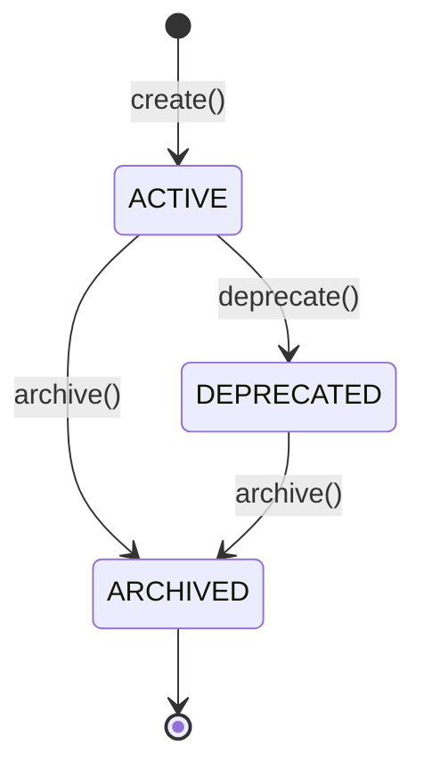

# Catalog — Catálogo de Recursos

> **Contexto:** Catalog | **Atualizado em:** 2026-02-28 | **Versão ADR baseline:** ADR-0051

O módulo Catalog gerencia as **definições reutilizáveis de recursos** da plataforma FitTrack — principalmente exercícios, com suporte a alimentos e templates de avaliação reservados para o pós-MVP. Esses recursos são a matéria-prima para as prescrições: quando um profissional prescreve um exercício a um cliente, o sistema copia ("snapshot") o conteúdo atual do catálogo para dentro da prescrição de forma imutável. Isso garante que mudanças futuras no catálogo nunca alterem retrospectivamente o que foi prescrito.

---

## Visão Geral

### O que este módulo faz

O Catalog mantém dois tipos de itens: os **globais** (curados pela plataforma, visíveis a todos os profissionais) e os **customizados** (criados por cada profissional, visíveis apenas ao dono). Profissionais podem criar, editar, deprecar e arquivar seus próprios itens de catálogo. Ao atualizar o conteúdo de um item, o sistema incrementa seu número de versão e publica um evento para que outros contextos — em especial o de Prescrições — saibam que uma nova versão está disponível.

O catálogo é a **fonte da verdade** para definições de exercícios, mas jamais é consultado diretamente na hora de exibir uma prescrição já criada: para isso, o contexto de Prescrições usa o snapshot imutável embutido no momento da criação.

### O que este módulo NÃO faz

- **Não cria nem gerencia prescrições (Deliverables):** a criação do snapshot e o ciclo de vida da prescrição vivem no contexto de Prescrições (Deliverables).
- **Não registra execuções de treino:** quem faz isso é o contexto de Execução (Execution).
- **Não controla acesso ou cobrança:** validação de AccessGrant e pagamentos ficam no contexto de Billing.
- **Não gerencia itens de alimentos (FOOD) nem templates de avaliação (EVALUATION_TEMPLATE) no MVP:** esses tipos são reservados e serão introduzidos em versões futuras (ADR-0044).
- **Não expõe soft-delete ao domínio:** a exclusão lógica (`deletedAt`) é responsabilidade da camada de persistência (ADR-0013 Tier 3); o agregado não modela esse campo.

### Módulos com os quais se relaciona

| Módulo        | Tipo de relação      | Como se comunica                                              |
| ------------- | -------------------- | ------------------------------------------------------------- |
| Deliverables  | Fornece dados para   | Leitura via `findByIdForProfessional` no repositório          |
| Deliverables  | Publica eventos para | Evento: `TemplateVersionChanged`                              |
| PersonalMode  | Fornece dados para   | Leitura de itens globais/próprios para auto-rastreamento      |

---

## Modelo de Domínio

### Agregados

#### CatalogItem

Representa a **definição reutilizável de um recurso** — no MVP, um exercício físico. É a entidade central do catálogo: contém nome, categoria, grupos musculares, instruções de execução e URL de mídia. Possui um **número de versão de conteúdo** (`contentVersion`) que aumenta a cada atualização, permitindo rastrear qual versão estava ativa no momento de cada prescrição.

Um `CatalogItem` pertence a um dos dois modelos de propriedade:
- **Global** (`professionalProfileId = null`): curado pela plataforma, visível a todos os profissionais, imutável do ponto de vista dos profissionais.
- **Customizado** (`professionalProfileId = UUID`): criado por um profissional, visível e mutável apenas por esse profissional.

A propriedade é **imutável após a criação** — um item nunca muda de global para customizado ou vice-versa.

**Estados possíveis:**

| Estado       | Novas prescrições | Mutação de conteúdo | Descrição                                        |
| ------------ | ----------------- | ------------------- | ------------------------------------------------ |
| `ACTIVE`     | Permitida         | Permitida           | Em uso e recomendado para prescrição             |
| `DEPRECATED` | Permitida         | Permitida           | Ainda utilizável, mas não mais recomendado       |
| `ARCHIVED`   | Bloqueada         | Bloqueada           | Aposentado permanentemente; somente leitura      |

`ARCHIVED` é um **estado terminal**: nenhuma transição de saída é permitida.

**Transições de estado:**

**Regras de invariante:**

- Um `CatalogItem` é criado sempre no estado `ACTIVE` — não existe estado `DRAFT` neste módulo, ao contrário de Prescrições.
- `professionalProfileId` é imutável após a criação: define a propriedade permanentemente.
- `contentVersion` começa em `1` e incrementa em toda chamada bem-sucedida de `updateContent()`.
- Itens `ARCHIVED` não aceitam mutação de conteúdo (retornam `CATALOG_ITEM_ARCHIVED`).
- Transições de estado inválidas (ex: `DEPRECATED → ACTIVE`) retornam `INVALID_CATALOG_ITEM_TRANSITION`.
- Snapshots já embutidos em Prescrições existentes são **permanentemente imutáveis**, mesmo que o item de catálogo original seja atualizado, deprecado ou arquivado (ADR-0011 §3).

**Operações disponíveis:**

| Operação          | O que faz                                                         | Quando pode ser chamada              | Possíveis erros                       |
| ----------------- | ----------------------------------------------------------------- | ------------------------------------ | ------------------------------------- |
| `create()`        | Cria novo CatalogItem em `ACTIVE`; `contentVersion = 1`           | Sempre (fábrica estática)            | `INVALID_CATALOG_ITEM` (nome inválido) |
| `deprecate()`     | `ACTIVE → DEPRECATED`; seta `deprecatedAtUtc`                    | Somente em `ACTIVE`                  | `INVALID_CATALOG_ITEM_TRANSITION`     |
| `archive()`       | `ACTIVE\|DEPRECATED → ARCHIVED`; seta `archivedAtUtc` (terminal) | Em `ACTIVE` ou `DEPRECATED`          | `INVALID_CATALOG_ITEM_TRANSITION`     |
| `updateContent()` | Atualiza campos de conteúdo; incrementa `contentVersion`          | Em `ACTIVE` ou `DEPRECATED`          | `CATALOG_ITEM_ARCHIVED`               |

**Campos do agregado:**

| Campo                  | Tipo              | Imutável? | Descrição                                                  |
| ---------------------- | ----------------- | --------- | ---------------------------------------------------------- |
| `id`                   | `string` (UUIDv4) | Sim       | Identificador único                                        |
| `professionalProfileId`| `string \| null`  | Sim       | `null` = global; UUID = item próprio do profissional       |
| `type`                 | `CatalogItemType` | Sim       | Discriminador do recurso (`EXERCISE` no MVP)               |
| `status`               | `CatalogItemStatus`| Não      | Estado atual do ciclo de vida                              |
| `name`                 | `CatalogItemName` | Não       | Nome legível (Value Object, 1–120 chars)                   |
| `contentVersion`       | `number`          | Não       | Versão do conteúdo; começa em 1; incrementa a cada update  |
| `description`          | `string \| null`  | Não       | Descrição livre opcional                                   |
| `category`             | `string \| null`  | Não       | Categoria do exercício (ex: `'STRENGTH'`, `'CARDIO'`)      |
| `muscleGroups`         | `string[]`        | Não       | Grupos musculares alvo (ex: `['CHEST', 'TRICEPS']`)        |
| `instructions`         | `string \| null`  | Não       | Instruções de execução passo a passo                       |
| `mediaUrl`             | `string \| null`  | Não       | URL do vídeo ou imagem demonstrativa                       |
| `createdAtUtc`         | `UTCDateTime`     | Sim       | Instante UTC de criação                                    |
| `deprecatedAtUtc`      | `UTCDateTime \| null` | —     | Preenchido ao deprecar                                     |
| `archivedAtUtc`        | `UTCDateTime \| null` | —     | Preenchido ao arquivar                                     |

---

### Value Objects

| Value Object      | O que representa                 | Regras de validação                                                 |
| ----------------- | -------------------------------- | ------------------------------------------------------------------- |
| `CatalogItemName` | Nome legível de um item de catálogo | Mínimo 1 caractere, máximo 120 caracteres após `.trim()`. Não pode ser vazio ou somente espaços. |

---

### Erros de Domínio

| Código                                   | Significado                              | Quando ocorre                                                      |
| ---------------------------------------- | ---------------------------------------- | ------------------------------------------------------------------ |
| `CATALOG.INVALID_CATALOG_ITEM`           | Campo inválido (principalmente nome)     | Nome vazio, somente espaços ou com mais de 120 caracteres          |
| `CATALOG.INVALID_CATALOG_ITEM_TRANSITION`| Transição de estado não permitida        | `deprecate()` em item não-ACTIVE; `archive()` em item já ARCHIVED  |
| `CATALOG.CATALOG_ITEM_NOT_FOUND`         | Item não encontrado ou de outro tenant   | Item inexistente, ou profissional tentando acessar item de outro dono (ADR-0025 — 404, nunca 403) |
| `CATALOG.CATALOG_ITEM_ARCHIVED`          | Mutação de conteúdo em item arquivado    | `updateContent()` chamado em item com status `ARCHIVED`            |

---

## Funcionalidades e Casos de Uso

> Esta seção descreve **tudo que o sistema permite fazer** neste módulo.

---

### Criar Item de Catálogo

**O que é:** Permite a um profissional (ou à plataforma, no caso de itens globais) registrar uma nova definição de recurso — no MVP, um exercício físico — que poderá ser usada em prescrições futuras.

**Quem pode usar:** Profissional autenticado (para itens customizados) ou a plataforma (para itens globais — operação administrativa restrita na camada HTTP).

**Como funciona (passo a passo):**

1. Se `professionalProfileId` for fornecido, valida que é um UUIDv4 válido (ADR-0025).
2. Valida o nome: cria o Value Object `CatalogItemName` — mínimo 1, máximo 120 chars após trim.
3. Valida `createdAtUtc`: converte a string ISO 8601 UTC para `UTCDateTime` (ADR-0010).
4. Cria o agregado `CatalogItem` com status `ACTIVE` e `contentVersion = 1`.
5. Persiste via `ICatalogItemRepository.save()`.
6. Retorna o DTO de saída com todos os campos do item criado.

**Regras de negócio aplicadas:**

- ✅ `professionalProfileId` deve ser um UUIDv4 válido ou `null` (para itens globais).
- ✅ Nome deve ter entre 1 e 120 caracteres (após remover espaços das extremidades).
- ✅ `createdAtUtc` deve ser uma string UTC válida terminando em `Z`.
- ✅ O item é criado diretamente em `ACTIVE` — não existe fase de rascunho no catálogo.
- ❌ Nome inválido → `CATALOG.INVALID_CATALOG_ITEM`.
- ❌ `professionalProfileId` com formato inválido → `CORE.INVALID_UUID`.
- ❌ Data em formato não-UTC (ex: com offset `+03:00`) → erro de validação temporal.

**Resultado esperado:** DTO com `catalogItemId`, `status: ACTIVE`, `contentVersion: 1`, e todos os campos de conteúdo.

**Efeitos colaterais:** Nenhum evento publicado. O módulo Catalog não emite eventos em criação no MVP — não há consumidores cross-context registrados para esse tipo de evento (ADR-0009 §5).

---

### Deprecar Item de Catálogo

**O que é:** Marca um item customizado como "não recomendado para novas prescrições", sem bloqueá-lo imediatamente. O item continua disponível para prescrição enquanto o profissional decide se irá arquivá-lo ou mantê-lo em uso eventual.

**Quem pode usar:** Profissional autenticado, dono do item.

**Como funciona (passo a passo):**

1. Valida os UUIDs de entrada (`professionalProfileId` e `catalogItemId`).
2. Busca o item via `findByIdAndProfessionalProfileId` — retorna `null` tanto para itens de outro profissional quanto para itens globais (ADR-0025).
3. Se `null`, retorna `CATALOG_ITEM_NOT_FOUND`.
4. Executa `item.deprecate()` — transiciona `ACTIVE → DEPRECATED`, preenche `deprecatedAtUtc`.
5. Persiste o estado atualizado.
6. Retorna DTO com `status: DEPRECATED` e `deprecatedAtUtc`.

**Regras de negócio aplicadas:**

- ✅ Somente itens `ACTIVE` podem ser deprecados.
- ✅ Profissionais não podem deprecar itens globais (plataforma curated) — a busca por `findByIdAndProfessionalProfileId` retorna `null` para itens globais, produzindo `CATALOG_ITEM_NOT_FOUND` (ADR-0025).
- ✅ Itens de outros profissionais retornam `CATALOG_ITEM_NOT_FOUND`, nunca `403` (ADR-0025 — tenant isolation).
- ❌ Tentar deprecar item já `DEPRECATED` ou `ARCHIVED` → `CATALOG.INVALID_CATALOG_ITEM_TRANSITION`.
- ❌ IDs inválidos → `CORE.INVALID_UUID`.

**Resultado esperado:** DTO com `catalogItemId`, `status: DEPRECATED`, `deprecatedAtUtc` (ISO 8601 UTC).

**Efeitos colaterais:** Nenhum evento publicado. Snapshots já embutidos em prescrições existentes **não são afetados**.

---

### Arquivar Item de Catálogo

**O que é:** Aposenta permanentemente um item customizado. Itens arquivados não podem mais ser usados em novas prescrições e não podem ter seu conteúdo alterado. É um estado terminal e irreversível.

**Quem pode usar:** Profissional autenticado, dono do item.

**Como funciona (passo a passo):**

1. Valida os UUIDs de entrada (`professionalProfileId` e `catalogItemId`).
2. Busca o item via `findByIdAndProfessionalProfileId` — retorna `null` para itens de outro profissional e para itens globais (ADR-0025).
3. Se `null`, retorna `CATALOG_ITEM_NOT_FOUND`.
4. Executa `item.archive()` — transiciona `ACTIVE|DEPRECATED → ARCHIVED`, preenche `archivedAtUtc`.
5. Persiste o estado atualizado.
6. Retorna DTO com `status: ARCHIVED` e `archivedAtUtc`.

**Regras de negócio aplicadas:**

- ✅ Aceita tanto itens `ACTIVE` quanto `DEPRECATED` como estado de origem.
- ✅ Profissionais não podem arquivar itens globais — mesma lógica de tenant isolation aplicada em deprecar.
- ✅ O registro do item nunca é apagado fisicamente do banco de dados (ADR-0013 Tier 3 — soft-delete via `deletedAt` na persistência, quando necessário).
- ❌ Tentar arquivar item já `ARCHIVED` → `CATALOG.INVALID_CATALOG_ITEM_TRANSITION`.
- ❌ IDs inválidos → `CORE.INVALID_UUID`.

**Resultado esperado:** DTO com `catalogItemId`, `status: ARCHIVED`, `archivedAtUtc` (ISO 8601 UTC).

**Efeitos colaterais:** Nenhum evento publicado. Snapshots já embutidos em prescrições existentes **não são afetados**.

---

### Atualizar Conteúdo do Item de Catálogo

**O que é:** Permite ao profissional atualizar os campos de conteúdo de um item customizado — nome, descrição, categoria, grupos musculares, instruções e URL de mídia. A cada atualização bem-sucedida, o número de versão do item (`contentVersion`) é incrementado, permitindo rastrear qual versão estava vigente em cada prescrição.

**Quem pode usar:** Profissional autenticado, dono do item.

**Como funciona (passo a passo):**

1. Valida os UUIDs de entrada (`professionalProfileId` e `catalogItemId`).
2. Se um novo `name` for fornecido, valida criando o Value Object `CatalogItemName`.
3. Busca o item via `findByIdAndProfessionalProfileId` — retorna `null` para itens de outro profissional e para itens globais (ADR-0025).
4. Se `null`, retorna `CATALOG_ITEM_NOT_FOUND`.
5. Captura `previousVersion = item.contentVersion` para o payload do evento.
6. Executa `item.updateContent(fields)` — verifica guard de `ARCHIVED`, aplica apenas os campos fornecidos (campos omitidos permanecem inalterados), incrementa `contentVersion`.
7. Persiste o estado atualizado.
8. Publica evento `TemplateVersionChanged` via porta `ICatalogEventPublisher` (post-save, ADR-0009 §4).
9. Retorna DTO com o conteúdo atualizado e a nova `contentVersion`.

**Regras de negócio aplicadas:**

- ✅ Campos omitidos no DTO não são alterados (update parcial — PATCH semântico).
- ✅ `null` explícito em um campo nullable **limpa** o campo (ex: `category: null` remove a categoria).
- ✅ Atualizações em itens `DEPRECATED` são **permitidas** (ADR-0011 §7) — o item pode ser corrigido mesmo depois de deprecado.
- ✅ Profissionais não podem atualizar itens globais — a busca retorna `null` e produz `CATALOG_ITEM_NOT_FOUND`.
- ✅ O evento `TemplateVersionChanged` só é publicado para itens customizados, nunca para itens globais (o guard de `findByIdAndProfessionalProfileId` garante isso).
- ❌ Item `ARCHIVED` → `CATALOG.CATALOG_ITEM_ARCHIVED` (antes mesmo de tentar o update).
- ❌ Nome vazio ou com mais de 120 chars → `CATALOG.INVALID_CATALOG_ITEM`.
- ❌ IDs inválidos → `CORE.INVALID_UUID`.

**Resultado esperado:** DTO com `catalogItemId`, `status`, `name`, nova `contentVersion`, e todos os campos de conteúdo atualizados.

**Efeitos colaterais:** Publica `TemplateVersionChanged` via porta `ICatalogEventPublisher` após persistência bem-sucedida. O evento carrega `previousVersion` e `newVersion` para que consumidores downstream (Deliverables, analytics) detectem desvio de versão em prescrições ativas.

---

## Porta da Application Layer / `ICatalogEventPublisher`

A publicação de eventos é delegada à porta `ICatalogEventPublisher`, injetada por construtor no único caso de uso que emite eventos. Essa separação mantém o agregado puro (sem infra-estrutura) e centraliza o dispatch no use case (ADR-0009 §4, ADR-0047).

| Método                          | Evento publicado              | Publicado por use case            |
| ------------------------------- | ----------------------------- | --------------------------------- |
| `publishTemplateVersionChanged` | `TemplateVersionChanged` (v1) | `UpdateCatalogItemContent`        |

---

## Repositório / `ICatalogItemRepository`

O repositório expõe **dois padrões de busca**, refletindo os dois casos de acesso distintos ao catálogo:

| Método                              | Retorna                                                   | Uso adequado                                      |
| ----------------------------------- | --------------------------------------------------------- | ------------------------------------------------- |
| `findById` ⚠️ **@deprecated**       | Qualquer item (sem escopo de tenant)                      | **Não usar em use cases** — viola ADR-0025        |
| `findByIdForProfessional`           | Item global OU item próprio do profissional               | Leitura/resolução na hora da prescrição           |
| `findByIdAndProfessionalProfileId`  | Apenas item próprio do profissional (global = `null`)     | Mutações: deprecar, arquivar, atualizar conteúdo  |
| `findManyVisibleToProfessional`     | Globais + próprios do profissional (paginado, com filtros) | Listagem do catálogo disponível para prescrição   |
| `findManyByProfessionalProfileId`   | Apenas próprios do profissional (paginado, com filtros)   | Gerência da biblioteca própria do profissional    |

**Filtros de listagem disponíveis:** `status` (`CatalogItemStatus`) e `type` (`CatalogItemType`).

> **Por que dois métodos de busca?** A separação é intencional: para **leitura** (resolução no momento da prescrição), um item global ou próprio é igualmente válido — logo `findByIdForProfessional` retorna ambos. Para **mutação**, apenas itens próprios podem ser alterados — `findByIdAndProfessionalProfileId` retorna `null` para itens globais, gerando `CATALOG_ITEM_NOT_FOUND` (ADR-0025 — 404, nunca 403). Isso impede que profissionais modifiquem acidentalmente itens da plataforma.

---

## Regras de Negócio Consolidadas

| #  | Regra                                                                                                                   | Onde é aplicada                           | ADR           |
| -- | ----------------------------------------------------------------------------------------------------------------------- | ----------------------------------------- | ------------- |
| 1  | CatalogItems nunca referenciam recursos vivos em Prescrições; o conteúdo é copiado como snapshot imutável na criação da Prescrição | Contexto de Prescrições (Deliverables)    | ADR-0011      |
| 2  | Um snapshot de Prescrição é imutável após sua criação; atualizações no catálogo não o afetam                            | Contexto de Prescrições (Deliverables)    | ADR-0011 §3   |
| 3  | `contentVersion` começa em 1 e incrementa a cada `updateContent()` bem-sucedido                                         | Agregado `CatalogItem`                    | ADR-0011 §4   |
| 4  | `professionalProfileId` é imutável após criação; define a propriedade do item permanentemente                            | Agregado `CatalogItem`                    | ADR-0025      |
| 5  | Itens globais (`professionalProfileId = null`) são somente-leitura para profissionais                                    | Use Cases (lookup `findByIdAndProfessionalProfileId`) | ADR-0025 |
| 6  | Cross-tenant: profissional tentando acessar/mutar item de outro dono recebe 404, nunca 403                               | Use Cases + repositório                   | ADR-0025      |
| 7  | CatalogItems são criados diretamente em `ACTIVE` — não há estado DRAFT                                                   | Agregado `CatalogItem.create()`           | ADR-0011 §7   |
| 8  | `ARCHIVED` é terminal: nenhuma transição de saída é permitida                                                            | Agregado `CatalogItem.archive()`          | ADR-0011 §7   |
| 9  | Itens `DEPRECATED` ainda podem ser usados em novas prescrições e têm conteúdo mutável                                    | Agregado `CatalogItem`, Use Cases         | ADR-0011 §7   |
| 10 | Items `ARCHIVED` bloqueiam toda mutação de conteúdo (`updateContent()` retorna `CATALOG_ITEM_ARCHIVED`)                  | Agregado `CatalogItem.updateContent()`    | ADR-0011 §3   |
| 11 | O evento `TemplateVersionChanged` só é publicado para itens **customizados**, nunca para globais                         | Use Case `UpdateCatalogItemContent`       | ADR-0009 §7   |
| 12 | Eventos são publicados **após** a persistência ter sido concluída com sucesso (post-save)                                | Use Case `UpdateCatalogItemContent`       | ADR-0009 §4   |
| 13 | O agregado `CatalogItem` é puro: não emite eventos internamente; o dispatch é responsabilidade do use case               | Arquitetura geral                         | ADR-0009, ADR-0047 |
| 14 | Hard-delete de CatalogItems é proibido; soft-delete é gerenciado na camada de persistência (ADR-0013 Tier 3)             | Camada de infraestrutura                  | ADR-0013      |
| 15 | Timestamps usam UTC (`createdAtUtc`, `deprecatedAtUtc`, `archivedAtUtc`); formato ISO 8601 terminando em `Z`             | Value Objects / DTOs                      | ADR-0010      |
| 16 | Apenas o tipo `EXERCISE` está ativo no MVP; `FOOD` e `EVALUATION_TEMPLATE` são reservados para pós-MVP                   | Enum `CatalogItemType`                    | ADR-0001 §1, ADR-0044 |
| 17 | Novos tipos de recurso no catálogo exigem revisão de ADR e feature flag antes de serem introduzidos                      | Governança                                | ADR-0044      |
| 18 | Concorrência controlada por locking otimista via campo `version` herdado de `AggregateRoot`                              | Infraestrutura / repositório              | ADR-0006      |

---

## Eventos de Domínio

### Eventos Publicados por este Módulo

| Evento                   | Quando é publicado                                              | O que contém                                                                                                    | Quem consome                              |
| ------------------------ | --------------------------------------------------------------- | --------------------------------------------------------------------------------------------------------------- | ----------------------------------------- |
| `TemplateVersionChanged` | Após `UpdateCatalogItemContent` persistir o conteúdo atualizado | `catalogItemId`, `professionalProfileId`, `previousVersion`, `newVersion` | Contexto de Prescrições (drift de versão), Analytics |

> **Nota:** `TemplateVersionChanged` é publicado **somente para itens customizados**. Itens globais não podem ser mutados por profissionais, portanto o evento nunca é emitido para eles.

> **Publicação:** Síncrona via porta `ICatalogEventPublisher`. Implementação de outbox assíncrono (ADR-0016) é pós-MVP.

### Eventos Consumidos por este Módulo

Nenhum. O módulo Catalog não reage a eventos de outros contextos no MVP.

---

## Infraestrutura e Persistência

### Dados armazenados

| Tabela/Coleção  | O que armazena                        | Campos principais                                                                                    |
| --------------- | ------------------------------------- | ---------------------------------------------------------------------------------------------------- |
| `catalog_items` | Definições de recursos do catálogo    | `id`, `professional_profile_id` (null=global), `type`, `status`, `name`, `content_version`, `description`, `category`, `muscle_groups`, `instructions`, `media_url`, `created_at_utc`, `deprecated_at_utc`, `archived_at_utc`, `deleted_at` (soft-delete), `version` (optimistic lock) |

### Integrações externas

Nenhuma. O módulo Catalog não depende de serviços externos.

---

## Conformidade com ADRs

| ADR                                          | Status       | Observações                                                                                              |
| -------------------------------------------- | ------------ | -------------------------------------------------------------------------------------------------------- |
| ADR-0001 (Bounded Contexts)                  | ✅ Conforme  | `CatalogItem` pertence exclusivamente ao contexto Catalog; sem dependência de infra de outros contextos  |
| ADR-0006 (Concurrency — Optimistic Lock)     | ✅ Conforme  | `version` herdado de `AggregateRoot`; gerenciado pela persistência                                      |
| ADR-0009 (Pureza de Agregados / Domain Events)| ✅ Conforme | Agregado puro; dispatch de eventos feito pelo use case via porta `ICatalogEventPublisher`                |
| ADR-0010 (UTC / Temporal Policy)             | ✅ Conforme  | Todos os timestamps são `UTCDateTime`; DTOs usam ISO 8601 terminando em `Z`                              |
| ADR-0011 (Catalog Snapshot Policy)           | ✅ Conforme  | Lifecycle, `contentVersion`, imutabilidade de snapshots e relação com Deliverables conforme §2–§7        |
| ADR-0013 (Soft Delete — Tier 3)              | ✅ Conforme  | Hard-delete proibido; `deletedAt` gerenciado na persistência; domínio não expõe esse campo               |
| ADR-0025 (Tenant Isolation)                  | ✅ Conforme  | Mutações usam `findByIdAndProfessionalProfileId` (404 para global + cross-tenant); nunca 403             |
| ADR-0044 (Deliverable Type Expansion)        | ✅ Conforme  | `FOOD` e `EVALUATION_TEMPLATE` reservados como comentários no enum; novos tipos exigem ADR + feature flag |
| ADR-0047 (UseCase dispatcha eventos)         | ✅ Conforme  | `UpdateCatalogItemContent` é o único dispatcher; `DeprecateCatalogItem` e `ArchiveCatalogItem` não emitem eventos (por design no MVP) |
| ADR-0051 (DomainResult\<T\> — Either)        | ✅ Conforme  | Todos os use cases e operações de domínio retornam `DomainResult<T>`; nenhuma exceção lançada            |

---

## Gaps e Melhorias Identificadas

| #  | Tipo             | Descrição                                                                                                                                                                                | Prioridade |
| -- | ---------------- | ---------------------------------------------------------------------------------------------------------------------------------------------------------------------------------------- | ---------- |
| 1  | 🔵 Pós-MVP       | `CatalogItemType.FOOD` e `CatalogItemType.EVALUATION_TEMPLATE` estão reservados no enum mas sem implementação. Quando introduzidos, exigirão ADR + feature flag (ADR-0044).              | Baixa      |
| 2  | 🔵 Pós-MVP       | Publicação de eventos (`TemplateVersionChanged`) é síncrona no MVP. Outbox assíncrono (ADR-0016) é pendente para garantir entrega confiável em falhas de infraestrutura.                 | Baixa      |
| 3  | 🔵 Informativo   | `ICatalogItemRepository.findById()` está marcado como `@deprecated` na interface — sem consumidor atual nos use cases. Candidato a remoção quando a camada de infraestrutura implementar o repositório real. | Baixa |
| 4  | 🔵 Informativo   | Não há eventos publicados para criação (`CatalogItemCreated`), deprecação (`CatalogItemDeprecated`) nem arquivamento (`CatalogItemArchived`). Isso é uma decisão de design documentada: não existem consumidores cross-context registrados para esses eventos no MVP (ADR-0009 §5, ADR-0001 §5). | Informativo |

---

## Cobertura de Testes

**75 testes unitários** (100% de cobertura em linhas, funções, branches e statements).

| Arquivo de testes                                       | Testes |
| ------------------------------------------------------- | ------ |
| `tests/unit/domain/catalog-item.spec.ts`                | 31     |
| `tests/unit/application/create-catalog-item.spec.ts`    | 9      |
| `tests/unit/application/deprecate-catalog-item.spec.ts` | 9      |
| `tests/unit/application/archive-catalog-item.spec.ts`   | 9      |
| `tests/unit/application/update-catalog-item-content.spec.ts` | 17 |

Os testes de domínio cobrem: Value Object `CatalogItemName` (validação de limites), ciclo de vida completo do agregado, método `updateContent` (todos os campos, comportamento em DEPRECATED, guard em ARCHIVED), métodos de consulta (`isActive`, `isGlobal`, `isOwnedBy`, `isAvailableForPrescription`) e defesa de cópia do getter `muscleGroups`.

Os testes de aplicação cobrem: happy paths, isolamento de tenant (cross-tenant + global), transições de estado inválidas, validação de input (UUIDs, nome, createdAtUtc), guard ARCHIVED, dispatch do evento `TemplateVersionChanged` (versões corretas, sem dispatch em falha).

---

## Histórico de Atualizações

| Data       | O que mudou                 |
| ---------- | --------------------------- |
| 2026-02-28 | Documentação inicial gerada |
