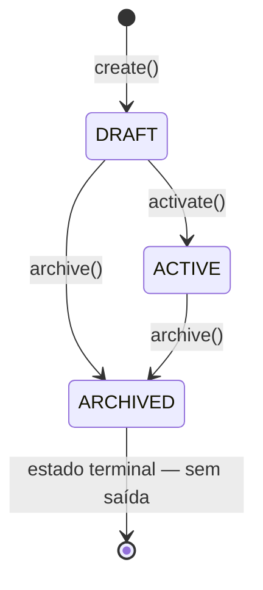
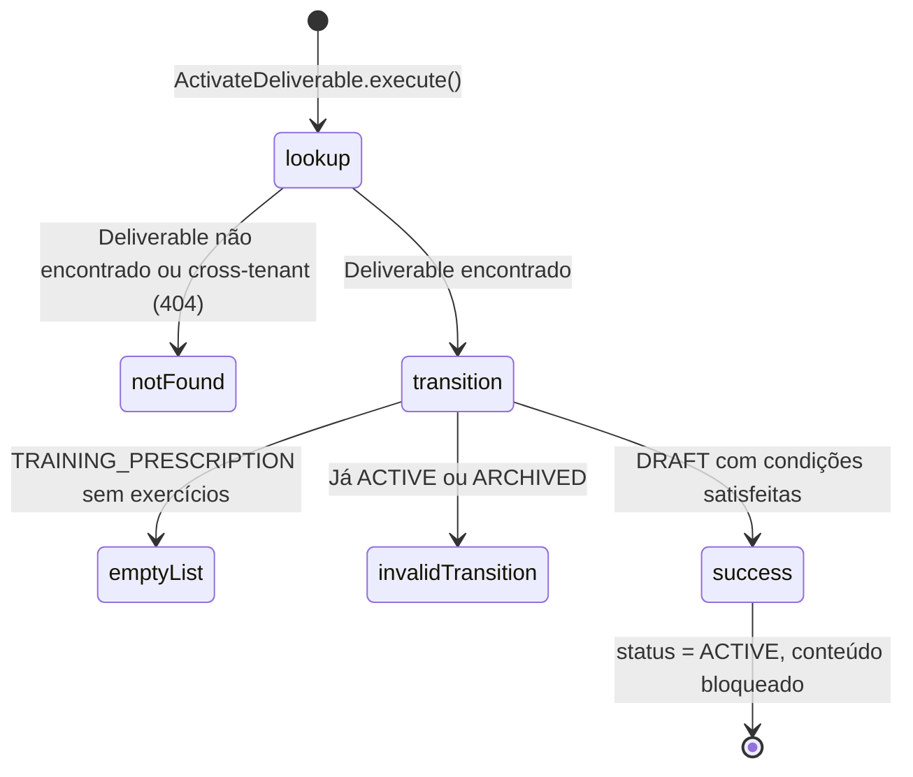

# Deliverables (Prescrições de Serviço)

> **Contexto:** Execuções | **Atualizado em:** 2026-02-28 | **Versão ADR baseline:** ADR-0044

O módulo de Deliverables gerencia as **prescrições de serviço** que profissionais de fitness elaboram para seus clientes: planos de treino, planos alimentares e avaliações fisiológicas. Um Deliverable define o conteúdo do serviço — exercícios, instruções e metadados — que será entregue ao cliente sob uma AccessGrant válida. Quando ativado, o conteúdo é bloqueado como um snapshot imutável, garantindo que a prescrição histórica nunca seja alterada por modificações futuras no catálogo. É este snapshot que o módulo de Execuções referencia ao registrar que o serviço foi realizado.

---

## Visão Geral

### O que este módulo faz

- Permite que profissionais criem prescrições de serviço em estado rascunho e as editem livremente antes de publicar
- Gerencia o ciclo de vida completo: DRAFT (editável) → ACTIVE (conteúdo bloqueado) → ARCHIVED (encerrado)
- Controla a composição de exercícios em planos de treino — adição, remoção e reordenação — enquanto o Deliverable estiver em rascunho
- Garante que, no momento da ativação, o conteúdo do catálogo seja capturado como snapshot imutável, desacoplando a prescrição histórica de atualizações futuras
- Mantém rastreabilidade do catálogo via `catalogItemId` + `catalogVersion` em cada ExerciseAssignment
- Impõe isolamento por tenant: toda operação é escopada ao profissional proprietário

### O que este módulo NÃO faz

| Responsabilidade | Onde vive |
|-----------------|-----------|
| Registrar que um serviço foi realizado (Execution) | Módulo `executions` |
| Verificar se o cliente tem AccessGrant ativa para receber o Deliverable | Módulo `billing` / `access-grants` |
| Manter o catálogo de exercícios, alimentos e templates | Módulo `catalog` |
| Autenticar e autorizar o profissional | Módulo `identity` |
| Agendar sessões com clientes | Módulo `scheduling` |
| Replicar automaticamente atualizações do catálogo para prescrições existentes | Não é uma operação suportada (ADR-0011 §5) |

### Módulos com os quais se relaciona

| Módulo | Tipo de relação | Como se comunica |
|--------|-----------------|-----------------|
| `@fittrack/core` | Usa primitivos de | Shared Kernel: `AggregateRoot`, `Either`, `UTCDateTime`, `LogicalDay`, `ValueObject`, `generateId` |
| `catalog` | Consome dados de | `catalogItemId` + `catalogVersion` fornecidos pelo caller ao criar ExerciseAssignments (snapshot) |
| `executions` | Fornece referência para | Módulo de Execuções lê o ID do Deliverable e verifica status ACTIVE via API pública (ADR-0029) |
| `billing` / `access-grants` | Pré-requisito de | AccessGrant válida é necessária para atribuir o Deliverable a clientes — validação ocorre no contexto da Execução |

---

## Modelo de Domínio

### Agregados

#### Deliverable

Um Deliverable representa a **prescrição formalizada de um serviço profissional**: pode ser um plano de treino com exercícios ordenados, um plano alimentar ou uma avaliação fisiológica. É o artefato central que o profissional elabora e que, após ativação, pode ser atribuído a clientes. Quando o cliente executa o serviço, o módulo de Execuções referencia este Deliverable pelo seu ID — o Deliverable em si é o snapshot imutável.

**Estados possíveis:**

| Estado | Descrição |
|--------|-----------|
| `DRAFT` | Rascunho em elaboração. O conteúdo (exercícios) pode ser livremente adicionado ou removido. Ainda não pode ser atribuído a clientes via AccessGrant. |
| `ACTIVE` | Ativo e com conteúdo bloqueado como snapshot. Pode ser atribuído a clientes. Nenhuma modificação de exercícios é permitida. |
| `ARCHIVED` | Arquivado permanentemente. Nenhuma nova atribuição é permitida. Estado terminal — sem saída. Execuções existentes que referenciam este Deliverable permanecem intactas. |

**Transições de estado:**



**Regras de invariante:**

- `professionalProfileId` é imutável após a criação e nunca pode ser nulo — identifica o tenant proprietário (ADR-0025)
- O conteúdo (exercícios) só pode ser mutado em estado DRAFT; tentativas de modificar um Deliverable ACTIVE ou ARCHIVED retornam `DELIVERABLE_NOT_DRAFT`
- Uma TRAINING_PRESCRIPTION não pode ser ativada com lista de exercícios vazia — uma prescrição sem conteúdo não é válida para entrega (ADR-0044 §2)
- `contentVersion` começa em 1 na criação e sobe 1 a cada `addExercise()` ou `removeExercise()` — rastreia o histórico de edições do conteúdo
- `logicalDay` é calculado uma única vez na criação a partir de `createdAtUtc` + `timezoneUsed` (IANA) e nunca é recomputado (ADR-0010)
- O estado ARCHIVED é terminal: não há transição de saída, nem mesmo retorno a DRAFT
- Nenhum evento de domínio é emitido pelo agregado — transições de estado são mutações puras (ADR-0009 §6)
- Referências a outros agregados são feitas apenas por ID (string), nunca por objeto (ADR-0047)

**Operações disponíveis:**

| Operação | O que faz | Quando pode ser chamada | Possíveis erros |
|----------|-----------|------------------------|-----------------|
| `create()` | Cria novo Deliverable em DRAFT; `contentVersion = 1`; lista de exercícios vazia | Sempre | — |
| `addExercise(props)` | Adiciona ExerciseAssignment ao final; atribui `orderIndex`; incrementa `contentVersion` | Apenas em DRAFT | `DELIVERABLE.DELIVERABLE_NOT_DRAFT` |
| `removeExercise(id)` | Remove ExerciseAssignment por ID; reindexia os restantes; incrementa `contentVersion` | Apenas em DRAFT | `DELIVERABLE.DELIVERABLE_NOT_DRAFT`, `DELIVERABLE.EXERCISE_NOT_FOUND` |
| `activate()` | DRAFT → ACTIVE; bloqueia conteúdo como snapshot imutável; registra `activatedAtUtc` | Apenas de DRAFT | `DELIVERABLE.INVALID_DELIVERABLE_TRANSITION`, `DELIVERABLE.EMPTY_EXERCISE_LIST` |
| `archive()` | DRAFT ou ACTIVE → ARCHIVED (terminal); registra `archivedAtUtc` | DRAFT ou ACTIVE | `DELIVERABLE.INVALID_DELIVERABLE_TRANSITION` |

---

### Entidades Subordinadas

#### ExerciseAssignment

Um ExerciseAssignment representa **uma prescrição de exercício** dentro de um Deliverable do tipo TRAINING_PRESCRIPTION. Carrega dois tipos de dados: o **snapshot do conteúdo do catálogo** (nome, categoria, grupos musculares, instruções, mídia) capturado no momento da adição, e os **parâmetros de execução** específicos desta prescrição (séries, repetições, duração, intervalo, notas).

É um **subordinado exclusivo** do Deliverable: não é acessível por ID de fora dos limites do agregado e só pode ser criado ou removido pelos métodos `addExercise()` e `removeExercise()` do Deliverable. Seu conteúdo é travado quando o Deliverable é ativado.

**Campos do snapshot de catálogo (ADR-0011 §2):**

| Campo | Tipo | Descrição |
|-------|------|-----------|
| `catalogItemId` | `string \| null` | ID do item de origem no catálogo (para rastreabilidade; null quando catálogo não estava disponível na criação) |
| `catalogVersion` | `number \| null` | Versão do item no catálogo no instante do snapshot |
| `snapshotCreatedAtUtc` | `string \| null` | Instante UTC em que o snapshot foi capturado |
| `name` | `string` | Nome do exercício no momento da prescrição |
| `category` | `string \| null` | Categoria (ex: `STRENGTH`, `CARDIO`, `MOBILITY`) |
| `muscleGroups` | `string[] \| null` | Grupos musculares alvo (ex: `['CHEST', 'TRICEPS']`) |
| `instructions` | `string \| null` | Instruções de execução passo a passo |
| `mediaUrl` | `string \| null` | URL de vídeo ou imagem demonstrativa |

**Campos de prescrição:**

| Campo | Tipo | Descrição |
|-------|------|-----------|
| `sets` | `number \| null` | Número de séries prescritas |
| `reps` | `number \| null` | Repetições por série |
| `durationSeconds` | `number \| null` | Duração do exercício em segundos (para exercícios baseados em tempo) |
| `restSeconds` | `number \| null` | Intervalo de descanso entre séries em segundos |
| `notes` | `string \| null` | Observações de coaching |
| `orderIndex` | `number` | Posição do exercício na sequência (zero-based; reindexado automaticamente após remoção) |

---

### Value Objects

| Value Object | O que representa | Regras de validação |
|-------------|-----------------|---------------------|
| `DeliverableTitle` | Título legível da prescrição | 1 a 120 caracteres após `.trim()`; título vazio ou acima de 120 chars retorna `DELIVERABLE.INVALID_DELIVERABLE` |

---

### Erros de Domínio

| Código | Significado | Quando ocorre |
|--------|-------------|---------------|
| `DELIVERABLE.INVALID_DELIVERABLE` | Campo com valor inválido | Título vazio, título com mais de 120 chars, ou qualquer validação de campo no agregado |
| `DELIVERABLE.INVALID_DELIVERABLE_TRANSITION` | Transição de estado não permitida | Ativar um Deliverable que já está ACTIVE ou ARCHIVED; arquivar um Deliverable já ARCHIVED |
| `DELIVERABLE.DELIVERABLE_NOT_FOUND` | Deliverable não encontrado | ID inexistente ou pertencente a outro tenant (retorna 404 — nunca 403 — ADR-0025) |
| `DELIVERABLE.DELIVERABLE_NOT_ACTIVE` | Deliverable não está ACTIVE | Operação que exige estado ACTIVE mas o Deliverable está em DRAFT ou ARCHIVED (disponibilizado para consumidores externos como o módulo de Execuções) |
| `DELIVERABLE.DELIVERABLE_NOT_DRAFT` | Deliverable não está em DRAFT | Tentativa de adicionar ou remover exercício de Deliverable ACTIVE ou ARCHIVED |
| `DELIVERABLE.EMPTY_EXERCISE_LIST` | Lista de exercícios vazia | Ativar um Deliverable do tipo TRAINING_PRESCRIPTION sem nenhum ExerciseAssignment |
| `DELIVERABLE.EXERCISE_NOT_FOUND` | ExerciseAssignment não encontrado | `removeExercise()` chamado com ID que não existe na lista interna do Deliverable |

---

## Funcionalidades e Casos de Uso

> Esta seção descreve **tudo que o sistema permite fazer** neste módulo.

### Criar Prescrição de Serviço

**O que é:** Cria um novo Deliverable em estado rascunho (DRAFT). O profissional define o tipo de serviço, o título, e opcionalmente exercícios iniciais (apenas para TRAINING_PRESCRIPTION). O Deliverable fica disponível para edição até ser explicitamente ativado.

**Quem pode usar:** Profissional autenticado com `professionalProfileId` extraído do JWT.

**Como funciona (passo a passo):**

1. Valida que `professionalProfileId` é um UUIDv4 — o valor sempre vem do JWT, nunca do corpo da requisição (ADR-0025 §3)
2. Valida o título: 1–120 caracteres após trimagem de espaços
3. Valida `createdAtUtc`: deve ser ISO 8601 com sufixo `Z` — UTC puro é obrigatório (ADR-0010)
4. Calcula `logicalDay` a partir de `createdAtUtc` + `timezoneUsed` (IANA); este valor é imutável após este ponto (ADR-0010)
5. Cria o Deliverable em DRAFT com `contentVersion = 1` e lista de exercícios vazia
6. Para TRAINING_PRESCRIPTION: se `exercises` fornecido, adiciona cada exercício via `addExercise()`, incrementando `contentVersion` a cada adição; exercícios com `catalogItemId` capturam o snapshot de catálogo
7. Para DIET_PLAN e PHYSIOLOGICAL_ASSESSMENT: qualquer `exercises` no input é ignorado silenciosamente
8. Persiste o Deliverable no repositório
9. Retorna DTO completo com ID, tipo, status, `contentVersion`, `logicalDay`, `timezoneUsed` e `exerciseCount`

**Regras de negócio aplicadas:**

- ✅ `professionalProfileId` deve ser UUIDv4 válido (proveniente do JWT)
- ✅ Título: 1 a 120 caracteres
- ✅ `createdAtUtc` deve terminar com `Z` (UTC puro)
- ✅ `timezoneUsed` deve ser uma timezone IANA válida
- ✅ `contentVersion` começa em 1 e sobe 1 por exercício adicionado na criação
- ❌ `professionalProfileId` inválido → `INVALID_UUID`
- ❌ Título vazio ou longo demais → `DELIVERABLE.INVALID_DELIVERABLE`
- ❌ `createdAtUtc` com offset (ex: `+03:00`) → `TEMPORAL_VIOLATION`
- ❌ Timezone inválida → `INVALID_TIMEZONE`

**Resultado esperado:** `CreateDeliverableOutputDTO` com todos os campos do Deliverable criado.

**Efeitos colaterais:** Nenhum evento publicado. O Deliverable é persistido no repositório.

---

### Ativar Prescrição (Publicar)

**O que é:** Transiciona o Deliverable de DRAFT para ACTIVE, bloqueando o conteúdo como snapshot imutável (ADR-0011 §3). A partir deste momento, o Deliverable pode ser atribuído a clientes via AccessGrant e referenciado por Execuções. Nenhuma modificação de exercícios é permitida após a ativação — se o conteúdo precisar mudar, o Deliverable deve ser arquivado e uma nova versão criada.

**Quem pode usar:** Profissional autenticado, dono do Deliverable.

**Como funciona (passo a passo):**

1. Busca o Deliverable pelo `deliverableId` **e** `professionalProfileId` — acesso cross-tenant retorna 404, nunca 403 (ADR-0025)
2. Delega ao agregado a transição `DRAFT → ACTIVE`
3. O agregado valida: se o tipo for TRAINING_PRESCRIPTION, exige ao menos um ExerciseAssignment (ADR-0044 §2)
4. Registra `activatedAtUtc` com `UTCDateTime.now()`
5. Persiste o Deliverable atualizado
6. Retorna DTO com `deliverableId`, `type`, `status = ACTIVE`, `contentVersion` e `activatedAtUtc`



**Regras de negócio aplicadas:**

- ✅ Deve existir e pertencer ao tenant do profissional autenticado
- ✅ Deve estar em DRAFT para ser ativado
- ✅ TRAINING_PRESCRIPTION deve ter pelo menos 1 ExerciseAssignment
- ❌ Não encontrado ou pertence a outro tenant → `DELIVERABLE.DELIVERABLE_NOT_FOUND`
- ❌ Já ACTIVE ou ARCHIVED → `DELIVERABLE.INVALID_DELIVERABLE_TRANSITION`
- ❌ TRAINING_PRESCRIPTION sem exercícios → `DELIVERABLE.EMPTY_EXERCISE_LIST`

**Resultado esperado:** `ActivateDeliverableOutputDTO` com status ACTIVE e `activatedAtUtc`.

**Efeitos colaterais:** Nenhum evento publicado. O Deliverable é persistido. Conteúdo passa a ser imutável (snapshot semantics — ADR-0011 §3).

---

### Arquivar Prescrição (Encerrar)

**O que é:** Transiciona o Deliverable para ARCHIVED — estado terminal e permanente. O Deliverable encerrado não pode mais ser atribuído a novos clientes, nem ter seu conteúdo modificado. As Execuções já registradas que referenciam este Deliverable **não são afetadas** — a imutabilidade das Execuções é absoluta (ADR-0005).

**Quem pode usar:** Profissional autenticado, dono do Deliverable.

**Como funciona (passo a passo):**

1. Busca o Deliverable pelo `deliverableId` **e** `professionalProfileId` — cross-tenant retorna 404 (ADR-0025)
2. Delega ao agregado a transição para ARCHIVED
3. Aceita tanto DRAFT → ARCHIVED quanto ACTIVE → ARCHIVED
4. Rejeita ARCHIVED → ARCHIVED (terminal, sem saída permitida)
5. Registra `archivedAtUtc` com `UTCDateTime.now()`
6. Persiste o Deliverable atualizado
7. Retorna DTO com `deliverableId`, `type`, `status = ARCHIVED` e `archivedAtUtc`

**Regras de negócio aplicadas:**

- ✅ Deve existir e pertencer ao tenant do profissional autenticado
- ✅ Deve estar em DRAFT ou ACTIVE
- ❌ Não encontrado ou pertence a outro tenant → `DELIVERABLE.DELIVERABLE_NOT_FOUND`
- ❌ Já ARCHIVED → `DELIVERABLE.INVALID_DELIVERABLE_TRANSITION`

**Resultado esperado:** `ArchiveDeliverableOutputDTO` com status ARCHIVED e `archivedAtUtc`.

**Efeitos colaterais:** Nenhum evento publicado. O Deliverable é persistido como encerrado permanentemente. Execuções existentes que referenciam este Deliverable permanecem intactas e imutáveis.

---

## Regras de Negócio Consolidadas

| # | Regra | Onde é aplicada | ADR |
|---|-------|----------------|-----|
| 1 | Todo Deliverable nasce em DRAFT — nunca é criado já ACTIVE ou ARCHIVED | `Deliverable.create()` | ADR-0008 §8 |
| 2 | `professionalProfileId` é imutável, não nulo, e sempre originado do JWT | `CreateDeliverable` | ADR-0025 §3 |
| 3 | Acesso cross-tenant retorna 404, nunca 403 | `ActivateDeliverable`, `ArchiveDeliverable` | ADR-0025 §4 |
| 4 | Conteúdo (exercícios) só pode ser mutado em DRAFT | `Deliverable.addExercise()`, `.removeExercise()` | ADR-0011 §3 |
| 5 | TRAINING_PRESCRIPTION não pode ser ativado sem pelo menos um ExerciseAssignment | `Deliverable.activate()` | ADR-0044 §2 |
| 6 | Exercícios fornecidos para DIET_PLAN e PHYSIOLOGICAL_ASSESSMENT são ignorados | `CreateDeliverable` | ADR-0044 §1 |
| 7 | Ativação bloqueia o conteúdo como snapshot imutável | `Deliverable.activate()` | ADR-0011 §3 |
| 8 | ARCHIVED é terminal — sem transição de saída | `Deliverable.archive()` | ADR-0008 §8 |
| 9 | `contentVersion` começa em 1 e sobe 1 por `addExercise()` ou `removeExercise()` | `Deliverable.addExercise()`, `.removeExercise()` | ADR-0008 §8 |
| 10 | `logicalDay` é calculado uma única vez na criação (`createdAtUtc` + `timezoneUsed`) e nunca recomputado | `CreateDeliverable` | ADR-0010 |
| 11 | `createdAtUtc` deve ser ISO 8601 com sufixo `Z` (UTC puro) | `CreateDeliverable` | ADR-0010 |
| 12 | ExerciseAssignment carrega snapshot completo do catálogo: `name`, `category`, `muscleGroups`, `instructions`, `mediaUrl`, `catalogItemId`, `catalogVersion`, `snapshotCreatedAtUtc` | `ExerciseAssignment.create()` | ADR-0011 §2 |
| 13 | Arquivamento de um Deliverable não afeta Execuções existentes | `ArchiveDeliverable` | ADR-0005 |
| 14 | Nenhum evento de domínio é emitido pelo agregado — transições são mutações puras | `Deliverable` | ADR-0009 §6 |
| 15 | Controle de concorrência por otimistic locking via campo `version` herdado da AggregateRoot | Repositório | ADR-0006 |
| 16 | Todos os retornos de use cases são `DomainResult<T>` (Either) — sem throws explícitos | Todos os use cases | ADR-0051 |
| 17 | Novos tipos de Deliverable requerem ADR + revisão de invariantes + feature flag antes de qualquer implementação | — | ADR-0044 §3 |

---

## Eventos de Domínio

### Eventos Publicados por este Módulo

**Este módulo não publica eventos de domínio.**

Por design (ADR-0009 §6), o agregado `Deliverable` não emite eventos em suas transições de estado — as transições são mutações puras internas ao agregado. Nenhuma porta de evento (`IEventPublisher`) foi implementada neste módulo; nenhum use case publica eventos.

> **Nota para o futuro:** Se for necessário notificar outros contextos sobre ativação ou arquivamento de Deliverables (por exemplo, para invalidar caches de leitura ou acionar fluxos de recomendação), deve-se adicionar um port de evento (`IDeliverableEventPublisher`) ao use case correspondente, seguindo o padrão de ADR-0009 e ADR-0048.

### Eventos Consumidos por este Módulo

**Este módulo não consome eventos de domínio.**

---

## API / Interface

> Como outros sistemas (frontend, outros serviços) interagem com este módulo.

### Criar Prescrição

- **Tipo:** REST POST
- **Caminho:** `/api/v1/deliverables`
- **Autenticação:** Bearer token obrigatório
- **Autorização:** Profissional autenticado; `professionalProfileId` extraído do JWT

**Dados de entrada:**

```
professionalProfileId : string   — extraído do JWT (não aceito do body — ADR-0025)
title                 : string   — obrigatório; 1–120 chars
type                  : string   — TRAINING_PRESCRIPTION | DIET_PLAN | PHYSIOLOGICAL_ASSESSMENT
description           : string?  — opcional; texto livre
createdAtUtc          : string   — ISO 8601 UTC, ex: "2026-02-28T10:00:00.000Z"
timezoneUsed          : string   — IANA timezone, ex: "America/Sao_Paulo"
exercises             : array?   — opcional; apenas para TRAINING_PRESCRIPTION
  name                : string   — obrigatório
  catalogItemId       : string?  — opcional; ID do item no catálogo
  catalogVersion      : number?  — opcional; versão do catálogo
  sets                : number?  — opcional
  reps                : number?  — opcional
  durationSeconds     : number?  — opcional
  restSeconds         : number?  — opcional
  notes               : string?  — opcional
```

**Dados de saída (sucesso):**

```
deliverableId         : string   — UUIDv4 gerado
professionalProfileId : string
title                 : string
type                  : string
status                : "DRAFT"
contentVersion        : number   — 1 + número de exercícios iniciais adicionados
description           : string | null
exerciseCount         : number
logicalDay            : string   — YYYY-MM-DD (calculado de createdAtUtc + timezoneUsed)
timezoneUsed          : string
createdAtUtc          : string   — ISO 8601 UTC
```

**Possíveis erros:**

| Código HTTP | Código de erro | Quando ocorre |
|-------------|----------------|---------------|
| 400 | `INVALID_UUID` | `professionalProfileId` não é UUIDv4 |
| 400 | `DELIVERABLE.INVALID_DELIVERABLE` | Título vazio ou com mais de 120 chars |
| 400 | `TEMPORAL_VIOLATION` | `createdAtUtc` sem sufixo `Z` (não é UTC puro) |
| 400 | `INVALID_TIMEZONE` | `timezoneUsed` não é uma timezone IANA válida |

---

### Ativar Prescrição

- **Tipo:** REST PATCH
- **Caminho:** `/api/v1/deliverables/:deliverableId/activate`
- **Autenticação:** Bearer token obrigatório
- **Autorização:** Profissional autenticado, dono do Deliverable

**Dados de entrada:**

```
deliverableId         : string   — na URL
professionalProfileId : string   — extraído do JWT
```

**Dados de saída (sucesso):**

```
deliverableId  : string
type           : string
status         : "ACTIVE"
contentVersion : number
activatedAtUtc : string   — ISO 8601 UTC
```

**Possíveis erros:**

| Código HTTP | Código de erro | Quando ocorre |
|-------------|----------------|---------------|
| 404 | `DELIVERABLE.DELIVERABLE_NOT_FOUND` | Não encontrado ou pertence a outro tenant |
| 422 | `DELIVERABLE.INVALID_DELIVERABLE_TRANSITION` | Já está ACTIVE ou ARCHIVED |
| 422 | `DELIVERABLE.EMPTY_EXERCISE_LIST` | TRAINING_PRESCRIPTION sem nenhum exercício |

---

### Arquivar Prescrição

- **Tipo:** REST PATCH
- **Caminho:** `/api/v1/deliverables/:deliverableId/archive`
- **Autenticação:** Bearer token obrigatório
- **Autorização:** Profissional autenticado, dono do Deliverable

**Dados de entrada:**

```
deliverableId         : string   — na URL
professionalProfileId : string   — extraído do JWT
```

**Dados de saída (sucesso):**

```
deliverableId : string
type          : string
status        : "ARCHIVED"
archivedAtUtc : string   — ISO 8601 UTC
```

**Possíveis erros:**

| Código HTTP | Código de erro | Quando ocorre |
|-------------|----------------|---------------|
| 404 | `DELIVERABLE.DELIVERABLE_NOT_FOUND` | Não encontrado ou pertence a outro tenant |
| 422 | `DELIVERABLE.INVALID_DELIVERABLE_TRANSITION` | Já está ARCHIVED (estado terminal) |

---

## Infraestrutura e Persistência

### Dados armazenados

| Tabela/Coleção | O que armazena | Campos principais |
|----------------|----------------|------------------|
| `deliverables` | Aggregate root `Deliverable` | `id`, `professionalProfileId`, `title`, `type`, `status`, `contentVersion`, `description`, `logicalDay`, `timezoneUsed`, `createdAtUtc`, `activatedAtUtc`, `archivedAtUtc`, `version` (otimistic lock) |
| `exercise_assignments` | Entidades subordinadas do Deliverable | `id`, `deliverableId`, `orderIndex`, `name`, `catalogItemId`, `catalogVersion`, `snapshotCreatedAtUtc`, `category`, `muscleGroups`, `instructions`, `mediaUrl`, `sets`, `reps`, `durationSeconds`, `restSeconds`, `notes` |

### Integrações externas

Nenhuma integração com serviços externos neste módulo. A integração com o catálogo é feita via campos de snapshot fornecidos pelo caller no momento da criação (o caller já possui a referência do item do catálogo e a repassa como dado de entrada).

---

## Conformidade com ADRs

| ADR | Status | Observações |
|-----|--------|-------------|
| ADR-0005 (Imutabilidade de Execuções) | ✅ Conforme | `ArchiveDeliverable` documenta explicitamente que Execuções existentes não são afetadas pelo arquivamento |
| ADR-0006 (Controle de concorrência) | ✅ Conforme | Campo `version` herdado de `AggregateRoot`; gerenciado exclusivamente pelo repositório a cada save |
| ADR-0008 §8 (Ciclo de vida do Deliverable) | ✅ Conforme | 3 estados (DRAFT, ACTIVE, ARCHIVED), 3 transições definidas, ARCHIVED terminal, `contentVersion` e mutação somente em DRAFT |
| ADR-0009 (Contrato de eventos de domínio) | ✅ Conforme | Agregado não emite eventos; use cases não publicam eventos; nenhum port de evento implementado |
| ADR-0010 (Política temporal canônica) | ✅ Conforme | `logicalDay` calculado via `LogicalDay.fromDate(createdAtUtc, timezone)`; `createdAtUtc` validado via `UTCDateTime.fromISO()` |
| ADR-0011 (Snapshot do catálogo) | ✅ Conforme | `ExerciseAssignment` carrega todos os campos de snapshot obrigatórios; conteúdo travado após ACTIVE |
| ADR-0025 (Multi-tenancy e isolamento de dados) | ✅ Conforme | Repositório usa `findByIdAndProfessionalProfileId` para todas as mutações; cross-tenant = 404 |
| ADR-0044 (Expansão de tipos de Deliverable) | ✅ Conforme | 3 tipos MVP registrados; comentário no enum informa que novos tipos requerem ADR |
| ADR-0047 (Definição canônica de Aggregate Root) | ✅ Conforme | `ExerciseAssignment` é subordinado exclusivo de `Deliverable`; referências cruzadas entre agregados por ID string |
| ADR-0051 (DomainResult\<T\>) | ✅ Conforme | Todos os use cases retornam `DomainResult<T>`; nenhum throw escapado para a camada de aplicação |

---

## Gaps e Melhorias Identificadas

| # | Tipo | Descrição | Prioridade |
|---|------|-----------|------------|
| 1 | 🔵 Informativo | `findManyByProfessionalProfileId` existe na interface do repositório com paginação, mas nenhum use case de listagem (`ListDeliverables`) foi implementado. A funcionalidade de listar prescrições de um profissional está prevista na interface mas ainda não exposta na camada de aplicação. | Baixa |
| 2 | 🔵 Informativo | `DeliverableNotActiveError` (código `DELIVERABLE.DELIVERABLE_NOT_ACTIVE`) está exportado via `index.ts` para consumo externo — é correto por design para uso pelo módulo de Execuções ao verificar se um Deliverable está apto a receber novas Execuções. Nenhum use case interno ao módulo o utiliza diretamente, o que é o comportamento esperado. | Baixa |
| 3 | 🔵 Informativo | Os campos de snapshot do catálogo (`category`, `muscleGroups`, `instructions`, `mediaUrl`) são nullable por backward compatibility com prescrições criadas antes do módulo `catalog` existir. ADR-0011 §2 recomenda que sejam preenchidos quando `catalogItemId` é fornecido — a validação desta regra é responsabilidade do caller (camada de apresentação ou orquestração), não do domínio. | Baixa |

---

## Histórico de Atualizações

| Data | O que mudou |
|------|-------------|
| 2026-02-28 | Documentação inicial gerada (pós adr-check com fixes aplicados) — 91 testes cobertos |
