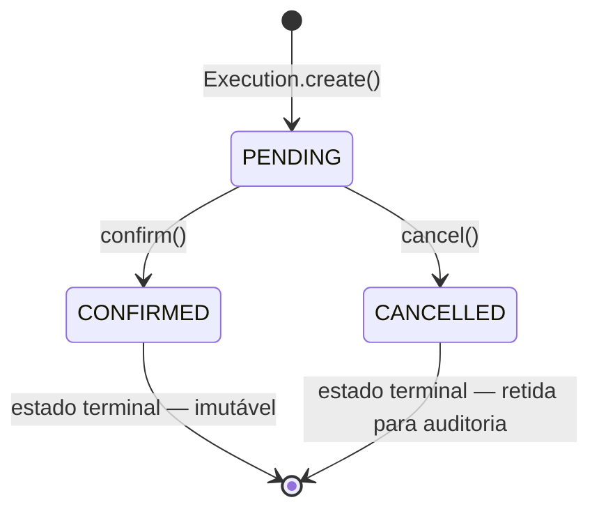
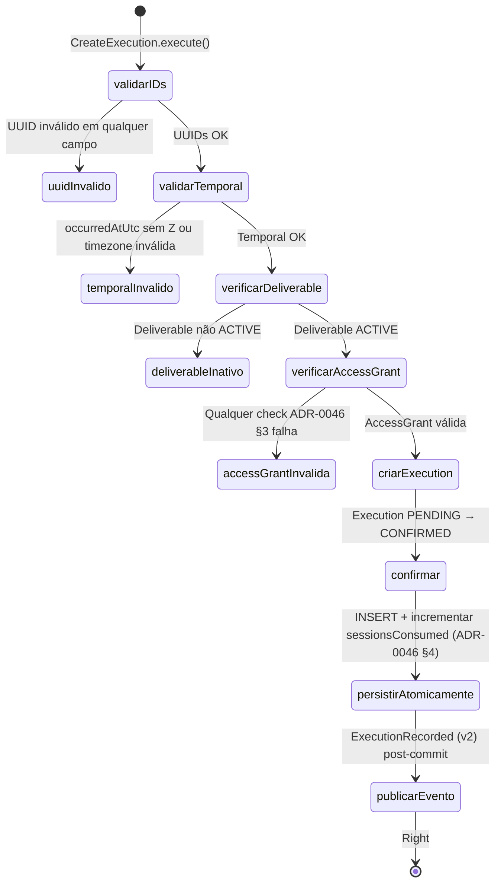

# Execution (Registro de Entrega de Serviços)

> **Contexto:** Execuções | **Atualizado em:** 2026-02-28 | **Versão ADR baseline:** ADR-0005 (CANONICAL)

O módulo de Execution é o **coração do registro histórico de entregas** do FitTrack. Uma Execution documenta o fato de que um serviço profissional (definido por um Deliverable ativo) foi efetivamente realizado para um cliente específico, em um momento específico, sob uma AccessGrant válida. Uma vez criada, uma Execution nunca é alterada nem excluída — é um fato permanente e imutável do sistema. Quando um profissional erra ao registrar uma entrega, o protocolo não é corrigir o registro original, mas criar um **registro compensatório** (`ExecutionCorrection`) que explica o erro sem tocar nos dados originais.

---

## Visão Geral

### O que este módulo faz

- Registra fatos imutáveis de entrega de serviços profissionais (`CreateExecution`)
- Verifica, antes de cada registro, que o AccessGrant é válido (5 verificações — ADR-0046 §3) e que o Deliverable está ATIVO
- Incrementa atomicamente o contador de sessões consumidas no AccessGrant junto com o INSERT da Execution — em uma única transação de banco de dados
- Publica eventos de domínio post-commit para gatilhar derivação de métricas e projeções
- Permite que profissionais adicionem correções explicativas a registros confirmados, sem alterar os dados originais (`RecordExecutionCorrection`)
- Oferece consulta individualizada por ID e listagem paginada, sempre escopados ao tenant

### O que este módulo NÃO faz

| Responsabilidade | Onde vive |
|-----------------|-----------|
| Gerenciar o AccessGrant (criar, revogar, suspender) | Módulo `billing` / `access-grants` |
| Criar e gerenciar Deliverables (prescrições) | Módulo `deliverables` |
| Derivar métricas a partir de Execuções | Módulo `metrics` (consome `ExecutionRecorded`) |
| Criar projeções de SelfLog | Módulo `self-log` (consome `ExecutionRecorded`) |
| Recomputar métricas após correção | Módulo `metrics` (consome `ExecutionCorrectionRecorded`) |
| Agendar sessões | Módulo `scheduling` |
| Autenticar e autorizar o profissional | Módulo `identity` |

### Módulos com os quais se relaciona

| Módulo | Tipo de relação | Como se comunica |
|--------|-----------------|-----------------|
| `@fittrack/core` | Usa primitivos de | Shared Kernel: `AggregateRoot`, `Either`, `UTCDateTime`, `LogicalDay`, `generateId` |
| `billing` / `access-grants` | Pré-requisito + acoplamento transacional | `IAccessGrantPort.validate()` (5 checks); `ICreateExecutionUnitOfWork` incrementa sessões atomicamente |
| `deliverables` | Pré-requisito de | `IDeliverableVerificationPort.isActive()` — verifica via API pública (ADR-0029, ADR-0001 §3) |
| `metrics` | Publica para (downstream) | Evento `ExecutionRecorded` (v2) gatilha derivação; `ExecutionCorrectionRecorded` (v1) gatilha recomputa |
| `self-log` | Publica para (downstream) | Evento `ExecutionRecorded` (v2) gatilha criação de SelfLogEntry (ADR-0010, ADR-0016) |

---

## Modelo de Domínio

### Agregados

#### Execution

Uma Execution é um **registro histórico permanente e imutável** do fato de que um serviço profissional foi entregue. Ela captura quem entregou o serviço (`professionalProfileId`), para quem (`clientId`), qual serviço (`deliverableId`), sob qual autorização (`accessGrantId`), quando (`occurredAtUtc`, `logicalDay`) e em qual fuso horário do cliente (`timezoneUsed`). É a fonte de verdade primária do sistema — nenhuma métrica, projeção ou relatório substitui ou altera uma Execution.

**Estados possíveis:**

| Estado | Descrição | Terminal? |
|--------|-----------|-----------|
| `PENDING` | Criada, ainda não confirmada. Estado inicial obrigatório. | Não |
| `CONFIRMED` | Entrega confirmada. Gatilha derivação de métricas. Pode receber correções explicativas. | Sim |
| `CANCELLED` | Cancelada antes da confirmação. Retida permanentemente para auditoria. | Sim |

**Transições de estado:**



> Na prática, o use case `CreateExecution` cria a Execution em PENDING e imediatamente chama `confirm()` antes de persistir — a Execution nunca fica em PENDING em produção. CANCELLED é usado por fluxos externos (ex: cancelamento de sessão agendada).

**Regras de invariante (ADR-0005 — CANONICAL):**

- Uma Execution, uma vez persistida, é **permanentemente imutável**: nenhum campo pode ser alterado, nenhum update pode ser executado, nenhum delete é permitido em hipótese alguma
- A Execution é **retida permanentemente**: não é excluída por chargeback, revogação de AccessGrant, encerramento de conta, status BANNED do profissional, nem por pedido de exclusão LGPD (PII pode ser anonimizado, mas a estrutura do registro permanece)
- `logicalDay` é calculado uma única vez na criação a partir de `occurredAtUtc` + `timezoneUsed` e nunca é recomputado, mesmo que o cliente mude de timezone depois (ADR-0010)
- `professionalProfileId`, `clientId`, `accessGrantId`, `deliverableId` são imutáveis após a criação e referenciados apenas por ID (ADR-0047)
- Correções são sempre **registros compensatórios** — nunca alteram os campos originais da Execution
- Apenas Executions em estado CONFIRMED podem receber correções (PENDING ainda não foi confirmada; CANCELLED nunca foi entregue)
- Nenhum evento de domínio é emitido pelo próprio agregado — eventos são responsabilidade do Use Case, disparados post-commit (ADR-0009 §1)

**Operações disponíveis:**

| Operação | O que faz | Quando pode ser chamada | Possíveis erros |
|----------|-----------|------------------------|-----------------|
| `create(props)` | Cria Execution em PENDING | Sempre (pré-condições validadas pelo use case) | — |
| `confirm()` | PENDING → CONFIRMED | Apenas de PENDING | `EXECUTION.INVALID_EXECUTION` |
| `cancel()` | PENDING → CANCELLED | Apenas de PENDING | `EXECUTION.INVALID_EXECUTION` |
| `recordCorrection(reason, correctedBy)` | Adiciona ExecutionCorrection ao histórico | Apenas em CONFIRMED | `EXECUTION.INVALID_EXECUTION`, `EXECUTION.CORRECTION_REASON_REQUIRED` |

---

### Entidades Subordinadas

#### ExecutionCorrection

Uma ExecutionCorrection é um **registro compensatório explicativo** adicionado a uma Execution quando o profissional identifica que a entrega foi registrada incorretamente. Ela **não altera nenhum campo da Execution original** — apenas documenta o erro e quem o corrigiu, com data e hora. O motivo da correção é obrigatório para garantir rastreabilidade de auditoria (ADR-0027).

Correções são append-only: uma Execution pode ter zero ou mais correções em sequência, cada uma independente. Quando uma correção é adicionada, o evento `ExecutionCorrectionRecorded` é publicado post-commit pelo use case para gatilhar recomputa de métricas no módulo de Metrics (ADR-0043).

**Campos:**

| Campo | Tipo | Descrição |
|-------|------|-----------|
| `id` | `string` (UUIDv4) | Identificador único da correção |
| `reason` | `string` | Explicação obrigatória e não vazia do erro (trimada antes de armazenar) |
| `correctedAtUtc` | `UTCDateTime` | Instante UTC em que a correção foi registrada (gerado automaticamente) |
| `correctedBy` | `string` (UUIDv4) | UUID do ator que registrou a correção (profissional ou admin) |

É um subordinado exclusivo da Execution: não é acessível por ID fora dos limites do agregado e só pode ser criado via `Execution.recordCorrection()`.

---

### Erros de Domínio

| Código | Significado | Quando ocorre |
|--------|-------------|---------------|
| `EXECUTION.INVALID_EXECUTION` | Operação inválida ou campo com valor incorreto | UUID inválido nos IDs de entrada; `occurredAtUtc` sem `Z`; timezone IANA inválida; tentativa de confirmar/cancelar Execution não-PENDING; tentativa de corrigir Execution não-CONFIRMED |
| `EXECUTION.EXECUTION_NOT_FOUND` | Execution não encontrada | ID inexistente ou pertencente a outro tenant (retorna 404 — nunca 403 — ADR-0025) |
| `EXECUTION.ACCESS_GRANT_INVALID` | AccessGrant inválida | Qualquer uma das 5 verificações de ADR-0046 §3 falhou (status não-ACTIVE, clientId divergente, professionalProfileId divergente, validUntil expirado, sessionAllotment esgotado) |
| `EXECUTION.DELIVERABLE_INACTIVE` | Deliverable não está ACTIVE | Tentativa de criar Execution referenciando um Deliverable em DRAFT, ARCHIVED ou não encontrado |
| `EXECUTION.CORRECTION_REASON_REQUIRED` | Motivo da correção ausente | `recordCorrection()` chamado com string vazia ou apenas espaços em branco |

---

## Funcionalidades e Casos de Uso

> Esta seção descreve **tudo que o sistema permite fazer** neste módulo.

### Registrar Entrega de Serviço

**O que é:** Cria um registro imutável do fato de que um serviço foi entregue a um cliente. Este é o ponto central do sistema FitTrack — toda a arquitetura financeira, de métricas e de agendamento converge aqui para garantir que cada entrega de serviço seja registrada de forma segura, auditável e permanente.

**Quem pode usar:** Profissional autenticado, após o cliente ter consumido o serviço.

**Como funciona (passo a passo):**



1. Valida todos os UUIDs de entrada: `professionalProfileId` (do JWT), `clientId`, `accessGrantId`, `deliverableId` — todos devem ser UUIDv4 válidos
2. Valida `occurredAtUtc`: deve ser ISO 8601 com sufixo `Z` (UTC puro — ADR-0010)
3. Calcula `logicalDay` a partir de `occurredAtUtc` + `timezoneUsed` (IANA) — imutável após este ponto (ADR-0010)
4. Verifica que o Deliverable está ACTIVE via `IDeliverableVerificationPort.isActive()` — consulta cross-context via API pública, nunca acessa o repositório de Deliverables diretamente (ADR-0029, ADR-0001 §3)
5. Valida o AccessGrant via `IAccessGrantPort.validate()` — executa as 5 verificações obrigatórias de ADR-0046 §3:
   1. `status === ACTIVE`
   2. `clientId` bate com o da requisição
   3. `professionalProfileId` bate com o tenant
   4. `validUntil` é nulo ou não expirou ainda
   5. `sessionAllotment` é nulo ou `sessionsConsumed < sessionAllotment`
6. Cria a Execution em PENDING e imediatamente a confirma (`PENDING → CONFIRMED`)
7. Persiste atomicamente via `ICreateExecutionUnitOfWork.commitExecution()`: INSERT da Execution + incremento de `sessionsConsumed` no AccessGrant em **uma única transação de banco de dados** — exceção documentada ao ADR-0003 §1, exigida pelo ADR-0046 §4 para evitar sobre-consumo de sessões
8. Publica `ExecutionRecorded` (v2) post-commit via `IExecutionEventPublisher`

**Regras de negócio aplicadas:**

- ✅ `professionalProfileId` deve ser UUIDv4 (sempre do JWT — ADR-0025)
- ✅ Todos os IDs de referência devem ser UUIDv4 válidos
- ✅ `occurredAtUtc` deve terminar com `Z` (UTC puro)
- ✅ `timezoneUsed` deve ser timezone IANA válida
- ✅ Deliverable deve estar em status ACTIVE no momento do registro
- ✅ AccessGrant deve passar todas as 5 verificações de ADR-0046 §3
- ✅ INSERT da Execution e incremento de sessões são atômicos (mesma transação)
- ✅ `ExecutionRecorded` é publicado somente após commit bem-sucedido
- ❌ Qualquer UUID inválido → `EXECUTION.INVALID_EXECUTION`
- ❌ `occurredAtUtc` com offset → `EXECUTION.INVALID_EXECUTION`
- ❌ Timezone inválida → `EXECUTION.INVALID_EXECUTION`
- ❌ Deliverable não-ACTIVE → `EXECUTION.DELIVERABLE_INACTIVE`
- ❌ AccessGrant inválida → `EXECUTION.ACCESS_GRANT_INVALID`

**Resultado esperado:** `CreateExecutionOutputDTO` com todos os campos da Execution, sempre com `status = "CONFIRMED"`.

**Efeitos colaterais:**
- Execution persiste permanentemente no banco de dados (nunca será excluída)
- `sessionsConsumed` no AccessGrant é incrementado na mesma transação; se o allotment for atingido, o AccessGrant pode ser transicionado para EXPIRED
- Evento `ExecutionRecorded` (v2) é publicado — downstream: Metrics (derivação de métricas), Analytics, SelfLog (projeção de entrada)

---

### Registrar Correção de Entrega

**O que é:** Registra um fato compensatório explicativo em uma Execution já confirmada. A correção **nunca altera os dados originais da Execution** — é um registro adicional append-only que documenta o erro e quem o identificou. Gatilha recomputa de métricas no módulo de Metrics.

**Caso de uso:** O profissional registrou uma entrega para o cliente A mas deveria ter sido para o cliente B. O registro original para o cliente A permanece inalterado, e uma correção é adicionada explicando o erro. O módulo de Metrics recebe o evento e recomputa as métricas afetadas.

**Quem pode usar:** Profissional autenticado, dono da Execution.

**Como funciona (passo a passo):**

1. Valida que `correctedBy` é um UUIDv4 válido (armazenado para rastreabilidade de auditoria — ADR-0027)
2. Busca a Execution por `executionId` + `professionalProfileId` — cross-tenant retorna 404, nunca 403 (ADR-0025)
3. Delega ao agregado `Execution.recordCorrection(reason, correctedBy)`:
   - Valida que o status é CONFIRMED (PENDING e CANCELLED não aceitam correções)
   - Valida que `reason` não é vazio ou whitespace-only (obrigatório por auditoria — ADR-0027)
   - Trima espaços da reason antes de armazenar
   - Cria o `ExecutionCorrection` com `correctedAtUtc = UTCDateTime.now()`
   - Adiciona ao histórico append-only da Execution
4. Persiste a Execution com a correção adicionada via `executionRepository.save()`
5. Publica `ExecutionCorrectionRecorded` (v1) post-commit

**Regras de negócio aplicadas:**

- ✅ `correctedBy` deve ser UUIDv4 válido
- ✅ Execution deve existir e pertencer ao tenant
- ✅ Execution deve estar em CONFIRMED (correções não se aplicam a PENDING ou CANCELLED)
- ✅ `reason` não pode ser vazio ou apenas espaços
- ✅ Os campos originais da Execution (professionalProfileId, clientId, deliverableId, etc.) nunca são modificados
- ❌ `correctedBy` inválido → `EXECUTION.INVALID_EXECUTION`
- ❌ Execution não encontrada ou cross-tenant → `EXECUTION.EXECUTION_NOT_FOUND`
- ❌ Execution em PENDING ou CANCELLED → `EXECUTION.INVALID_EXECUTION`
- ❌ Reason vazio ou whitespace → `EXECUTION.CORRECTION_REASON_REQUIRED`

**Resultado esperado:** `RecordExecutionCorrectionOutputDTO` com `correctionId`, `executionId`, `reason`, `correctedBy` e `correctedAtUtc`.

**Efeitos colaterais:** Evento `ExecutionCorrectionRecorded` (v1) publicado post-commit — downstream: módulo de Metrics para recomputa de métricas afetadas (ADR-0043).

---

### Consultar Entrega por ID

**O que é:** Retorna os detalhes completos de uma Execution individual, incluindo seu histórico completo de correções para rastreabilidade de auditoria.

**Quem pode usar:** Profissional autenticado, dono da Execution.

**Como funciona:**

1. Busca a Execution por `executionId` + `professionalProfileId` — cross-tenant retorna 404 (ADR-0025)
2. Retorna o DTO completo com todos os campos da Execution e o histórico completo de correções

**Regras de negócio aplicadas:**

- ✅ Execution deve existir e pertencer ao tenant
- ❌ Não encontrada ou cross-tenant → `EXECUTION.EXECUTION_NOT_FOUND`

**Resultado esperado:** `GetExecutionOutputDTO` com todos os campos da Execution + array `corrections` com o histórico completo.

**Efeitos colaterais:** Nenhum. Operação somente leitura.

---

### Listar Entregas do Profissional (Paginado)

**O que é:** Retorna uma lista paginada de todas as Executions pertencentes ao profissional autenticado, ordenadas da mais recente para a mais antiga (`occurredAtUtc` descrescente). Cada item inclui um resumo com `correctionCount` para exibição rápida sem carregar históricos completos.

**Quem pode usar:** Profissional autenticado.

**Como funciona:**

1. Consulta o repositório com `professionalProfileId` + paginação (`page`, `limit` — 1-indexed)
2. Mapeia cada Execution para um item de lista com `correctionCount` (não inclui os textos das correções — use `GetExecution` para o histórico completo)

**Regras de negócio aplicadas:**

- ✅ Resultados sempre escopados ao `professionalProfileId` do JWT (ADR-0025)
- ✅ Nenhuma Execution de outro tenant aparece na lista

**Resultado esperado:** `ListExecutionsOutputDTO` com `items`, `total`, `page`, `limit` e `hasNextPage`.

**Efeitos colaterais:** Nenhum. Operação somente leitura.

---

## Regras de Negócio Consolidadas

| # | Regra | Onde é aplicada | ADR |
|---|-------|----------------|-----|
| 1 | Uma Execution, uma vez persistida, é permanentemente imutável — sem UPDATE, sem DELETE em hipótese alguma | Repositório (apenas INSERT) | ADR-0005 CANONICAL |
| 2 | Uma Execution é retida para sempre — nenhum evento (chargeback, revogação, LGPD, banning) a exclui | Repositório | ADR-0005 §2-3 |
| 3 | Correções são registros compensatórios — nunca alteram os campos originais da Execution | `Execution.recordCorrection()` | ADR-0005 §4 |
| 4 | Apenas Executions CONFIRMED podem receber correções | `Execution.recordCorrection()` | ADR-0005 §9 |
| 5 | O motivo da correção é obrigatório e não pode ser vazio (rastreabilidade de auditoria) | `Execution.recordCorrection()` | ADR-0027 |
| 6 | AccessGrant deve passar 5 verificações antes de qualquer Execution ser criada | `CreateExecution` + `IAccessGrantPort` | ADR-0046 §3 |
| 7 | INSERT da Execution e incremento de sessionsConsumed são atômicos (mesma transação DB) | `ICreateExecutionUnitOfWork` | ADR-0046 §4 |
| 8 | Deliverable deve estar em ACTIVE no momento do registro; verificação via API pública (nunca diretamente no repo de Deliverables) | `CreateExecution` + `IDeliverableVerificationPort` | ADR-0029, ADR-0001 §3, ADR-0044 §2 |
| 9 | `occurredAtUtc` representa o instante real da entrega (caller-supplied), não o instante de gravação | `CreateExecution` | ADR-0010 §2 |
| 10 | `logicalDay` é calculado uma única vez na criação (occurredAtUtc + timezoneUsed) e nunca recomputado | `CreateExecution` | ADR-0010 §5 |
| 11 | `timezoneUsed` é o fuso horário do cliente no momento da entrega; armazenado para auditoria | Execution | ADR-0010 |
| 12 | `occurredAtUtc` deve ser ISO 8601 com sufixo `Z` (UTC puro) | `CreateExecution` | ADR-0010 |
| 13 | Acesso cross-tenant retorna 404, nunca 403 | `GetExecution`, `RecordExecutionCorrection`, `ListExecutions` | ADR-0025 §4 |
| 14 | `professionalProfileId` sempre vem do JWT — nunca do corpo da requisição | `CreateExecution` | ADR-0025 §3 |
| 15 | Todos os IDs de referência (clientId, accessGrantId, deliverableId) são UUIDv4 | `CreateExecution` | ADR-0047 |
| 16 | Eventos são publicados somente pós-commit bem-sucedido | `CreateExecution`, `RecordExecutionCorrection` | ADR-0009 §4 |
| 17 | O agregado não emite eventos — eventos são responsabilidade exclusiva do Use Case | `Execution` | ADR-0009 §1 |
| 18 | Todos os use cases retornam `DomainResult<T>` (Either) — sem throws explícitos | Todos os use cases | ADR-0051 |
| 19 | Otimistic locking via campo `version` herdado de AggregateRoot (proteção em save) | Repositório | ADR-0006 |
| 20 | Métricas derivadas de Executions nunca substituem a Execution como fonte de verdade | `metrics` (contexto consumidor) | ADR-0005 §7, ADR-0014 |

---

## Eventos de Domínio

### Eventos Publicados por este Módulo

#### ExecutionRecorded (eventVersion: 2)

Publicado por `CreateExecution` após a Execution ser persistida e o `sessionsConsumed` ser incrementado atomicamente.

**Payload:**

| Campo | Tipo | Descrição |
|-------|------|-----------|
| `executionId` | `string` | ID da Execution criada |
| `clientId` | `string` | ID do cliente que recebeu o serviço |
| `professionalProfileId` | `string` | ID do profissional (tenant) — também usado como `tenantId` do evento |
| `deliverableId` | `string` | ID do Deliverable entregue |
| `logicalDay` | `string` | Data da entrega no fuso do cliente (YYYY-MM-DD) |
| `status` | `string` | Sempre `"CONFIRMED"` no momento da emissão |
| `occurredAtUtc` | `string` | ISO 8601 UTC do instante real da entrega (adicionado na v2 — ADR-0010) |
| `timezoneUsed` | `string` | IANA timezone do cliente (adicionado na v2 — ADR-0010) |

> **Nota de schema:** v2 adicionou `occurredAtUtc` e `timezoneUsed`, necessários para que o handler de projeção SelfLog popule os campos temporais do SelfLogEntry (ADR-0010 §1). Consumidores da v1 devem ser compatíveis com os campos adicionais.

**Consumers downstream:**
- `metrics` — derivação de métricas (ADR-0043, ADR-0014)
- `self-log` — criação de SelfLogEntry projection (ADR-0016)
- Analytics / webhooks externos (ADR-0038)

---

#### ExecutionCorrectionRecorded (eventVersion: 1)

Publicado por `RecordExecutionCorrection` após a correção ser adicionada e a Execution persistida.

**Payload:**

| Campo | Tipo | Descrição |
|-------|------|-----------|
| `correctionId` | `string` | ID da ExecutionCorrection criada |
| `originalExecutionId` | `string` | ID da Execution corrigida |
| `reason` | `string` | Texto explicativo da correção (armazenado para recomputa downstream) |

**Consumers downstream:**
- `metrics` — recomputa métricas afetadas pela Execution original (ADR-0043)

---

### Eventos Consumidos por este Módulo

**Este módulo não consome eventos de domínio.** Toda a lógica de pré-condição é executada sincronicamente via ports (AccessGrant e Deliverable) durante o request.

---

## Ports (Dependências Externas)

O módulo de Execution depende de 4 ports de aplicação — interfaces que isolam a lógica de domínio das implementações de infraestrutura e de outros bounded contexts.

### IAccessGrantPort

Verifica a validade de um AccessGrant sem que o módulo de Execution precise conhecer o modelo interno do módulo de Billing. Executa as 5 verificações do ADR-0046 §3 em sequência:

```
1. status === ACTIVE
2. clientId bate com o da requisição
3. professionalProfileId bate com o tenant
4. validUntil é null ou não expirou (comparado com currentUtc)
5. sessionAllotment é null ou sessionsConsumed < sessionAllotment
```

Retorna `Right<void>` quando tudo passa. Retorna `Left<AccessGrantInvalidError>` com código `EXECUTION.ACCESS_GRANT_INVALID` na primeira falha.

---

### IDeliverableVerificationPort

Verifica se um Deliverable está em status ACTIVE, sem que o módulo de Execution acesse diretamente o repositório de Deliverables (ADR-0001 §3). A implementação de infraestrutura chama a API pública do módulo de Deliverables (ADR-0029).

Retorna `true` quando o Deliverable existe, pertence ao profissional, e está ACTIVE. Retorna `false` para DRAFT, ARCHIVED, não encontrado ou cross-tenant.

---

### ICreateExecutionUnitOfWork

A port mais crítica do módulo — implementa a **exceção documentada ao ADR-0003** (uma transação por agregado). Recebe a Execution confirmada e o `accessGrantId`, e atomicamente:

1. Abre uma transação de banco de dados
2. Insere a Execution (INSERT — nunca UPDATE)
3. Incrementa `sessionsConsumed` no AccessGrant referenciado
4. Se o allotment for atingido, transiciona o AccessGrant para EXPIRED (ADR-0046 §4)
5. Faz commit da transação

Esta atomicidade é fundamental: sem ela, uma sessão poderia ser consumida sem que a Execution fosse gravada (ou vice-versa), levando a inconsistências financeiras.

---

### IExecutionEventPublisher

Publica os dois eventos de domínio do módulo post-commit:

| Método | Evento | Quando |
|--------|--------|--------|
| `publishExecutionRecorded(event)` | `ExecutionRecorded` (v2) | Após `CreateExecution` commit bem-sucedido |
| `publishExecutionCorrectionRecorded(event)` | `ExecutionCorrectionRecorded` (v1) | Após `RecordExecutionCorrection` commit bem-sucedido |

---

## API / Interface

> Como outros sistemas (frontend, outros serviços) interagem com este módulo.

### Registrar Entrega de Serviço

- **Tipo:** REST POST
- **Caminho:** `/api/v1/executions`
- **Autenticação:** Bearer token obrigatório
- **Autorização:** Profissional autenticado; `professionalProfileId` do JWT

**Dados de entrada:**

```
professionalProfileId : string   — extraído do JWT (ADR-0025 — nunca do body)
clientId              : string   — UUIDv4 do cliente que recebeu o serviço
accessGrantId         : string   — UUIDv4 do AccessGrant que autoriza esta entrega
deliverableId         : string   — UUIDv4 do Deliverable entregue (deve estar ACTIVE)
occurredAtUtc         : string   — ISO 8601 UTC, ex: "2026-02-28T14:30:00.000Z"
timezoneUsed          : string   — IANA timezone do cliente, ex: "America/Sao_Paulo"
```

**Dados de saída (sucesso):**

```
executionId           : string   — UUIDv4 gerado
professionalProfileId : string
clientId              : string
accessGrantId         : string
deliverableId         : string
occurredAtUtc         : string   — ISO 8601 UTC (instante real da entrega)
logicalDay            : string   — YYYY-MM-DD (calculado de occurredAtUtc + timezoneUsed)
timezoneUsed          : string
createdAtUtc          : string   — ISO 8601 UTC (instante de gravação no sistema)
status                : "CONFIRMED"
```

**Possíveis erros:**

| Código HTTP | Código de erro | Quando ocorre |
|-------------|----------------|---------------|
| 400 | `EXECUTION.INVALID_EXECUTION` | Qualquer UUID inválido; `occurredAtUtc` sem `Z`; timezone IANA inválida |
| 422 | `EXECUTION.DELIVERABLE_INACTIVE` | Deliverable não está em ACTIVE |
| 422 | `EXECUTION.ACCESS_GRANT_INVALID` | AccessGrant falhou em qualquer das 5 verificações |

---

### Registrar Correção de Entrega

- **Tipo:** REST POST
- **Caminho:** `/api/v1/executions/:executionId/corrections`
- **Autenticação:** Bearer token obrigatório
- **Autorização:** Profissional autenticado, dono da Execution

**Dados de entrada:**

```
executionId           : string   — na URL
professionalProfileId : string   — extraído do JWT
reason                : string   — obrigatório; não pode ser vazio
correctedBy           : string   — UUIDv4 do ator (geralmente o próprio profissional)
```

**Dados de saída (sucesso):**

```
correctionId   : string   — UUIDv4 gerado
executionId    : string
reason         : string   — trimado
correctedBy    : string
correctedAtUtc : string   — ISO 8601 UTC (instante da correção)
```

**Possíveis erros:**

| Código HTTP | Código de erro | Quando ocorre |
|-------------|----------------|---------------|
| 400 | `EXECUTION.INVALID_EXECUTION` | `correctedBy` não é UUIDv4; Execution não está CONFIRMED |
| 400 | `EXECUTION.CORRECTION_REASON_REQUIRED` | `reason` vazio ou whitespace |
| 404 | `EXECUTION.EXECUTION_NOT_FOUND` | Execution não encontrada ou pertence a outro tenant |

---

### Consultar Entrega por ID

- **Tipo:** REST GET
- **Caminho:** `/api/v1/executions/:executionId`
- **Autenticação:** Bearer token obrigatório
- **Autorização:** Profissional autenticado, dono da Execution

**Dados de entrada:**

```
executionId           : string   — na URL
professionalProfileId : string   — extraído do JWT
```

**Dados de saída (sucesso):**

```
executionId           : string
professionalProfileId : string
clientId              : string
accessGrantId         : string
deliverableId         : string
occurredAtUtc         : string
logicalDay            : string
timezoneUsed          : string
createdAtUtc          : string
status                : string
corrections           : array
  correctionId        : string
  reason              : string
  correctedBy         : string
  correctedAtUtc      : string
```

**Possíveis erros:**

| Código HTTP | Código de erro | Quando ocorre |
|-------------|----------------|---------------|
| 404 | `EXECUTION.EXECUTION_NOT_FOUND` | Não encontrada ou pertence a outro tenant |

---

### Listar Entregas do Profissional

- **Tipo:** REST GET
- **Caminho:** `/api/v1/executions`
- **Autenticação:** Bearer token obrigatório
- **Autorização:** Profissional autenticado

**Dados de entrada:**

```
professionalProfileId : string   — extraído do JWT
page                  : number   — 1-indexed, mín: 1
limit                 : number   — tamanho máximo da página, mín: 1
```

**Dados de saída (sucesso):**

```
items           : array
  executionId   : string
  clientId      : string
  deliverableId : string
  occurredAtUtc : string
  logicalDay    : string
  timezoneUsed  : string
  status        : string
  correctionCount : number   — quantidade de correções (sem os textos)
total           : number   — total de Executions no tenant
page            : number   — página atual
limit           : number   — tamanho da página
hasNextPage     : boolean
```

---

## Infraestrutura e Persistência

### Dados armazenados

| Tabela/Coleção | O que armazena | Restrições |
|----------------|----------------|------------|
| `executions` | Aggregate root `Execution` | **Apenas INSERT** — UPDATE e DELETE são proibidos na camada de infraestrutura (ADR-0005) |
| `execution_corrections` | Entidades `ExecutionCorrection` subordinadas | **Apenas INSERT** — correções são append-only |

**Campos da tabela `executions`:** `id`, `professionalProfileId`, `clientId`, `accessGrantId`, `deliverableId`, `occurredAtUtc`, `logicalDay`, `timezoneUsed`, `createdAtUtc`, `status`, `version` (otimistic lock).

### Integrações externas relevantes

| Integração | Via | Quando |
|------------|-----|--------|
| AccessGrant (Billing context) | `IAccessGrantPort` + `ICreateExecutionUnitOfWork` | Toda criação de Execution |
| Deliverables context | `IDeliverableVerificationPort` | Toda criação de Execution |
| Metrics context | Evento `ExecutionRecorded` | Post-commit de CreateExecution |
| Metrics context | Evento `ExecutionCorrectionRecorded` | Post-commit de RecordExecutionCorrection |
| SelfLog context | Evento `ExecutionRecorded` | Post-commit de CreateExecution |

---

## Conformidade com ADRs

| ADR | Status | Observações |
|-----|--------|-------------|
| ADR-0005 CANONICAL (Imutabilidade de Execuções) | ✅ Conforme | Repositório expõe apenas INSERT; `recordCorrection()` é append-only; Execution retida para sempre |
| ADR-0003 (Transação por agregado) | ✅ Conforme — com exceção documentada | `ICreateExecutionUnitOfWork` implementa a exceção documentada de ADR-0046 §4: INSERT de Execution + incremento de sessões na mesma transação |
| ADR-0006 (Controle de concorrência) | ✅ Conforme | Campo `version` herdado de `AggregateRoot`; gerenciado pelo repositório |
| ADR-0009 (Contrato de eventos de domínio) | ✅ Conforme | Agregado não emite eventos; Use Cases publicam post-commit; dois eventos com schema versionado |
| ADR-0010 (Política temporal canônica) | ✅ Conforme | `logicalDay` calculado via `LogicalDay.fromDate(occurredAtUtc, timezone)`; `occurredAtUtc` validado via `UTCDateTime.fromISO()` |
| ADR-0016 (Consistência eventual) | ✅ Conforme | Metrics e SelfLog são atualizados de forma eventual via eventos pós-commit |
| ADR-0025 (Multi-tenancy e isolamento de dados) | ✅ Conforme | Repositório usa `findByIdAndProfessionalProfileId`; ListExecutions usa `findManyByProfessionalProfileId`; cross-tenant = 404 |
| ADR-0027 (Auditoria e rastreabilidade) | ✅ Conforme | `correctedBy` armazenado como UUIDv4; `reason` obrigatória; `correctedAtUtc` sistema-atribuído |
| ADR-0029 (API pública vs interna) | ✅ Conforme | Verifica Deliverable via `IDeliverableVerificationPort` (API pública), nunca acessa repo de Deliverables diretamente |
| ADR-0046 §3 (Verificação de AccessGrant) | ✅ Conforme | `IAccessGrantPort.validate()` executa todas as 5 verificações obrigatórias |
| ADR-0046 §4 (Atomicidade de consumo de sessões) | ✅ Conforme | `ICreateExecutionUnitOfWork` garante INSERT + incremento na mesma transação |
| ADR-0047 (Definição canônica de Aggregate Root) | ✅ Conforme | `ExecutionCorrection` é subordinado exclusivo; todas as referências cross-aggregate por ID string |
| ADR-0051 (DomainResult\<T\>) | ✅ Conforme | Todos os use cases retornam `DomainResult<T>`; nenhum throw explícito na camada de aplicação |

---

## Gaps e Melhorias Identificadas

| # | Tipo | Descrição | Prioridade |
|---|------|-----------|------------|
| 1 | 🔵 Informativo | O use case `CreateExecution` cria a Execution em PENDING e imediatamente a confirma antes de persistir. O status PENDING nunca é observado em produção para Executions criadas por este use case. O status CANCELLED é suportado pelo domínio para uso por fluxos de cancelamento externos (ex: cancelamento de sessão agendada), mas nenhum use case `CancelExecution` existe no módulo atualmente. | Baixa |
| 2 | 🔵 Informativo | `ExecutionRecorded` está na versão 2 — o schema da v1 não incluía `occurredAtUtc` e `timezoneUsed`. Consumidores legados da v1 devem ser verificados para garantir compatibilidade com os campos adicionais. A documentação de migração de v1→v2 está no comentário do evento (`execution-recorded-event.ts`). | Média |
| 3 | 🔵 Informativo | A listagem (`ListExecutions`) inclui `correctionCount` mas não os textos das correções. Para exibir o histórico completo, é necessário chamar `GetExecution`. Este é o design intencional (eficiência de listas vs detalhe), mas deve ser documentado para o frontend que precisa exibir correções na listagem. | Baixa |

---

## Histórico de Atualizações

| Data | O que mudou |
|------|-------------|
| 2026-02-28 | Documentação inicial gerada (pós adr-check com fixes aplicados) — 63 testes cobertos |
