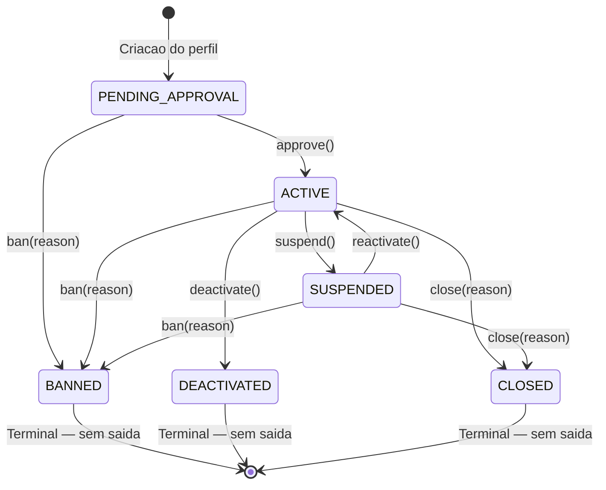
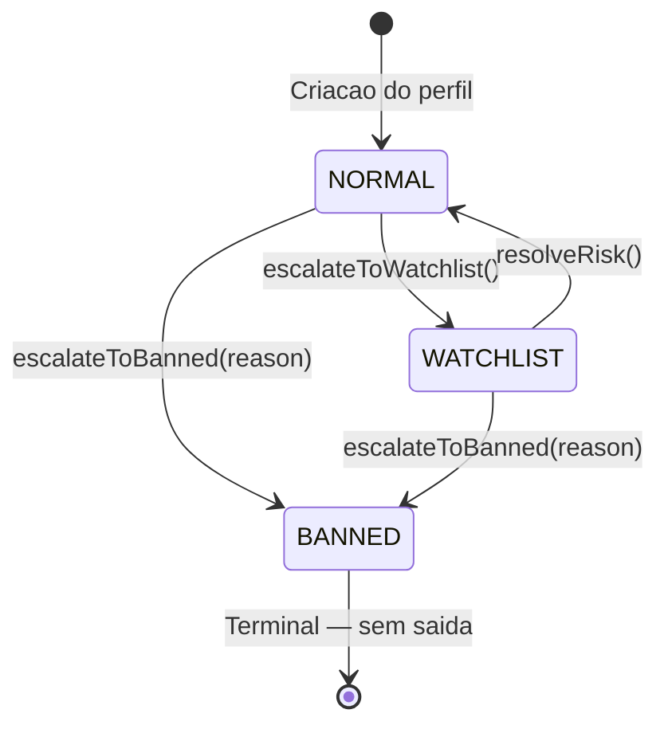

> Ultima atualizacao: 2026-02-28 — Revisao pos adr-check: sem alteracoes estruturais; documentacao confirmada conforme com o estado atual do codigo.

# Identity — Identidade e Perfil Profissional

> **Contexto:** Identity | **Atualizado em:** 2026-02-28 | **Versao ADR baseline:** ADR-0051

O modulo Identity e responsavel por gerenciar a identidade de todos os atores da plataforma:
usuarios (clientes, profissionais e administradores) e perfis profissionais. Ele controla o
ciclo de vida completo do perfil profissional — desde a criacao ate o banimento ou encerramento
— e e o guardiao da maquina de estados de risco (`RiskStatus`) que determina se um profissional
pode operar na plataforma.

---

## Visao Geral

### O que este modulo faz

O Identity gerencia **quem pode existir e operar** na plataforma FitTrack. Ele:

- Cria e armazena usuarios com seus dados basicos (nome, e-mail, papel/role)
- Cria perfis profissionais vinculados a usuarios com papel PROFESSIONAL
- Controla a maquina de estados do perfil profissional (aprovacao, suspensao, reativacao, banimento, desativacao, encerramento)
- Governa o `RiskStatus` do profissional (NORMAL, WATCHLIST, BANNED) que determina o nivel de acesso operacional
- Publica eventos de dominio pos-commit via `IIdentityEventPublisher` para cada transicao de estado
- Fornece consultas de estado (`isOperational`, `canAcceptNewSales`, `isBanned`) usadas por outros modulos

### O que este modulo NAO faz

| Responsabilidade | Onde vive |
| --- | --- |
| Autenticacao (login, tokens JWT, sessoes) | Camada de infraestrutura / Auth (ADR-0023) — ainda nao implementada neste pacote |
| Autorizacao (politicas de acesso) | Application layer dos respectivos modulos (ADR-0024) |
| Vinculo profissional-cliente (`ProfessionalClientLink`) | Contexto UserProfile (ADR-0001) |
| Gestao de planos e assinaturas (`ServicePlan`) | Contexto Billing / ServicePlan |
| Registro de execucoes e agendamentos | Contextos Execution e Scheduling |
| Transicoes de RiskStatus (escalateToWatchlist, resolveRisk) | Contexto Risk — possui seus proprios use cases em `packages/risk/` |

### Modulos com os quais se relaciona

| Modulo | Tipo de relacao | Como se comunica |
| --- | --- | --- |
| **Risk** | Consome eventos de risco | Evento: `RiskStatusChanged` (v2) — atualiza riskStatus |
| **Billing** | Publica eventos para | Eventos: `ProfessionalProfileBanned`, `ProfessionalProfileSuspended` — Billing suspende planos |
| **Scheduling** | Publica eventos para | Eventos: `ProfessionalProfileBanned`, `ProfessionalProfileSuspended` — Scheduling bloqueia agendamentos |
| **Execution** | Publica eventos para | Evento: `ProfessionalProfileBanned` — Execution bloqueia novos registros |
| **Audit** | Publica eventos para | Todas as transicoes de estado geram entradas no AuditLog |

---

## Modelo de Dominio

### Agregados

#### User

O `User` representa a identidade autenticada de qualquer ator na plataforma. Todo usuario tem um papel imutavel (CLIENT, PROFESSIONAL ou ADMIN) definido no momento do cadastro.

**Propriedades:**

| Campo | Tipo | Descricao |
| --- | --- | --- |
| `id` | string (UUIDv4) | Identificador unico, imutavel |
| `name` | PersonName | Nome completo (2–120 caracteres) |
| `email` | Email | E-mail unico na plataforma, normalizado em minusculas |
| `role` | UserRole | Papel: CLIENT, PROFESSIONAL ou ADMIN — imutavel apos criacao (ADR-0023 §4) |
| `createdAtUtc` | UTCDateTime | Data/hora de criacao em UTC |

**Regras de invariante:**

- O papel (role) e definido na criacao e **nunca pode ser alterado** — isso garante que nenhum ator consiga escalar seus proprios privilegios
- O e-mail e unico em toda a plataforma — impede cadastros duplicados
- Nome e e-mail sao dados pessoais (Categoria C / LGPD) — sujeitos a anonimizacao, mas o registro estrutural e retido para integridade referencial com Executions, Transactions e AuditLog
- O User **nao** referencia diretamente o ProfessionalProfile — a relacao e feita pelo campo `ProfessionalProfile.userId` (ADR-0047 §5: referencias entre agregados apenas por ID)

**Operacoes disponiveis:**

| Operacao | O que faz | Quando pode ser chamada | Possiveis erros |
| --- | --- | --- | --- |
| `User.create()` | Cria um novo usuario | Sempre (validacao de email e nome) | `IDENTITY.INVALID_EMAIL`, `IDENTITY.INVALID_PERSON_NAME` |
| `User.reconstitute()` | Rehidrata a partir da persistencia | Uso interno do repositorio | — |

---

#### ProfessionalProfile

O `ProfessionalProfile` e o agregado central do modulo. Representa a identidade operacional de um profissional de fitness na plataforma. Controla duas maquinas de estado independentes: o **status do perfil** (ciclo de vida) e o **RiskStatus** (governanca de risco financeiro).

**Propriedades:**

| Campo | Tipo | Descricao |
| --- | --- | --- |
| `id` | string (UUIDv4) | Identificador unico, imutavel |
| `userId` | string (UUIDv4) | Referencia ao User (por ID, nao por objeto — ADR-0047) |
| `displayName` | PersonName | Nome de exibicao (2–120 caracteres) |
| `status` | ProfessionalProfileStatus | Estado atual do ciclo de vida |
| `riskStatus` | RiskStatus | Classificacao de risco atual |
| `createdAtUtc` | UTCDateTime | Data/hora de criacao |
| `bannedAtUtc` | UTCDateTime \| null | Data/hora do banimento (se aplicavel) |
| `bannedReason` | string \| null | Motivo do banimento |
| `deactivatedAtUtc` | UTCDateTime \| null | Data/hora da desativacao voluntaria |
| `closedAtUtc` | UTCDateTime \| null | Data/hora do encerramento formal |
| `closedReason` | string \| null | Motivo do encerramento |
| `suspendedAtUtc` | UTCDateTime \| null | Data/hora da suspensao |

##### Maquina de Estados — Status do Perfil (ADR-0008 §5)

| Estado | Descricao | Terminal? |
| --- | --- | --- |
| `PENDING_APPROVAL` | Perfil criado, aguardando aprovacao da plataforma. Nao pode operar. | Nao |
| `ACTIVE` | Aprovado e operacional. Pode aceitar vendas, criar agendamentos e registrar execucoes. | Nao |
| `SUSPENDED` | Temporariamente suspenso. Nao pode aceitar novos agendamentos, mas dados historicos permanecem. | Nao |
| `BANNED` | Permanentemente banido. Todas as operacoes bloqueadas. **Irreversivel.** | **Sim** |
| `DEACTIVATED` | Desativacao voluntaria pelo profissional. Dados historicos retidos. | **Sim** |
| `CLOSED` | Encerramento formal (administrativo, expiracao de trial ou iniciativa do sistema). | **Sim** |

**Transicoes de estado:**



##### Maquina de Estados — RiskStatus (ADR-0022 §2)

| Estado | Descricao | Terminal? |
| --- | --- | --- |
| `NORMAL` | Sem indicadores de risco. Acesso total a plataforma. | Nao |
| `WATCHLIST` | Indicadores de risco presentes. Monitoramento ativo, restricoes operacionais. | Nao |
| `BANNED` | Violacao confirmada. Suspensao permanente e irreversivel. | **Sim** |

**Transicoes de risco:**



> **Nota:** As transicoes de RiskStatus (`escalateToWatchlist`, `escalateToBanned`, `resolveRisk`) sao orquestradas pelo contexto **Risk** (`packages/risk/`), nao pelo Identity. O Identity apenas hospeda a maquina de estados no agregado `ProfessionalProfile`.

**Regras de invariante:**

1. **BANNED e terminal e irreversivel** — uma vez banido, o profissional nunca retorna a NORMAL ou WATCHLIST. Isso existe para proteger clientes e a integridade financeira da plataforma (ADR-0022)
2. **Banimento forca riskStatus para BANNED** — se o perfil e banido via `ban()`, o riskStatus e automaticamente ajustado para BANNED, garantindo consistencia entre as duas maquinas de estado
3. **Encerramento e desativacao NAO revogam AccessGrants** — clientes que ja compraram acesso mantem seus direitos ate a expiracao natural (ADR-0008, ADR-0013)
4. **Mudancas de riskStatus nunca alteram dados historicos** — Executions e Transactions existentes sao permanentes e intocaveis (ADR-0022 §6)
5. **resolveRisk() nao altera o status do perfil** — um perfil SUSPENDED com risco resolvido continua SUSPENDED; a resolucao de risco e independente do ciclo de vida

**Operacoes disponiveis:**

| Operacao | O que faz | Pre-condicoes | Possiveis erros |
| --- | --- | --- | --- |
| `ProfessionalProfile.create()` | Cria perfil em PENDING_APPROVAL + NORMAL | userId e displayName validos | — |
| `approve()` | PENDING_APPROVAL → ACTIVE | status = PENDING_APPROVAL | `IDENTITY.INVALID_PROFILE_TRANSITION` |
| `suspend()` | ACTIVE → SUSPENDED | status = ACTIVE | `IDENTITY.INVALID_PROFILE_TRANSITION` |
| `reactivate()` | SUSPENDED → ACTIVE | status = SUSPENDED | `IDENTITY.INVALID_PROFILE_TRANSITION` |
| `ban(reason)` | → BANNED (de PENDING, ACTIVE ou SUSPENDED) | status ∈ {PENDING, ACTIVE, SUSPENDED} | `IDENTITY.INVALID_PROFILE_TRANSITION` |
| `deactivate()` | ACTIVE → DEACTIVATED | status = ACTIVE | `IDENTITY.INVALID_PROFILE_TRANSITION` |
| `close(reason)` | → CLOSED (de ACTIVE ou SUSPENDED) | status ∈ {ACTIVE, SUSPENDED} | `IDENTITY.INVALID_PROFILE_TRANSITION` |
| `escalateToWatchlist()` | NORMAL → WATCHLIST | riskStatus = NORMAL | `IDENTITY.INVALID_RISK_STATUS_TRANSITION` |
| `escalateToBanned(reason)` | → BANNED (risco e perfil) | riskStatus ≠ BANNED | `IDENTITY.INVALID_RISK_STATUS_TRANSITION` |
| `resolveRisk()` | WATCHLIST → NORMAL | riskStatus = WATCHLIST | `IDENTITY.INVALID_RISK_STATUS_TRANSITION` |
| `isOperational()` | Retorna true se ACTIVE e risco ≠ BANNED | Consulta — sempre disponivel | — |
| `canAcceptNewSales()` | Retorna true se ACTIVE e NORMAL | Consulta — sempre disponivel | — |
| `isBanned()` | Retorna true se status = BANNED | Consulta — sempre disponivel | — |
| `isClosed()` | Retorna true se status = CLOSED | Consulta — sempre disponivel | — |

---

### Value Objects

| Value Object | O que representa | Regras de validacao |
| --- | --- | --- |
| `Email` | Endereco de e-mail do usuario | Validacao RFC-5321 (regex); normalizado para minusculas; espacos removidos; Categoria C (PII/LGPD) |
| `PersonName` | Nome de pessoa (usuario ou profissional) | 2 a 120 caracteres; espacos nas extremidades removidos; Categoria C (PII/LGPD) |

---

### Enums

| Enum | Valores | Descricao |
| --- | --- | --- |
| `UserRole` | `CLIENT`, `PROFESSIONAL`, `ADMIN` | Papel do usuario — imutavel apos criacao (ADR-0023 §4) |
| `ProfessionalProfileStatus` | `PENDING_APPROVAL`, `ACTIVE`, `SUSPENDED`, `BANNED`, `DEACTIVATED`, `CLOSED` | Estados do ciclo de vida do perfil profissional (ADR-0008 §5) |
| `RiskStatus` | `NORMAL`, `WATCHLIST`, `BANNED` | Classificacao de risco financeiro e operacional (ADR-0022) |

---

### Erros de Dominio

| Codigo | Significado | Quando ocorre |
| --- | --- | --- |
| `IDENTITY.INVALID_EMAIL` | E-mail com formato invalido | Tentativa de criar Email com string que nao atende RFC-5321 |
| `IDENTITY.INVALID_PERSON_NAME` | Nome fora dos limites | Nome vazio, menor que 2 caracteres ou maior que 120 |
| `IDENTITY.INVALID_PROFILE_TRANSITION` | Transicao de estado invalida | Tentativa de transicao nao permitida pela maquina de estados (ex: BANNED → ACTIVE) |
| `IDENTITY.INVALID_RISK_STATUS_TRANSITION` | Transicao de risco invalida | Tentativa de transicao de risco nao permitida (ex: BANNED → NORMAL) |
| `IDENTITY.PROFESSIONAL_PROFILE_NOT_FOUND` | Perfil profissional nao encontrado | Busca por ID que nao existe ou pertence a outro tenant (retorna 404, nunca 403 — ADR-0025) |
| `IDENTITY.USER_NOT_FOUND` | Usuario nao encontrado | Busca por ID de usuario inexistente |
| `IDENTITY.INVALID_ROLE` | Papel invalido | Tentativa de criar usuario com role que nao existe no enum UserRole |
| `IDENTITY.EMAIL_ALREADY_IN_USE` | E-mail ja cadastrado | Tentativa de criar usuario com e-mail que ja pertence a outro usuario |
| `IDENTITY.USER_ALREADY_HAS_PROFILE` | Usuario ja tem perfil | Tentativa de criar segundo ProfessionalProfile para um mesmo userId |

---

## Funcionalidades e Casos de Uso

### 1. Criar Usuario (`CreateUser`)

**O que e:** Registra um novo ator na plataforma (cliente, profissional ou administrador) com seus dados basicos de identidade.

**Quem pode usar:** Sistema (durante fluxo de cadastro)

**Como funciona (passo a passo):**

1. Valida o formato do e-mail (RFC-5321) e cria o value object `Email`
2. Valida o nome (2–120 caracteres) e cria o value object `PersonName`
3. Verifica se o role informado e valido (CLIENT, PROFESSIONAL ou ADMIN)
4. Consulta o repositorio para garantir que o e-mail nao esta em uso
5. Cria o agregado `User` com ID gerado (UUIDv4) e timestamp UTC
6. Persiste no repositorio
7. Retorna o DTO de saida com id, nome, email, role e createdAtUtc

**Regras de negocio aplicadas:**

- ✅ E-mail deve ter formato valido
- ✅ Nome deve ter entre 2 e 120 caracteres
- ✅ Role deve ser CLIENT, PROFESSIONAL ou ADMIN
- ✅ E-mail deve ser unico na plataforma
- ❌ E-mail invalido → `IDENTITY.INVALID_EMAIL`
- ❌ Nome invalido → `IDENTITY.INVALID_PERSON_NAME`
- ❌ Role inexistente → `IDENTITY.INVALID_ROLE`
- ❌ E-mail duplicado → `IDENTITY.EMAIL_ALREADY_IN_USE`

**Resultado esperado:** DTO com `{ id, name, email, role, createdAtUtc }`

**Efeitos colaterais:** Nenhum evento de dominio e publicado (ADR-0009: `UserCreated` e explicitamente proibido como evento generico).

---

### 2. Criar Perfil Profissional (`CreateProfessionalProfile`)

**O que e:** Cria o perfil operacional de um profissional de fitness, vinculado a um User existente. O perfil nasce em estado PENDING_APPROVAL com risco NORMAL.

**Quem pode usar:** Sistema (durante fluxo de onboarding de profissional)

**Como funciona (passo a passo):**

1. Valida o formato do UUID do userId
2. Valida o displayName (2–120 caracteres)
3. Verifica se o User existe no repositorio
4. Verifica se o User ja nao possui um ProfessionalProfile
5. Cria o agregado `ProfessionalProfile` em PENDING_APPROVAL + NORMAL
6. Persiste no repositorio
7. Retorna o DTO de saida

**Regras de negocio aplicadas:**

- ✅ userId deve ser UUID valido
- ✅ displayName deve ter entre 2 e 120 caracteres
- ✅ User referenciado deve existir
- ✅ User nao pode ter mais de um perfil profissional
- ❌ UUID invalido → erro de validacao do core
- ❌ Nome invalido → `IDENTITY.INVALID_PERSON_NAME`
- ❌ User nao encontrado → `IDENTITY.USER_NOT_FOUND`
- ❌ User ja tem perfil → `IDENTITY.USER_ALREADY_HAS_PROFILE`

**Resultado esperado:** DTO com `{ id, userId, displayName, status: "PENDING_APPROVAL", riskStatus: "NORMAL", createdAtUtc }`

**Efeitos colaterais:** Nenhum evento publicado (ADR-0009: `ProfessionalProfileCreated` e proibido como evento generico).

---

### 3. Aprovar Perfil Profissional (`ApproveProfessionalProfile`)

**O que e:** Aprova um perfil profissional pendente, permitindo que o profissional comece a operar na plataforma.

**Quem pode usar:** Admin (revisao de cadastro)

**Como funciona (passo a passo):**

1. Valida o formato do UUID do professionalProfileId
2. Busca o perfil no repositorio
3. Chama `profile.approve()` no agregado
4. A maquina de estados valida: apenas PENDING_APPROVAL → ACTIVE e permitido
5. Persiste no repositorio
6. Publica evento `ProfessionalProfileApproved` via `IIdentityEventPublisher`
7. Retorna o DTO de saida

**Regras de negocio aplicadas:**

- ✅ Perfil deve existir
- ✅ Perfil deve estar em PENDING_APPROVAL
- ❌ Perfil nao encontrado → `IDENTITY.PROFESSIONAL_PROFILE_NOT_FOUND`
- ❌ Transicao invalida (ex: ja ACTIVE) → `IDENTITY.INVALID_PROFILE_TRANSITION`

**Resultado esperado:** DTO com `{ profileId, status: "ACTIVE" }`

**Efeitos colaterais:** Evento `ProfessionalProfileApproved` publicado pos-commit. Billing habilita planos; Notification envia boas-vindas.

---

### 4. Suspender Perfil Profissional (`SuspendProfessionalProfile`)

**O que e:** Suspende temporariamente um profissional ativo. Enquanto suspenso, nao pode aceitar novos agendamentos.

**Quem pode usar:** Admin ou Sistema (por violacao de termos)

**Como funciona (passo a passo):**

1. Valida o formato do UUID do professionalProfileId
2. Busca o perfil no repositorio
3. Chama `profile.suspend()` no agregado
4. A maquina de estados valida: apenas ACTIVE → SUSPENDED e permitido
5. Registra suspendedAtUtc
6. Persiste no repositorio
7. Publica evento `ProfessionalProfileSuspended` via `IIdentityEventPublisher`
8. Retorna o DTO de saida

**Regras de negocio aplicadas:**

- ✅ Perfil deve existir
- ✅ Perfil deve estar ACTIVE
- ❌ Perfil nao encontrado → `IDENTITY.PROFESSIONAL_PROFILE_NOT_FOUND`
- ❌ Transicao invalida → `IDENTITY.INVALID_PROFILE_TRANSITION`

**Resultado esperado:** DTO com `{ profileId, status: "SUSPENDED", suspendedAtUtc }`

**Efeitos colaterais:** Evento `ProfessionalProfileSuspended` publicado pos-commit. Scheduling bloqueia novos agendamentos.

---

### 5. Reativar Perfil Profissional (`ReactivateProfessionalProfile`)

**O que e:** Reativa um profissional previamente suspenso, permitindo que retome operacoes.

**Quem pode usar:** Admin (apos revisao)

**Como funciona (passo a passo):**

1. Valida o formato do UUID do professionalProfileId
2. Busca o perfil no repositorio
3. Chama `profile.reactivate()` no agregado
4. A maquina de estados valida: apenas SUSPENDED → ACTIVE e permitido
5. Limpa o suspendedAtUtc
6. Persiste no repositorio
7. Publica evento `ProfessionalProfileReactivated` via `IIdentityEventPublisher`
8. Retorna o DTO de saida

**Regras de negocio aplicadas:**

- ✅ Perfil deve existir
- ✅ Perfil deve estar SUSPENDED
- ❌ Perfil nao encontrado → `IDENTITY.PROFESSIONAL_PROFILE_NOT_FOUND`
- ❌ Transicao invalida → `IDENTITY.INVALID_PROFILE_TRANSITION`

**Resultado esperado:** DTO com `{ profileId, status: "ACTIVE" }`

**Efeitos colaterais:** Evento `ProfessionalProfileReactivated` publicado pos-commit. Scheduling reabilita agendamentos.

---

### 6. Banir Perfil Profissional (`BanProfessionalProfile`)

**O que e:** Aplica banimento permanente a um profissional. Esta e a acao mais severa da plataforma — e terminal e irreversivel. Bloqueia todas as operacoes do profissional.

**Quem pode usar:** Admin (via contexto Risk ou acao administrativa direta)

**Como funciona (passo a passo):**

1. Valida o formato do UUID do professionalProfileId
2. Busca o perfil no repositorio
3. Captura o `previousStatus` antes da transicao
4. Chama `profile.ban(reason)` no agregado
5. A maquina de estados valida se a transicao e permitida (PENDING_APPROVAL, ACTIVE ou SUSPENDED → BANNED)
6. Se o riskStatus nao for BANNED, e forcado para BANNED automaticamente
7. Registra bannedAtUtc e bannedReason
8. Persiste no repositorio
9. Publica evento `ProfessionalProfileBanned` via `IIdentityEventPublisher`
10. Retorna o DTO de saida

**Regras de negocio aplicadas:**

- ✅ Perfil deve existir
- ✅ Perfil deve estar em estado que permita banimento (nao pode estar BANNED, DEACTIVATED ou CLOSED)
- ✅ Motivo (reason) e obrigatorio
- ❌ Perfil nao encontrado → `IDENTITY.PROFESSIONAL_PROFILE_NOT_FOUND`
- ❌ Transicao invalida (ex: ja BANNED) → `IDENTITY.INVALID_PROFILE_TRANSITION`

**Resultado esperado:** DTO com `{ profileId, status: "BANNED", riskStatus: "BANNED", bannedAtUtc }`

**Efeitos colaterais:**
- Evento `ProfessionalProfileBanned` publicado pos-commit com `{ reason, previousStatus }`
- Downstream: Billing suspende planos, Scheduling bloqueia agendamentos, Auth invalida todas as sessoes (ADR-0023)
- **Dados historicos (Executions, Transactions) sao permanentemente retidos** — nunca apagados

---

### 7. Desativar Perfil Profissional (`DeactivateProfessionalProfile`)

**O que e:** Permite que um profissional desative voluntariamente seu perfil. E uma decisao do proprio profissional, diferente do banimento (punitivo) e do encerramento formal (administrativo).

**Quem pode usar:** Profissional autenticado (sobre seu proprio perfil)

**Como funciona (passo a passo):**

1. Valida o formato do UUID do professionalProfileId
2. Busca o perfil no repositorio
3. Captura o `previousRiskStatus` antes da transicao
4. Chama `profile.deactivate()` no agregado
5. A maquina de estados valida: apenas ACTIVE → DEACTIVATED e permitido
6. Registra deactivatedAtUtc
7. Persiste no repositorio
8. Publica evento `ProfessionalProfileDeactivated` via `IIdentityEventPublisher`
9. Retorna o DTO de saida

**Regras de negocio aplicadas:**

- ✅ Perfil deve existir
- ✅ Perfil deve estar ACTIVE (nao pode desativar se SUSPENDED, PENDING, etc.)
- ✅ **AccessGrants existentes NAO sao revogados** — clientes mantem acesso ate expiracao natural
- ❌ Perfil nao encontrado → `IDENTITY.PROFESSIONAL_PROFILE_NOT_FOUND`
- ❌ Transicao invalida → `IDENTITY.INVALID_PROFILE_TRANSITION`

**Resultado esperado:** DTO com `{ profileId, status: "DEACTIVATED", deactivatedAtUtc }`

**Efeitos colaterais:**
- Evento `ProfessionalProfileDeactivated` publicado pos-commit com `{ previousRiskStatus }`
- AccessGrants **nao** sao revogados (invariante do projeto)

---

### 8. Encerrar Perfil Profissional (`CloseProfessionalProfile`)

**O que e:** Encerramento formal de um perfil profissional por motivo administrativo, expiracao de trial ou iniciativa do sistema. Distinto da desativacao (voluntaria pelo profissional) e do banimento (punitivo).

**Quem pode usar:** Admin ou Sistema

**Como funciona (passo a passo):**

1. Valida o formato do UUID do professionalProfileId
2. Busca o perfil no repositorio
3. Captura `previousStatus` e `previousRiskStatus` antes da transicao
4. Chama `profile.close(reason)` no agregado
5. A maquina de estados valida: ACTIVE ou SUSPENDED → CLOSED
6. Registra closedAtUtc e closedReason
7. Persiste no repositorio
8. Publica evento `ProfessionalProfileClosed` via `IIdentityEventPublisher`
9. Retorna o DTO de saida

**Regras de negocio aplicadas:**

- ✅ Perfil deve existir
- ✅ Perfil deve estar ACTIVE ou SUSPENDED
- ✅ Motivo (reason) e obrigatorio
- ✅ **AccessGrants existentes NAO sao revogados** (ADR-0013 Extension)
- ❌ Perfil nao encontrado → `IDENTITY.PROFESSIONAL_PROFILE_NOT_FOUND`
- ❌ Transicao invalida (ex: PENDING, BANNED, DEACTIVATED, ja CLOSED) → `IDENTITY.INVALID_PROFILE_TRANSITION`

**Resultado esperado:** DTO com `{ profileId, status: "CLOSED", closedAtUtc, closedReason }`

**Efeitos colaterais:**
- Evento `ProfessionalProfileClosed` publicado pos-commit com `{ previousStatus, previousRiskStatus, reason }`
- AccessGrants **nao** sao revogados (invariante do projeto)

---

## Regras de Negocio Consolidadas

| # | Regra | Onde e aplicada | ADR |
| --- | --- | --- | --- |
| 1 | BANNED e terminal e irreversivel — nenhuma transicao de saida e permitida | Agregado `ProfessionalProfile` | ADR-0022 |
| 2 | O papel (role) do usuario e imutavel apos criacao | Agregado `User` | ADR-0023 §4 |
| 3 | E-mail e unico em toda a plataforma | Use Case `CreateUser` | ADR-0000 |
| 4 | Um User so pode ter um ProfessionalProfile | Use Case `CreateProfessionalProfile` | ADR-0047 |
| 5 | Banimento forca riskStatus para BANNED automaticamente | Agregado `ProfessionalProfile.ban()` | ADR-0022 |
| 6 | Desativacao/encerramento NAO revogam AccessGrants | Agregado `ProfessionalProfile` | ADR-0008, ADR-0013 |
| 7 | Mudancas de riskStatus nunca alteram dados historicos | Regra global (Risk + Identity) | ADR-0022 §6 |
| 8 | resolveRisk() nao altera o status do perfil | Agregado `ProfessionalProfile` | ADR-0022 §2 |
| 9 | Referencias entre agregados apenas por ID | Agregados `User`, `ProfessionalProfile` | ADR-0047 §5 |
| 10 | Nome e e-mail sao PII (Categoria C / LGPD) — sujeitos a anonimizacao | Value Objects `Email`, `PersonName` | ADR-0037 |
| 11 | Registro estrutural do User e retido mesmo apos anonimizacao (integridade referencial) | Agregado `User` | ADR-0013, ADR-0037 |
| 12 | Profissional em WATCHLIST tem restricoes operacionais | Metodo `canAcceptNewSales()` | ADR-0022 §3 |
| 13 | Nenhum evento generico de criacao (UserCreated, ProfileCreated) e publicado | Use Cases de criacao | ADR-0009 |
| 14 | Todos os eventos de lifecycle sao publicados pos-commit pelo Use Case via IIdentityEventPublisher | Use Cases de transicao | ADR-0009 §4 |

---

## Eventos de Dominio

### Eventos Publicados por este Modulo

| Evento | Quando e publicado | Payload | Quem consome |
| --- | --- | --- | --- |
| `ProfessionalProfileApproved` | Perfil aprovado (PENDING → ACTIVE) | `{ profileId, userId }` | Billing (habilita planos), Notification |
| `ProfessionalProfileSuspended` | Perfil suspenso (ACTIVE → SUSPENDED) | `{ profileId, userId }` | Scheduling (bloqueia agendamentos), Notification |
| `ProfessionalProfileReactivated` | Perfil reativado (SUSPENDED → ACTIVE) | `{ profileId, userId }` | Scheduling (reabilita agendamentos), Notification |
| `ProfessionalProfileBanned` | Perfil banido permanentemente | `{ reason, previousStatus }` | Billing, Scheduling, Execution (bloqueio total), Auth (invalida sessoes) |
| `ProfessionalProfileDeactivated` | Desativacao voluntaria (ACTIVE → DEACTIVATED) | `{ previousRiskStatus }` | Notification |
| `ProfessionalProfileClosed` | Encerramento formal (ACTIVE/SUSPENDED → CLOSED) | `{ previousStatus, previousRiskStatus, reason }` | Notification |
| `RiskStatusChanged` (v2) | Mudanca no riskStatus do profissional | `{ previousStatus, newStatus, reason, evidenceRef }` | Billing, Scheduling, Execution (restricoes operacionais) |

### Eventos Consumidos por este Modulo

| Evento | De qual modulo | O que faz ao receber |
| --- | --- | --- |
| `RiskStatusChanged` | Risk | Atualiza o riskStatus do ProfessionalProfile (via Use Case no contexto Risk) |

> **Nota:** O evento `RiskStatusChanged` v2 tem como contexto produtor o **Risk**, nao o Identity (ADR-0009 §7 emendado). Porem, o contrato do evento vive no pacote Identity pois o agregado `ProfessionalProfile` e o que carrega o `riskStatus`.

---

## Portas da Application Layer

### IIdentityEventPublisher

Interface para publicacao de eventos de dominio pos-commit. Implementacao concreta vive na camada de infraestrutura.

| Metodo | Evento publicado |
| --- | --- |
| `publishProfessionalProfileApproved(event)` | `ProfessionalProfileApproved` |
| `publishProfessionalProfileSuspended(event)` | `ProfessionalProfileSuspended` |
| `publishProfessionalProfileReactivated(event)` | `ProfessionalProfileReactivated` |
| `publishProfessionalProfileBanned(event)` | `ProfessionalProfileBanned` |
| `publishProfessionalProfileDeactivated(event)` | `ProfessionalProfileDeactivated` |
| `publishProfessionalProfileClosed(event)` | `ProfessionalProfileClosed` |

---

## Interfaces de Repositorio

> Este modulo define apenas as **interfaces** (portas). As implementacoes (adapters Prisma) vivem na camada de infraestrutura.

### IUserRepository

| Metodo | Descricao |
| --- | --- |
| `findById(id)` | Busca usuario por ID |
| `findByEmail(email: Email)` | Busca usuario por e-mail (para verificacao de unicidade) |
| `save(user: User)` | Persiste ou atualiza um usuario |

### IProfessionalProfileRepository

| Metodo | Descricao |
| --- | --- |
| `findById(id)` | Busca perfil por ID |
| `findByUserId(userId: string)` | Busca perfil pelo ID do usuario vinculado |
| `save(profile: ProfessionalProfile)` | Persiste ou atualiza um perfil |

---

## Conformidade com ADRs

| ADR | Status | Observacoes |
| --- | --- | --- |
| ADR-0000 (Principios fundacionais) | ✅ Conforme | Isolamento multi-tenant, sem transacoes distribuidas |
| ADR-0001 (Bounded Contexts) | ✅ Conforme | Identity isolado; sem imports cross-context |
| ADR-0003 (Um agregado por transacao) | ✅ Conforme | Cada use case opera sobre um unico agregado |
| ADR-0008 (Ciclos de vida e transicoes) | ✅ Conforme | Maquina de estados completa com todos os estados terminais; todos os use cases implementados |
| ADR-0009 (Eventos de dominio) | ✅ Conforme | Agregados nao publicam eventos; Use Cases publicam pos-commit via IIdentityEventPublisher |
| ADR-0022 (Governanca de risco) | ✅ Conforme | BANNED terminal; riskStatus com transicoes validas |
| ADR-0025 (Multi-tenancy) | ✅ Conforme | Repositorios scoped; cross-tenant retorna 404 |
| ADR-0037 (PII / LGPD) | ✅ Conforme | Email e PersonName classificados como Categoria C |
| ADR-0047 (Aggregate roots) | ✅ Conforme | Referencias por ID; construtor privado; factory methods |
| ADR-0051 (DomainResult / sem throw) | ✅ Conforme | Todos os metodos retornam `DomainResult<T>`; nenhum `throw` no domain |

---

## Gaps e Melhorias Identificadas

| # | Tipo | Descricao | Prioridade |
| --- | --- | --- | --- |
| 1 | 🔵 Infraestrutura | Nenhuma implementacao de repositorio (Prisma) existe neste pacote — apenas interfaces. Planejado para quando a camada de infraestrutura for construida. | Baixa (planejado) |

---

## Estrutura de Arquivos

```
packages/identity/
├── index.ts                           # API publica do modulo (exporta User + ProfessionalProfile + 8 use cases)
├── package.json                       # @fittrack/identity v0.1.0
├── tsconfig.json
├── vitest.config.ts                   # Coverage 100% em domain + application
│
├── domain/
│   ├── aggregates/
│   │   ├── user.ts                    # User aggregate root
│   │   └── professional-profile.ts    # ProfessionalProfile aggregate root
│   ├── enums/
│   │   ├── risk-status.ts             # NORMAL | WATCHLIST | BANNED
│   │   ├── user-role.ts              # CLIENT | PROFESSIONAL | ADMIN
│   │   └── professional-profile-status.ts  # 6 estados do ciclo de vida
│   ├── errors/
│   │   ├── identity-error-codes.ts    # Registry: 9 codigos IDENTITY.*
│   │   ├── invalid-email-error.ts
│   │   ├── invalid-person-name-error.ts
│   │   ├── invalid-profile-transition-error.ts
│   │   ├── invalid-risk-status-transition-error.ts
│   │   ├── invalid-role-error.ts
│   │   ├── email-already-in-use-error.ts
│   │   ├── user-already-has-profile-error.ts
│   │   ├── user-not-found-error.ts
│   │   └── professional-profile-not-found-error.ts
│   ├── events/
│   │   ├── professional-profile-approved.ts
│   │   ├── professional-profile-suspended.ts
│   │   ├── professional-profile-reactivated.ts
│   │   ├── professional-profile-banned.ts
│   │   ├── professional-profile-deactivated.ts
│   │   ├── professional-profile-closed.ts
│   │   └── risk-status-changed.ts     # v2 — produzido pelo contexto Risk
│   ├── repositories/
│   │   ├── user-repository.ts         # IUserRepository (interface)
│   │   └── professional-profile-repository.ts  # IProfessionalProfileRepository
│   └── value-objects/
│       ├── email.ts                   # RFC-5321, lowercase, PII Cat. C
│       └── person-name.ts            # 2–120 chars, PII Cat. C
│
├── application/
│   ├── ports/
│   │   └── identity-event-publisher-port.ts  # IIdentityEventPublisher (6 metodos)
│   ├── dtos/
│   │   ├── create-user-input-dto.ts
│   │   ├── create-user-output-dto.ts
│   │   ├── create-professional-profile-input-dto.ts
│   │   ├── create-professional-profile-output-dto.ts
│   │   ├── approve-professional-profile-input-dto.ts
│   │   ├── approve-professional-profile-output-dto.ts
│   │   ├── suspend-professional-profile-input-dto.ts
│   │   ├── suspend-professional-profile-output-dto.ts
│   │   ├── reactivate-professional-profile-input-dto.ts
│   │   ├── reactivate-professional-profile-output-dto.ts
│   │   ├── ban-professional-profile-input-dto.ts
│   │   ├── ban-professional-profile-output-dto.ts
│   │   ├── deactivate-professional-profile-input-dto.ts
│   │   ├── deactivate-professional-profile-output-dto.ts
│   │   ├── close-professional-profile-input-dto.ts
│   │   └── close-professional-profile-output-dto.ts
│   └── use-cases/
│       ├── create-user.ts
│       ├── create-professional-profile.ts
│       ├── approve-professional-profile.ts    # PENDING_APPROVAL → ACTIVE
│       ├── suspend-professional-profile.ts    # ACTIVE → SUSPENDED
│       ├── reactivate-professional-profile.ts # SUSPENDED → ACTIVE
│       ├── ban-professional-profile.ts        # → BANNED (terminal)
│       ├── deactivate-professional-profile.ts # ACTIVE → DEACTIVATED (voluntario)
│       └── close-professional-profile.ts      # → CLOSED (administrativo)
│
└── tests/
    ├── stubs/
    │   └── in-memory-identity-event-publisher-stub.ts
    └── unit/
        ├── domain/
        │   ├── email.spec.ts              # 10 testes
        │   ├── person-name.spec.ts        # 10 testes
        │   ├── user.spec.ts              # 9 testes
        │   └── professional-profile.spec.ts  # 71 testes
        ├── application/
        │   ├── create-user.spec.ts                    # 6 testes
        │   ├── create-professional-profile.spec.ts    # 5 testes
        │   ├── approve-professional-profile.spec.ts   # 7 testes
        │   ├── suspend-professional-profile.spec.ts   # 8 testes
        │   ├── reactivate-professional-profile.spec.ts # 8 testes
        │   ├── ban-professional-profile.spec.ts       # 8 testes
        │   ├── deactivate-professional-profile.spec.ts # 9 testes
        │   └── close-professional-profile.spec.ts     # 10 testes
        └── factories/
            ├── make-user.ts
            ├── make-professional-profile.ts
            └── repositories/
                ├── in-memory-user-repository.ts
                └── in-memory-professional-profile-repository.ts
```

---

## Historico de Atualizacoes

| Data | O que mudou |
| --- | --- |
| 2026-02-25 | Documentacao inicial gerada via skill adr-module-docs |
| 2026-02-25 | Gaps 1-8 resolvidos: use cases approve/suspend/reactivate/close criados; event dispatch via IIdentityEventPublisher; rename Close→Deactivate + novo Close real; User exportado; 161 testes passando com 100% coverage |
| 2026-02-28 | Revisao pos adr-check: todos os gaps anteriores confirmados como resolvidos. Documentacao verificada conforme o estado atual do codigo — nenhuma alteracao estrutural necessaria. Gaps remanescentes: apenas ausencia de implementacao Prisma (planejado). |
