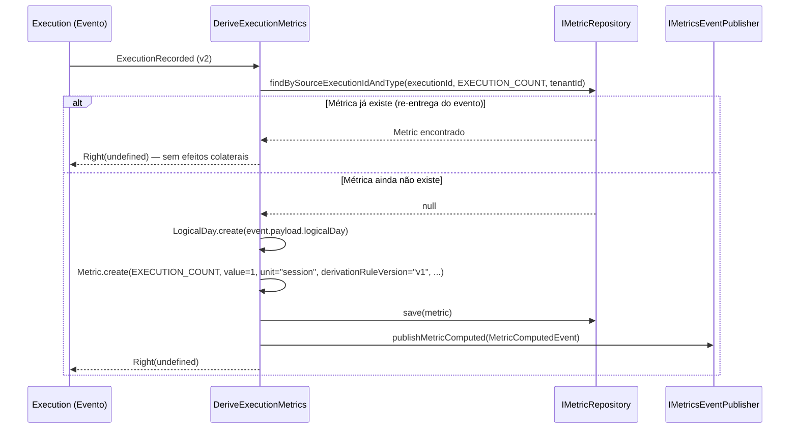

# Metrics (Métricas de Desempenho)

> **Contexto:** Metrics | **Atualizado em:** 2026-02-28 | **Versão ADR baseline:** ADR-0043

O módulo Metrics é responsável por derivar e armazenar métricas analíticas comportamentais de clientes a partir dos registros de execução de sessões. Toda vez que uma sessão confirmada é registrada no módulo Execution, o Metrics recebe esse evento e produz um registro imutável de métrica quantificando aquela sessão. O módulo serve como camada intermediária entre os dados transacionais (Executions) e as visualizações de progresso e dashboards, sem jamais influenciar ou alterar os dados que o originam.

---

## Visão Geral

### O que este módulo faz

O módulo Metrics consome eventos do módulo Execution e transforma cada sessão confirmada em um registro analítico estruturado — a `Metric`. Em MVP, essa transformação produz um único tipo de métrica: `EXECUTION_COUNT`, que representa a ocorrência de uma sessão em um determinado dia. O registro resultante carrega a rastreabilidade completa: qual Execution originou a métrica, qual regra de derivação foi aplicada e em qual versão, qual o dia lógico associado e qual fuso horário foi considerado.

Além de criar métricas, o módulo também recebe eventos de correção de execuções (`ExecutionCorrectionRecorded`) e os registra para futura reprocessamento — embora no MVP nenhuma recomputação automática seja realizada.

### O que este módulo NÃO faz

- **Não modifica Executions**: o fluxo de dados é estritamente unidirecional — Execution → Metric.
- **Não computa métricas fisiológicas** (ex.: estimativas de gordura corporal, VO₂ max): somente métricas comportamentais são permitidas no MVP (ADR-0028 §4).
- **Não recomputa métricas automaticamente** quando uma correção é registrada — isso requer um job batch administrativo explícito (ADR-0043 §3).
- **Não fornece interfaces de consulta públicas diretamente**: o repositório expõe operações de leitura para read models e dashboards, mas os endpoints REST/GraphQL são responsabilidade da camada de infraestrutura.
- **Não é fonte de verdade** para dados de entrega de serviço — essa responsabilidade é exclusiva do módulo Execution.

### Módulos com os quais se relaciona

| Módulo    | Tipo de relação     | Como se comunica                                                          |
| --------- | ------------------- | ------------------------------------------------------------------------- |
| Execution | Consome eventos de  | Evento: `ExecutionRecorded` (v2)                                          |
| Execution | Consome eventos de  | Evento: `ExecutionCorrectionRecorded` (v1)                                |
| Analytics / Dashboard | Publica eventos para | Evento: `MetricComputed` (v1)                                  |

---

## Modelo de Domínio

### Agregados

#### Metric

A `Metric` é o registro imutável de um valor analítico derivado de uma ou mais Executions confirmadas. Representa um fato analítico: "esta quantidade de sessões ocorreu neste dia para este cliente, segundo esta regra de derivação na versão X".

**Importante**: `Metric` não possui ciclo de vida com múltiplos estados — ela é criada uma única vez e nunca alterada. Não existem transições de estado. Se a regra de derivação muda, um **novo** registro `Metric` é criado com a versão atualizada; o registro antigo é preservado.

**Campos imutáveis do agregado:**

| Campo                  | Tipo         | Descrição                                                                                            |
| ---------------------- | ------------ | ---------------------------------------------------------------------------------------------------- |
| `id`                   | UUIDv4       | Identificador único do registro de métrica                                                           |
| `clientId`             | UUIDv4       | Cliente ao qual esta métrica pertence (referência cross-agregado, ADR-0047)                          |
| `professionalProfileId`| UUIDv4       | Profissional dono da métrica — chave de isolamento de tenant (ADR-0025)                              |
| `metricType`           | MetricType   | Tipo da métrica (`EXECUTION_COUNT`, `WEEKLY_VOLUME`, `STREAK_DAYS`)                                  |
| `value`                | number ≥ 0   | Valor numérico derivado (finito e não negativo)                                                      |
| `unit`                 | string 1–20  | Unidade de medida (ex.: `"session"`, `"day"`)                                                        |
| `derivationRuleVersion`| string 1–10  | Versão da regra de derivação usada (ex.: `"v1"`, `"v2.1"`) — ADR-0043 §1                            |
| `sourceExecutionIds`   | string[]     | IDs das Executions usadas na derivação — obrigatoriamente não vazio — ADR-0014 §2                   |
| `computedAtUtc`        | UTCDateTime  | Instante UTC em que a métrica foi computada                                                          |
| `logicalDay`           | LogicalDay   | Dia calendário âncora da métrica (ver tabela abaixo) — ADR-0010, ADR-0014 §2                        |
| `timezoneUsed`         | string       | Fuso horário IANA herdado da Execution de origem — ADR-0010                                          |

**`logicalDay` por tipo de métrica:**

| MetricType        | O que representa o `logicalDay`                                                |
| ----------------- | ------------------------------------------------------------------------------ |
| `EXECUTION_COUNT` | Exatamente o `logicalDay` da Execution de origem (relação 1:1)                 |
| `WEEKLY_VOLUME`   | Início da semana ISO (segunda-feira) do período de agregação (batch, pós-MVP)  |
| `STREAK_DAYS`     | Último dia ativo da sequência contígua de sessões (batch, pós-MVP)             |

**Regras de invariante:**

1. `sourceExecutionIds` deve conter pelo menos um ID — métrica sem origem é inválida.
2. Cada ID em `sourceExecutionIds` deve ser um UUIDv4 válido.
3. `value` deve ser um número finito e não negativo (≥ 0 é aceito — uma janela sem sessões pode ter valor zero).
4. `unit` deve ter entre 1 e 20 caracteres após trim.
5. `derivationRuleVersion` deve ter entre 1 e 10 caracteres após trim.
6. `timezoneUsed` não pode ser vazio ou apenas espaços.
7. `metricType` deve ser um valor reconhecido do enum `MetricType`.

**Operações disponíveis:**

| Operação              | O que faz                                                                    | Pré-condições              | Possíveis erros        |
| --------------------- | ---------------------------------------------------------------------------- | -------------------------- | ---------------------- |
| `Metric.create(props)`| Cria um novo registro imutável de métrica com todas as validações aplicadas  | Todos os campos obrigatórios presentes e válidos | `METRICS.METRIC_INVALID` |
| `Metric.reconstitute(id, props, version)` | Reconstitui um agregado a partir do banco (sem validação) | Dados confiáveis do repositório | — |

> **Não existem métodos `update()` ou `delete()`**. A imutabilidade é estrutural, não apenas convencional.

---

### Enums

#### MetricType

Define os tipos de métrica comportamental suportados pela plataforma:

| Valor              | Descrição                                                                             | Escopo |
| ------------------ | ------------------------------------------------------------------------------------- | ------ |
| `EXECUTION_COUNT`  | Uma sessão confirmada ocorreu neste `logicalDay`. `value` sempre = 1, `unit` = `"session"` | MVP — derivação evento a evento |
| `WEEKLY_VOLUME`    | Total de sessões confirmadas em uma semana ISO. `unit` = `"session"`                  | Pós-MVP — batch administrativo |
| `STREAK_DAYS`      | Número de dias consecutivos com pelo menos uma sessão, terminando no dia âncora. `unit` = `"day"` | Pós-MVP — batch administrativo |

> **Restrição ADR-0028 §4**: Métricas fisiológicas (ex.: `BODY_FAT_ESTIMATE`) são explicitamente proibidas no MVP. Toda interpretação clínica requer configuração profissional explícita e está fora do escopo atual.

---

### Erros de Domínio

| Código                  | Significado                          | Quando ocorre                                                                                                                              |
| ----------------------- | ------------------------------------ | ------------------------------------------------------------------------------------------------------------------------------------------ |
| `METRICS.METRIC_INVALID`| Violação de invariante na criação    | `sourceExecutionIds` vazio ou com UUID inválido; `value` negativo, NaN ou Infinity; `unit` vazia ou > 20 chars; `derivationRuleVersion` vazia ou > 10 chars; `timezoneUsed` vazio; `metricType` não reconhecido |

> O módulo possui apenas um código de erro. A mensagem (`reason`) fornece o detalhe específico da violação.

---

## Funcionalidades e Casos de Uso

### Derivar Métricas de uma Execução

**O que é:** Ao receber o evento `ExecutionRecorded`, o sistema cria um registro `Metric` do tipo `EXECUTION_COUNT` para a Execution correspondente. Esta é a funcionalidade central do módulo — transforma dados transacionais em métricas analíticas de desempenho do cliente.

**Quem pode usar:** Acionado automaticamente pelo sistema após a publicação do evento `ExecutionRecorded` pelo módulo Execution (handler assíncrono, consistência eventual — ADR-0016).

**Como funciona (passo a passo):**



1. **Guarda de idempotência (ADR-0007):** antes de qualquer ação, verifica se já existe uma métrica `EXECUTION_COUNT` derivada desta Execution para este tenant. Se sim, retorna sucesso sem criar duplicatas — proteção contra re-entrega de eventos (`at-least-once delivery`, ADR-0016 §1).
2. **Parsing temporal:** converte o campo `logicalDay` do payload do evento em um `LogicalDay` validado. Se o campo estiver malformado, retorna `Left<InvalidMetricError>` sem persistir nada.
3. **Criação da métrica:** instancia `Metric.create()` com `metricType=EXECUTION_COUNT`, `value=1`, `unit="session"`, `derivationRuleVersion="v1"`, e os demais campos herdados do evento.
4. **Persistência (ADR-0003):** salva o agregado no repositório em sua própria transação — separada da transação de criação da Execution.
5. **Publicação do evento pós-commit (ADR-0009 §4):** constrói e publica `MetricComputedEvent` após a persistência. O payload inclui apenas metadados (sem `value` ou `unit` — dados potencialmente sensíveis são excluídos por ADR-0037).

**Regras de negócio aplicadas:**

- ✅ A guarda de idempotência usa `(executionId, metricType, professionalProfileId)` como chave — o isolamento de tenant é parte da verificação (diferentes profissionais com o mesmo `executionId` não conflitam).
- ✅ `logicalDay` da métrica replica exatamente o `logicalDay` da Execution de origem (ADR-0010, ADR-0014 §2).
- ✅ `derivationRuleVersion` é `"v1"` para todas as métricas `EXECUTION_COUNT` do MVP.
- ✅ O uso de `UTCDateTime.now()` para `computedAtUtc` garante que o campo registra o momento real do cálculo, não o momento da Execution.
- ❌ `logicalDay` malformado no payload do evento → `Left<InvalidMetricError>` — sem persistência, sem evento publicado.

**Resultado esperado:** `Right<void>` — sem corpo de resposta para o handler de evento.

**Efeitos colaterais:** Publica `MetricComputedEvent` (v1) para notificar downstream consumers (analytics, dashboards) que uma nova métrica foi computada.

---

### Tratar Correção de Execução (Pós-MVP)

**O que é:** Ao receber o evento `ExecutionCorrectionRecorded`, o sistema registra a ocorrência da correção. No MVP, nenhuma recomputação automática de métricas é realizada — a correção é um ponto de extensão para futuros jobs batch.

**Quem pode usar:** Acionado automaticamente pelo sistema após a publicação do evento `ExecutionCorrectionRecorded` pelo módulo Execution.

**Como funciona:**

1. O use case recebe o evento `ExecutionCorrectionRecorded`.
2. O evento é validado (presença dos campos obrigatórios).
3. O adaptador de infraestrutura registra um log operacional com o `correctionId` e `originalExecutionId`.
4. **Nenhum registro de Metric é criado ou modificado.**
5. Retorna `Right(undefined)`.

**Por que não há recomputo automático?**

ADR-0043 §3 é explícito: reprocessamento retroativo de métricas requer um job batch administrativo explícito e intencional. Recompute automático disparado por evento é proibido — evita riscos de duplicação, race conditions e inconsistências em janelas de entrega at-least-once.

**Regras de negócio aplicadas:**

- ✅ Nenhuma métrica existente é modificada ou deletada ao receber este evento.
- ✅ Nenhuma nova métrica é criada automaticamente.
- ✅ A infraestrutura é responsável pelo log operacional; o use case não tem efeitos colaterais de domínio.
- ✅ O handler existe como ponto de extensão: um job batch futuro pode consultar esses logs para identificar quais métricas precisam de reprocessamento.

**Resultado esperado:** `Right<void>` — sempre (o handler nunca falha por razões de domínio).

**Efeitos colaterais:** Nenhum efeito colateral de domínio. Log operacional apenas na infraestrutura.

---

## Regras de Negócio Consolidadas

| #  | Regra                                                                                                           | Onde é aplicada               | ADR          |
| -- | --------------------------------------------------------------------------------------------------------------- | ----------------------------- | ------------ |
| 1  | Métricas são imutáveis após criação — nenhum `update()` ou `delete()` existe no repositório                    | Agregado `Metric`, `IMetricRepository` | ADR-0014 §5, ADR-0043 §5 |
| 2  | Mudanças de regra de derivação produzem **novos** registros com nova `derivationRuleVersion`; registros antigos são preservados | Use Case `DeriveExecutionMetrics` | ADR-0043 §2 |
| 3  | Reprocessamento retroativo exige job batch administrativo explícito — nunca automático por evento              | Use Case `HandleExecutionCorrection` | ADR-0043 §3 |
| 4  | O fluxo de dados é unidirecional: Execution → Metric → Read Model. Métricas nunca influenciam Executions       | Arquitetura do módulo          | ADR-0014 §1  |
| 5  | `sourceExecutionIds` deve ser não vazio — toda métrica deve ser rastreável à(s) Execution(ns) de origem         | `Metric.create()`             | ADR-0014 §2  |
| 6  | `value` deve ser finito e não negativo — valores absurdos não passam pela invariante do agregado               | `Metric.create()`             | ADR-0014 §2  |
| 7  | Apenas métricas **comportamentais** são suportadas no MVP — cálculos fisiológicos automáticos são proibidos     | `MetricType` enum             | ADR-0028 §4  |
| 8  | Idempotência: antes de criar uma `EXECUTION_COUNT`, verifica se já existe métrica para `(executionId, metricType, professionalProfileId)` | `DeriveExecutionMetrics`      | ADR-0007     |
| 9  | Isolamento de tenant: toda consulta ao repositório inclui `professionalProfileId` — acesso cross-tenant retorna null (404, nunca 403) | `IMetricRepository`           | ADR-0025     |
| 10 | `logicalDay` da métrica é o âncora temporal de derivação: para `EXECUTION_COUNT`, replica o `logicalDay` exato da Execution | `DeriveExecutionMetrics`      | ADR-0010, ADR-0014 §2 |
| 11 | `timezoneUsed` é herdado da Execution de origem — a métrica preserva o fuso horário do contexto em que a sessão foi registrada | `DeriveExecutionMetrics`      | ADR-0010     |
| 12 | `derivationRuleVersion` é imutável por registro — rastreabilidade auditável da regra aplicada                  | `Metric.create()`             | ADR-0043 §1, §5 |
| 13 | O payload de `MetricComputedEvent` não inclui `value` nem `unit` — esses campos são excluídos por conterem dados potencialmente sensíveis à saúde (ADR-0037) | `MetricComputedEvent`         | ADR-0037     |
| 14 | Agregados não coletam eventos de domínio — o use case constrói e publica `MetricComputedEvent` após a persistência | `DeriveExecutionMetrics`      | ADR-0009 §3, §4 |
| 15 | `WEEKLY_VOLUME` e `STREAK_DAYS` são pós-MVP e exigem batch de agregação multi-Execution — não são derivados no handler MVP | `MetricType` enum, `DeriveExecutionMetrics` | ADR-0043 §3  |

---

## Eventos de Domínio

### Eventos Publicados por este Módulo

| Evento           | Quando é publicado                                              | O que contém                                                                                    | Quem consome                                |
| ---------------- | --------------------------------------------------------------- | ----------------------------------------------------------------------------------------------- | ------------------------------------------- |
| `MetricComputed` | Após a persistência de uma nova `Metric` no repositório (post-commit, ADR-0009 §4) | `metricId`, `clientId`, `professionalProfileId`, `metricType`, `logicalDay`, `derivationRuleVersion` | Analytics, dashboards de progresso do cliente |

**Schema de `MetricComputed` (v1):**

```
metricId              : string  — ID do agregado Metric
clientId              : string  — ID do cliente ao qual a métrica pertence
professionalProfileId : string  — ID do profissional (tenant scope, ADR-0025)
metricType            : string  — Tipo da métrica (ex.: "EXECUTION_COUNT")
logicalDay            : string  — Dia âncora no formato YYYY-MM-DD (ADR-0010)
derivationRuleVersion : string  — Versão da regra aplicada (ex.: "v1")
```

> **Nota de privacidade (ADR-0037)**: `value` e `unit` foram deliberadamente excluídos do payload do evento. Valores de métricas agregadas de saúde/comportamento não devem trafegar em eventos de integração. Downstream consumers que precisam do valor devem consultar o read model diretamente.

### Eventos Consumidos por este Módulo

| Evento                        | De qual módulo | O que faz ao receber                                                                                |
| ----------------------------- | -------------- | --------------------------------------------------------------------------------------------------- |
| `ExecutionRecorded` (v2)      | Execution      | Cria um `Metric` do tipo `EXECUTION_COUNT` (com guarda de idempotência)                             |
| `ExecutionCorrectionRecorded` (v1) | Execution | Registra log operacional; sem efeitos de domínio no MVP (extensão para reprocessamento futuro)    |

---

## API / Interface

Este módulo não expõe endpoints públicos diretamente — é um bounded context puramente orientado a eventos no lado da escrita. As operações de leitura do repositório (`findByClientAndLogicalDay`, `findByClientAndDateRange`) são consumidas internamente por read models e camadas de apresentação de dashboards.

| Operação do repositório                  | O que retorna                                                    |
| ---------------------------------------- | ---------------------------------------------------------------- |
| `findById(id, professionalProfileId)`    | `Metric` scoped ao tenant, ou `null` se não encontrado          |
| `findBySourceExecutionIdAndType(executionId, metricType, professionalProfileId)` | `Metric` para guarda de idempotência, ou `null` |
| `findByClientAndLogicalDay(clientId, logicalDay, professionalProfileId)` | `Metric[]` — todas as métricas do cliente naquele dia |
| `findByClientAndDateRange(clientId, from, to, professionalProfileId)` | `Metric[]` — métricas do cliente no período [from, to] inclusivo |

---

## Infraestrutura e Persistência

### Dados armazenados

| Tabela           | O que armazena                                          | Campos principais                                                                                         |
| ---------------- | ------------------------------------------------------- | --------------------------------------------------------------------------------------------------------- |
| `metrics`        | Registros imutáveis de métricas derivadas de Executions | `id`, `client_id`, `professional_profile_id`, `metric_type`, `value`, `unit`, `derivation_rule_version`, `source_execution_ids`, `computed_at_utc`, `logical_day`, `timezone_used`, `version` |

**Semântica INSERT-only**: o repositório não expõe `update()` ou `delete()`. Mudanças de regra criam novos registros com nova `derivationRuleVersion`. Registros antigos são preservados para comparabilidade histórica (ADR-0043 §5).

**Concorrência**: o agregado herda bloqueio otimista (`version`) da classe base `AggregateRoot` (ADR-0006).

### Integrações externas

| Serviço/Mecanismo         | Para que é usado                                                                        | ADR de referência |
| ------------------------- | --------------------------------------------------------------------------------------- | ----------------- |
| Message bus / Outbox      | Recebe eventos `ExecutionRecorded` e `ExecutionCorrectionRecorded`; publica `MetricComputed` | ADR-0016, ADR-0009 §4 |
| Dead-letter queue (DLQ)   | Eventos não processados após 3 retentativas ficam no DLQ para revisão manual           | ADR-0016 §5       |

**SLA de consistência eventual para derivação de métricas (ADR-0016 §1):**
- Target: ≤ 15 minutos após o commit da Execution
- SLA: ≤ 1 hora

---

## Conformidade com ADRs

| ADR                                                    | Status        | Observações                                                                                        |
| ------------------------------------------------------ | ------------- | -------------------------------------------------------------------------------------------------- |
| ADR-0003 (Uma transação por agregado)                  | ✅ Conforme   | `DeriveExecutionMetrics` executa em transação própria, separada da Execution                       |
| ADR-0005 §7 (Métricas não alteram Executions)          | ✅ Conforme   | Fluxo unidirecional: Execution → Metric; sem referência de volta                                   |
| ADR-0007 (Idempotência)                                | ✅ Conforme   | `findBySourceExecutionIdAndType()` guarda contra re-entrega de `ExecutionRecorded`                 |
| ADR-0009 §3 (Agregado puro — sem eventos internos)     | ✅ Conforme   | `Metric.create()` não chama `addDomainEvent()`; use case constrói e publica o evento               |
| ADR-0009 §4 (Evento pós-commit)                        | ✅ Conforme   | `MetricComputedEvent` é publicado após `metricRepo.save()`                                         |
| ADR-0010 (Política temporal — logicalDay e UTC)        | ✅ Conforme   | `logicalDay` herdado da Execution; `computedAtUtc` via `UTCDateTime.now()`                         |
| ADR-0014 §1 (Hierarquia fonte de verdade)              | ✅ Conforme   | Execution → Metric → Read Model; Metric não supersede Execution                                    |
| ADR-0014 §5 (Imutabilidade de métricas)                | ✅ Conforme   | Sem `update()` ou `delete()` no agregado ou repositório                                            |
| ADR-0025 (Isolamento multi-tenant)                     | ✅ Conforme   | Todas as queries incluem `professionalProfileId`; cross-tenant = null (404, nunca 403)             |
| ADR-0028 §4 (Proibição de métricas fisiológicas)       | ✅ Conforme   | Apenas `EXECUTION_COUNT`, `WEEKLY_VOLUME`, `STREAK_DAYS` (comportamentais)                         |
| ADR-0037 (Dados sensíveis — LGPD)                      | ✅ Conforme   | `value` e `unit` excluídos do payload de `MetricComputedEvent`; sem PII nos logs de domínio       |
| ADR-0043 §1 (DerivationRuleVersion por registro)       | ✅ Conforme   | `derivationRuleVersion` imutável em cada `Metric`; MVP usa `"v1"`                                  |
| ADR-0043 §3 (Sem reprocessamento automático)           | ✅ Conforme   | `HandleExecutionCorrection` é log-only no MVP; recomputo requer job administrativo                 |
| ADR-0043 §5 (Registros antigos preservados)            | ✅ Conforme   | Repositório INSERT-only; regra nova → novo registro; antigo preservado                             |
| ADR-0047 (Referências cross-agregado por ID)           | ✅ Conforme   | `clientId`, `professionalProfileId`, `sourceExecutionIds` são IDs — nenhum agregado referenciado diretamente |
| ADR-0051 (DomainResult<T> / Either)                    | ✅ Conforme   | `DeriveExecutionMetrics.execute()` e `HandleExecutionCorrection.execute()` retornam `DomainResult<void>` |

---

## Gaps e Melhorias Identificadas

| #  | Tipo              | Descrição                                                                                                                                      | Prioridade |
| -- | ----------------- | ---------------------------------------------------------------------------------------------------------------------------------------------- | ---------- |
| 1  | 🔵 Pós-MVP        | `WEEKLY_VOLUME` e `STREAK_DAYS` estão definidos no enum mas não implementados — exigem batch de agregação multi-Execution (ADR-0043 §3). Não há use case ou job batch para esses tipos ainda. | Baixa (planejado) |
| 2  | 🔵 Pós-MVP        | `HandleExecutionCorrection` é um stub log-only no MVP. O job batch de reprocessamento retroativo (que consultaria os logs de correção para recomputar métricas) ainda não existe. | Baixa (planejado) |
| 3  | 🔵 Informativa    | O repositório expõe `findByClientAndLogicalDay()` e `findByClientAndDateRange()` para read models, mas não há use case de consulta no módulo (ex.: `GetClientMetrics`). A consulta é feita diretamente via repositório pela camada de infraestrutura, o que é aceitável, mas um use case dedicado aumentaria a testabilidade. | Baixa      |

---

## Cobertura de Testes

| Arquivo de teste                                    | Escopo           | Nº de testes |
| --------------------------------------------------- | ---------------- | ------------ |
| `tests/unit/domain/metric.spec.ts`                  | Agregado `Metric` | 26           |
| `tests/unit/application/derive-execution-metrics.spec.ts` | `DeriveExecutionMetrics` | 8 |
| `tests/unit/application/handle-execution-correction.spec.ts` | `HandleExecutionCorrection` | 2 |
| **Total**                                           |                  | **36**       |

**Principais cenários cobertos:**

- Criação bem-sucedida para os três tipos (`EXECUTION_COUNT`, `WEEKLY_VOLUME`, `STREAK_DAYS`)
- Todas as 7 invariantes de `Metric.create()` — incluindo limites de string, valores numéricos inválidos (NaN, Infinity, negativo), arrays vazios, UUIDs inválidos e metricType não reconhecido
- Cópia defensiva de `sourceExecutionIds` (mutação do array original não afeta o agregado)
- Pureza do agregado (nenhum evento de domínio coletado internamente)
- Trim automático de `unit`, `derivationRuleVersion` e `timezoneUsed`
- `reconstitute()` sem validação — confia na integridade do banco
- `DeriveExecutionMetrics`: happy path com verificação de payload do evento, idempotência (dupla entrega do mesmo evento não cria duplicata), isolamento de tenant na guarda de idempotência, e erro em `logicalDay` malformado
- `HandleExecutionCorrection`: retorno `Right(undefined)` para qualquer evento bem-formado — confirmando ausência de efeitos colaterais no MVP

---

## Histórico de Atualizações

| Data       | O que mudou                                    |
| ---------- | ---------------------------------------------- |
| 2026-02-28 | Documentação inicial gerada (adr-check aplicado) |
