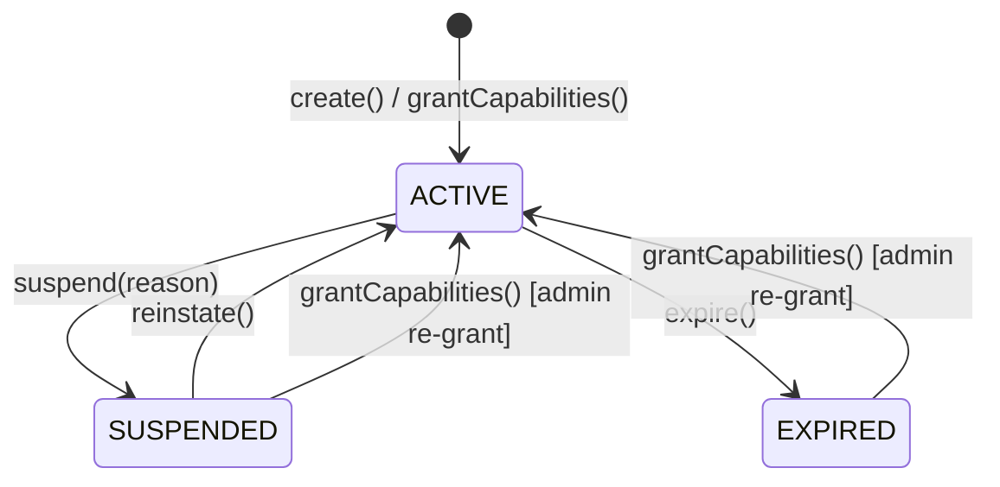

# Platform (Entitlements de Plataforma)

> **Contexto:** Platform | **Atualizado em:** 2026-02-28 | **Versão ADR baseline:** ADR-0049

O módulo Platform gerencia o conjunto de capacidades operacionais que cada profissional tem direito a usar na plataforma FitTrack. Enquanto o módulo Billing cuida de planos, preços e pagamentos, o módulo Platform traduz esses acordos comerciais em permissões técnicas concretas — como acesso à API externa, múltiplos perfis ou análises avançadas. É aqui que a plataforma decide, em tempo de execução, o que cada profissional pode ou não fazer.

---

## Visão Geral

### O que este módulo faz

O módulo Platform mantém um agregado chamado `PlatformEntitlement` por profissional, que representa o conjunto de capacidades (`EntitlementType[]`) ativas naquele momento. Esse conjunto pode ser concedido (grant), expandido (add capability), reduzido (remove capability), suspenso (suspend), restabelecido (reinstate) ou expirado (expire). Qualquer uso de uma funcionalidade premium no sistema consulta `hasCapability()` nesse agregado para decidir se a ação é permitida.

O módulo também registra toda mudança de entitlement em um log de auditoria (`PLATFORM_ENTITLEMENT_CHANGED`), garantindo rastreabilidade completa de quem alterou o quê, quando e por qual motivo.

### O que este módulo NÃO faz

- **Não gerencia planos, preços ou assinaturas**: isso é responsabilidade do módulo Billing. O módulo Platform não conhece os conceitos de "plano PRO", "plano ENTERPRISE" nem valores monetários — ele recebe apenas a lista de capacidades a conceder.
- **Não autentica nem autoriza sessões de usuário**: autenticação e controle de sessão estão no módulo Identity. O Platform responde à pergunta "este profissional tem direito a usar esta funcionalidade?" — não "este usuário está autenticado?".
- **Não suspende automaticamente por inadimplência**: quem dispara a suspensão é o módulo de Risk/Identity, ao detectar que um profissional foi banido. O Platform apenas executa a transição de estado.
- **Não expira automaticamente entitlements**: o job de scheduler (cron) é quem chama `ExpireEntitlement` quando o prazo vence. O módulo não tem temporização interna.

### Módulos com os quais se relaciona

| Módulo         | Tipo de relação       | Como se comunica                                                       |
| -------------- | --------------------- | ---------------------------------------------------------------------- |
| Identity / Risk | Consome eventos de   | Evento: `RiskStatusChanged(newStatus=BANNED)` → dispara `SuspendEntitlement` |
| Billing        | Consumido por        | Billing chama `GrantEntitlements` após confirmação de compra / troca de plano |
| Todos os módulos de funcionalidade | Consultado por | `hasCapability(entitlementType)` — verificação de permissão em tempo de execução |

---

## Modelo de Domínio

### Agregados

#### PlatformEntitlement

O `PlatformEntitlement` representa o conjunto de capacidades operacionais concedidas a um profissional. Existe no máximo **um** registro por profissional. O estado do agregado determina se as capacidades estão efetivas (`ACTIVE`) ou temporariamente/permanentemente inativas (`SUSPENDED` / `EXPIRED`).

**Design importante**: o domínio trabalha apenas com capacidades (`EntitlementType`), não com "planos". A tradução de plano comercial → lista de capacidades acontece na camada de produto/infraestrutura, antes de chamar `GrantEntitlements`. O domínio é agnóstico a planos PRO, ENTERPRISE etc.

**Estados possíveis:**

| Estado      | Descrição                                                                                                   |
| ----------- | ----------------------------------------------------------------------------------------------------------- |
| `ACTIVE`    | O profissional tem as capacidades concedidas e pode operar normalmente                                      |
| `SUSPENDED` | As capacidades estão preservadas como snapshot mas inativas — o profissional não pode usar funcionalidades premium |
| `EXPIRED`   | O grant chegou à data `expiresAt`. Terminal para mutações normais — apenas `grantCapabilities()` pode reativar |

**Transições de estado:**



> **`grantCapabilities()` é especial**: funciona a partir de qualquer estado (ACTIVE, SUSPENDED ou EXPIRED), redefine o conjunto de capacidades e força o status para ACTIVE. É a operação de re-grant administrativo — usada tanto para concessão inicial quanto para restauração de acesso após suspensão ou expiração.

**Regras de invariante:**

1. `hasCapability()` retorna `false` quando o status é SUSPENDED ou EXPIRED — independentemente do snapshot de capacidades preservado.
2. `addCapability()` e `removeCapability()` exigem status ACTIVE.
3. `suspend()` exige status ACTIVE — não é possível suspender um entitlement já suspenso ou expirado.
4. `reinstate()` exige status SUSPENDED — não é possível reativar um entitlement já ativo ou expirado.
5. `expire()` exige status ACTIVE — não é possível expirar um entitlement suspenso.
6. O array `entitlements` não contém duplicatas — deduplicação é aplicada em `create()` e `grantCapabilities()`.
7. `addCapability()` é idempotente no domínio: adicionar uma capacidade já presente retorna `Right(void)` sem efeito.

**Operações disponíveis:**

| Operação                       | O que faz                                                           | Quando pode ser chamada   | Possíveis erros            |
| ------------------------------ | ------------------------------------------------------------------- | ------------------------- | -------------------------- |
| `create()`                     | Cria novo entitlement em ACTIVE com o conjunto inicial              | Sempre (factory)          | —                          |
| `grantCapabilities(caps, expiresAt)` | Substitui capacidades e reseta para ACTIVE                    | Qualquer estado           | —                          |
| `addCapability(cap)`           | Adiciona uma capacidade ao conjunto (idempotente)                   | Apenas ACTIVE             | `PLATFORM.INVALID_TRANSITION` |
| `removeCapability(cap)`        | Remove uma capacidade do conjunto                                   | Apenas ACTIVE + cap presente | `PLATFORM.INVALID_TRANSITION` |
| `suspend(reason)`              | ACTIVE → SUSPENDED; preserva snapshot de capacidades               | Apenas ACTIVE             | `PLATFORM.INVALID_TRANSITION` |
| `reinstate()`                  | SUSPENDED → ACTIVE; restaura snapshot preservado                    | Apenas SUSPENDED          | `PLATFORM.INVALID_TRANSITION` |
| `expire()`                     | ACTIVE → EXPIRED                                                    | Apenas ACTIVE             | `PLATFORM.INVALID_TRANSITION` |
| `hasCapability(cap)`           | Retorna true se ACTIVE e a capacidade está no conjunto              | Sempre (leitura)          | —                          |
| `reconstitute()`               | Reconstitui o agregado do banco (sem validação)                     | Apenas pelo repositório   | —                          |

---

### Enums

#### EntitlementType — Capacidades Operacionais

| Valor                | Descrição                                                                              |
| -------------------- | -------------------------------------------------------------------------------------- |
| `MULTI_PROFILE`      | Permite criar múltiplos `ProfessionalProfile` sob uma mesma conta                     |
| `ADVANCED_ANALYTICS` | Acesso a dashboards avançados (Self-Log, Metrics, análise de coorte)                  |
| `LONG_TERM_PLANS`    | Criar `ServicePlan` com duração acima do limite base de planos                         |
| `ORG_MANAGEMENT`     | Gerenciar estrutura organizacional e sub-perfis profissionais                          |
| `PRIORITY_PAYOUT`    | Receber processamento prioritário no agendamento de repasses financeiros               |
| `API_ACCESS`         | Acesso à API REST/Webhook externa da plataforma                                        |

> Adicionar uma nova capacidade nunca exige mudança no modelo de plano de domínio — basta incluí-la no enum e na lógica de mapeamento produto→capacidade na camada de infraestrutura.

#### EntitlementStatus — Estados do Ciclo de Vida

| Valor       | Descrição                                                            |
| ----------- | -------------------------------------------------------------------- |
| `ACTIVE`    | Capacidades efetivas; profissional opera normalmente                 |
| `SUSPENDED` | Capacidades preservadas como snapshot; sem efeito operacional        |
| `EXPIRED`   | Grant vencido; terminal para transições normais                      |

---

### Erros de Domínio

| Código                           | Significado                                  | Quando ocorre                                                                                               |
| -------------------------------- | -------------------------------------------- | ----------------------------------------------------------------------------------------------------------- |
| `PLATFORM.ENTITLEMENT_NOT_FOUND` | Entitlement não encontrado para o profissional | Tentativa de operação em um entitlement que não existe no repositório                                     |
| `PLATFORM.INVALID_TRANSITION`    | Transição de estado inválida ou pré-condição violada | Status incompatível com a operação; capacidade ausente em `removeCapability`; reason vazia ou > 500 chars |

---

## Funcionalidades e Casos de Uso

### Conceder (ou Re-conceder) Capacidades a um Profissional

**O que é:** Cria ou atualiza o entitlement de um profissional com um conjunto completo de capacidades. É a operação chamada pelo Billing após confirmação de compra ou mudança de plano. Também é usada por administradores para conceder ou restaurar capacidades manualmente.

**Quem pode usar:** Sistema (Billing, ao processar `PurchaseCompleted`) ou administradores da plataforma.

**Como funciona (passo a passo):**

```mermaid
sequenceDiagram
    participant Actor as Billing / Admin
    participant UC as GrantEntitlements
    participant Repo as IPlatformEntitlementRepository
    participant Audit as IPlatformEntitlementAuditLog
    participant Pub as IPlatformEntitlementEventPublisher

    Actor->>UC: { professionalProfileId, entitlements[], reason, actorId, actorRole }
    UC->>UC: Valida reason (1–500 chars)
    UC->>UC: Valida entitlements (não vazio)
    UC->>Repo: findByProfessionalProfileId(professionalProfileId)
    alt Não existe
        Repo-->>UC: null
        UC->>UC: PlatformEntitlement.create(ACTIVE, caps, expiresAt)
    else Já existe (qualquer status)
        Repo-->>UC: entitlement atual
        UC->>UC: entitlement.grantCapabilities(caps, expiresAt) → ACTIVE
    end
    UC->>Repo: save(entitlement)
    UC->>Audit: writePlatformEntitlementChanged(...)
    UC->>Pub: publishEntitlementGranted(EntitlementGranted)
    UC-->>Actor: Right(void)
```

**Regras de negócio aplicadas:**

- ✅ Se nenhum entitlement existir: cria um novo em ACTIVE.
- ✅ Se já existir (mesmo que SUSPENDED ou EXPIRED): chama `grantCapabilities()` que substitui o conjunto e reseta para ACTIVE — sem precisar de uma reinstate prévia.
- ✅ Capacidades duplicadas no array de entrada são silenciosamente deduplicadas.
- ❌ Reason vazia ou > 500 caracteres → `Left<InvalidEntitlementTransitionError>` (sem persistência, sem auditoria, sem evento).
- ❌ Lista de entitlements vazia → `Left<InvalidEntitlementTransitionError>`.

**Resultado esperado:** `Right<void>`.

**Efeitos colaterais:**
- Escrita no AuditLog: `PLATFORM_ENTITLEMENT_CHANGED` com `actorId`, `actorRole`, `addedCapabilities` e `reason`.
- Evento: `EntitlementGranted` com payload `{ entitlements[], expiresAt }`.

---

### Adicionar uma Capacidade Individual

**O que é:** Acrescenta uma única capacidade a um entitlement ACTIVE existente, sem alterar as demais. Útil para concessões pontuais de funcionalidades (ex.: habilitar `API_ACCESS` para um profissional em plano intermediário).

**Quem pode usar:** Administradores da plataforma.

**Como funciona:**

1. Valida reason (1–500 chars).
2. Carrega entitlement por `professionalProfileId`.
3. **Guarda de idempotência**: se a capacidade já está presente (verificado via `hasCapability()` ou `entitlements.includes()`), retorna `Right(void)` sem salvar, sem auditoria, sem evento.
4. Chama `addCapability(cap)` no agregado — falha se status ≠ ACTIVE.
5. Persiste.
6. Escreve AuditLog com `addedCapabilities`.
7. Publica `EntitlementCapabilityAdded`.

**Regras de negócio aplicadas:**

- ✅ Idempotente: re-adicionar uma capacidade já presente é uma no-op bem-sucedida.
- ❌ Entitlement não encontrado → `Left<EntitlementNotFoundError>`.
- ❌ Status SUSPENDED ou EXPIRED → `Left<InvalidEntitlementTransitionError>`.
- ❌ Reason vazia ou > 500 chars → `Left<InvalidEntitlementTransitionError>`.

**Efeitos colaterais:** AuditLog + evento `EntitlementCapabilityAdded { capability, reason }`.

---

### Remover uma Capacidade Individual

**O que é:** Remove uma única capacidade de um entitlement ACTIVE existente. Usado em downgrade granular ou retirada administrativa de acesso a uma funcionalidade específica.

**Quem pode usar:** Administradores da plataforma.

**Como funciona:**

1. Valida reason (1–500 chars).
2. Carrega entitlement por `professionalProfileId`.
3. Chama `removeCapability(cap)` no agregado — falha se status ≠ ACTIVE ou se a capacidade não está presente.
4. Persiste.
5. Escreve AuditLog com `removedCapabilities`.
6. Publica `EntitlementCapabilityRemoved`.

**Regras de negócio aplicadas:**

- ✅ Não é idempotente: remover uma capacidade ausente retorna erro (diferente de `addCapability`).
- ❌ Entitlement não encontrado → `Left<EntitlementNotFoundError>`.
- ❌ Capacidade ausente no entitlement → `Left<InvalidEntitlementTransitionError>`.
- ❌ Status SUSPENDED ou EXPIRED → `Left<InvalidEntitlementTransitionError>`.
- ❌ Reason vazia ou > 500 chars → `Left<InvalidEntitlementTransitionError>`.

**Efeitos colaterais:** AuditLog + evento `EntitlementCapabilityRemoved { capability, reason }`.

---

### Suspender Entitlement

**O que é:** Transiciona o entitlement de ACTIVE para SUSPENDED, desativando todas as capacidades imediatamente. O snapshot do conjunto de capacidades é preservado para restauração futura sem necessidade de reprocessar configuração de plano.

Pode ser acionado automaticamente pelo sistema (quando o módulo de Risk detecta que um profissional foi banido — `RiskStatusChanged(newStatus=BANNED)`) ou manualmente por um administrador.

**Quem pode usar:** Sistema (`actorId=SYSTEM`, `actorRole=SYSTEM`) via handler de `RiskStatusChanged`; administradores da plataforma.

**Como funciona:**

1. Valida reason (1–500 chars).
2. Carrega entitlement por `professionalProfileId`.
3. **Guarda de idempotência**: se já está SUSPENDED, retorna `Right(void)` sem salvar, sem auditoria, sem evento — protege contra re-entrega do evento de risco.
4. Chama `suspend(reason)` — falha se EXPIRED.
5. Persiste.
6. Escreve AuditLog com `previousStatus=ACTIVE`, `newStatus=SUSPENDED`, e `actorId`/`actorRole` do ator.
7. Publica `EntitlementSuspended { reason, evidenceRef }`.

**Regras de negócio aplicadas:**

- ✅ Idempotente: suspender um entitlement já suspenso é uma no-op bem-sucedida (protege contra at-least-once delivery de `RiskStatusChanged`).
- ✅ `evidenceRef` transporta o ID do evento de risco quando acionado automaticamente; é `null` em suspensões manuais.
- ✅ O snapshot de capacidades é mantido em `entitlements[]` mesmo durante SUSPENDED, para que `reinstate()` possa restaurar exatamente o mesmo conjunto.
- ❌ Entitlement não encontrado → `Left<EntitlementNotFoundError>`.
- ❌ Status EXPIRED → `Left<InvalidEntitlementTransitionError>` (não é possível suspender um entitlement expirado).
- ❌ Reason vazia, whitespace-only ou > 500 chars → `Left<InvalidEntitlementTransitionError>`.

**Efeitos colaterais:** AuditLog + evento `EntitlementSuspended { reason, evidenceRef }`.

---

### Reativar Entitlement (Reinstate)

**O que é:** Transiciona o entitlement de SUSPENDED de volta para ACTIVE, restaurando o snapshot de capacidades preservado. Usado quando a causa da suspensão foi resolvida (ex.: risco mitigado, pagamento regularizado).

**Quem pode usar:** Administradores da plataforma.

**Como funciona:**

1. Valida reason (1–500 chars).
2. Carrega entitlement por `professionalProfileId`.
3. **Guarda de idempotência**: se já está ACTIVE, retorna `Right(void)` sem salvar, sem auditoria, sem evento.
4. Chama `reinstate()` — falha se EXPIRED.
5. Persiste.
6. Escreve AuditLog com `previousStatus=SUSPENDED`, `newStatus=ACTIVE`.
7. Publica `EntitlementReinstated { reason }`.

**Regras de negócio aplicadas:**

- ✅ Idempotente: reativar um entitlement já ativo é uma no-op bem-sucedida.
- ✅ As capacidades são restauradas exatamente como estavam no momento da suspensão — sem necessidade de chamar `GrantEntitlements` novamente.
- ❌ Entitlement não encontrado → `Left<EntitlementNotFoundError>`.
- ❌ Status EXPIRED → `Left<InvalidEntitlementTransitionError>` (entitlement expirado não pode ser reativado por reinstate; use `GrantEntitlements`).
- ❌ Reason vazia ou > 500 chars → `Left<InvalidEntitlementTransitionError>`.

**Efeitos colaterais:** AuditLog + evento `EntitlementReinstated { reason }`.

---

### Expirar Entitlement

**O que é:** Transiciona o entitlement de ACTIVE para EXPIRED quando a data `expiresAt` passou. Acionado por um scheduler/cron que verifica periodicamente quais entitlements venceram.

**Quem pode usar:** Sistema (scheduler/cron job — `actorId=SYSTEM`, `actorRole=SYSTEM`).

**Como funciona:**

1. Carrega entitlement por `entitlementId` + `professionalProfileId` (o scheduler tem os IDs).
2. **Guarda de idempotência**: se já está EXPIRED, retorna `Right(void)` sem efeitos — protege contra execuções duplas do cron.
3. Valida pré-condição: `expiresAt` deve ser não-nulo e estar no passado. Se for nulo ou futuro → falha.
4. Chama `expire()` — falha se status ≠ ACTIVE (SUSPENDED não pode expirar).
5. Persiste.
6. Escreve AuditLog com `actorId=SYSTEM`, `previousStatus=ACTIVE`, `newStatus=EXPIRED`.
7. Publica `EntitlementExpired { expiredAt }`.

**Regras de negócio aplicadas:**

- ✅ Idempotente: expirar um entitlement já expirado é uma no-op bem-sucedida.
- ✅ `actorId` e `actorRole` são sempre `"SYSTEM"` nesta operação — rastreabilidade de ações automatizadas (ADR-0027 §3).
- ❌ Entitlement não encontrado → `Left<EntitlementNotFoundError>`.
- ❌ `expiresAt` é null → `Left<InvalidEntitlementTransitionError>` (entitlement sem prazo não pode expirar automaticamente).
- ❌ `expiresAt` é futuro → `Left<InvalidEntitlementTransitionError>` (pré-condição não satisfeita).
- ❌ Status SUSPENDED → `Left<InvalidEntitlementTransitionError>` (entitlement suspenso não pode expirar — deve ser reativado ou re-granted antes).

**Efeitos colaterais:** AuditLog + evento `EntitlementExpired { expiredAt }`.

---

## Regras de Negócio Consolidadas

| #  | Regra                                                                                                                              | Onde é aplicada                    | ADR       |
| -- | ---------------------------------------------------------------------------------------------------------------------------------- | ---------------------------------- | --------- |
| 1  | Existe no máximo um `PlatformEntitlement` por `professionalProfileId`                                                             | `IPlatformEntitlementRepository`   | ADR-0047  |
| 2  | O domínio não conhece planos comerciais — trabalha apenas com capacidades (`EntitlementType[]`)                                   | `PlatformEntitlement.create()`, `grantCapabilities()` | Arquitetura |
| 3  | `hasCapability()` retorna `false` quando status ≠ ACTIVE, independentemente do snapshot preservado                               | `PlatformEntitlement.hasCapability()` | ADR-0047 |
| 4  | Capacidades duplicadas são silenciosamente deduplicadas em `create()` e `grantCapabilities()`                                    | `PlatformEntitlement`              | —         |
| 5  | `addCapability()` é idempotente no domínio: adicionar uma capacidade já presente é no-op                                         | `PlatformEntitlement.addCapability()` | ADR-0007 |
| 6  | `grantCapabilities()` reseta o status para ACTIVE a partir de qualquer estado — é o mecanismo de re-grant administrativo         | `PlatformEntitlement.grantCapabilities()` | —     |
| 7  | `reinstate()` exige status SUSPENDED — entitlements expirados precisam de `grantCapabilities()`, não de reinstate               | `PlatformEntitlement.reinstate()`  | ADR-0008  |
| 8  | `expire()` exige status ACTIVE — entitlements SUSPENDED não expiram (devem ser reativados ou re-granted antes)                  | `PlatformEntitlement.expire()`     | ADR-0008  |
| 9  | Todo use case valida `reason` (1–500 chars, não apenas espaços) antes de qualquer operação de domínio                           | Todos os use cases                 | ADR-0027  |
| 10 | `SuspendEntitlement` é idempotente: status já SUSPENDED → Right(void) sem save/audit/evento (proteção contra at-least-once delivery) | `SuspendEntitlement`          | ADR-0007  |
| 11 | `ReinstateEntitlement` é idempotente: status já ACTIVE → Right(void) sem save/audit/evento                                      | `ReinstateEntitlement`             | ADR-0007  |
| 12 | `ExpireEntitlement` é idempotente: status já EXPIRED → Right(void) sem save/audit/evento                                        | `ExpireEntitlement`                | ADR-0007  |
| 13 | `AddCapability` é idempotente no use case: capacidade já presente → Right(void) sem save/audit/evento                           | `AddCapability`                    | ADR-0007  |
| 14 | Toda mudança de estado ou capacidade gera uma entrada no AuditLog com `actorId`, `actorRole`, `reason` e `occurredAtUtc`        | Todos os use cases (pós-commit)    | ADR-0027 §2 |
| 15 | Ações automatizadas (suspend por risco, expire por scheduler) usam `actorId=SYSTEM`, `actorRole=SYSTEM` no AuditLog             | `SuspendEntitlement`, `ExpireEntitlement` | ADR-0027 §3 |
| 16 | Eventos são construídos e publicados pelo use case pós-commit; o agregado não coleta eventos internamente                        | Todos os use cases                 | ADR-0009 §3, §4 |
| 17 | Apenas um agregado por transação — `PlatformEntitlement` é o único modificado em cada use case                                  | Todos os use cases                 | ADR-0003  |
| 18 | `ExpireEntitlement` exige `expiresAt` não-nulo e no passado — validação de pré-condição no use case antes de chamar o domínio  | `ExpireEntitlement`                | ADR-0008  |

---

## Eventos de Domínio

### Eventos Publicados por este Módulo

| Evento                      | Quando é publicado                                              | O que contém                                        | Quem consome                                     |
| --------------------------- | --------------------------------------------------------------- | --------------------------------------------------- | ------------------------------------------------ |
| `EntitlementGranted`        | Após concessão (inicial ou re-grant) de capacidades             | `entitlements[]`, `expiresAt`                       | Billing (confirmação), notificações ao profissional |
| `EntitlementCapabilityAdded` | Após adição de uma capacidade individual                       | `capability`, `reason`                              | Notificações, analytics                          |
| `EntitlementCapabilityRemoved` | Após remoção de uma capacidade individual                    | `capability`, `reason`                              | Notificações, analytics                          |
| `EntitlementSuspended`      | Após suspensão (por risco ou admin)                             | `reason`, `evidenceRef` (ID do evento de risco ou null) | Risk (confirmação), notificações ao profissional |
| `EntitlementReinstated`     | Após reativação de entitlement suspenso                         | `reason`                                            | Notificações ao profissional                     |
| `EntitlementExpired`        | Após expiração por scheduler                                    | `expiredAt`                                         | Billing (renovação), notificações ao profissional |

**Schemas dos eventos (todos v1):**

```
EntitlementGranted        → payload: { entitlements: EntitlementType[], expiresAt: string | null }
EntitlementCapabilityAdded → payload: { capability: EntitlementType, reason: string }
EntitlementCapabilityRemoved → payload: { capability: EntitlementType, reason: string }
EntitlementSuspended      → payload: { reason: string, evidenceRef: string | null }
EntitlementReinstated     → payload: { reason: string }
EntitlementExpired        → payload: { expiredAt: string }
```

> Em todos os eventos: `aggregateId` = `entitlementId`, `tenantId` = `professionalProfileId`.

### Eventos Consumidos por este Módulo

| Evento                                    | De qual módulo  | O que faz ao receber                                                              |
| ----------------------------------------- | --------------- | --------------------------------------------------------------------------------- |
| `RiskStatusChanged(newStatus=BANNED)`     | Identity / Risk | Aciona `SuspendEntitlement` com `actorId=SYSTEM` e `evidenceRef=riskEventId`     |

---

## Ports (Dependências Externas)

| Port                                  | Responsabilidade                                                                                     |
| ------------------------------------- | ---------------------------------------------------------------------------------------------------- |
| `IPlatformEntitlementRepository`      | Persistência do agregado: `findById`, `findByProfessionalProfileId`, `save`                         |
| `IPlatformEntitlementEventPublisher`  | Publicação de 6 eventos de domínio pós-commit (ADR-0009 §4)                                         |
| `IPlatformEntitlementAuditLog`        | Registro de auditoria `PLATFORM_ENTITLEMENT_CHANGED` após cada mutação (ADR-0027 §2)                |

---

## Infraestrutura e Persistência

### Dados armazenados

| Tabela                      | O que armazena                                               | Campos principais                                                                             |
| --------------------------- | ------------------------------------------------------------ | --------------------------------------------------------------------------------------------- |
| `platform_entitlements`     | Um registro por profissional com seu conjunto de capacidades | `id`, `professional_profile_id`, `status`, `entitlements` (array), `expires_at`, `created_at_utc`, `version` |

### Integrações externas

| Serviço/Mecanismo        | Para que é usado                                                                               | ADR de referência |
| ------------------------ | ---------------------------------------------------------------------------------------------- | ----------------- |
| AuditLog (`PLATFORM_ENTITLEMENT_CHANGED`) | Registro de toda mudança com ator, razão e timestamps — obrigatório para LGPD e compliance | ADR-0027 §2, §3   |
| Message bus / Outbox     | Publicação dos 6 eventos de domínio; recepção de `RiskStatusChanged`                          | ADR-0009, ADR-0016 |
| Scheduler / Cron         | Aciona `ExpireEntitlement` periodicamente para processar entitlements vencidos                 | ADR-0032          |

---

## Conformidade com ADRs

| ADR                                                       | Status        | Observações                                                                                          |
| --------------------------------------------------------- | ------------- | ---------------------------------------------------------------------------------------------------- |
| ADR-0003 (Uma transação por agregado)                     | ✅ Conforme   | Cada use case modifica apenas `PlatformEntitlement`                                                  |
| ADR-0007 (Idempotência)                                   | ✅ Conforme   | 4 use cases têm guardas de idempotência explícitas (suspend, reinstate, expire, addCapability)       |
| ADR-0008 (Ciclo de vida e transições de estado)           | ✅ Conforme   | Todas as transições são validadas no agregado; expire exige ACTIVE, reinstate exige SUSPENDED        |
| ADR-0009 §3 (Agregado puro — sem eventos internos)        | ✅ Conforme   | `PlatformEntitlement` não chama `addDomainEvent()`; eventos construídos e publicados pelos use cases |
| ADR-0009 §4 (Eventos pós-commit)                          | ✅ Conforme   | Todos os 6 eventos são publicados após `repo.save()`                                                 |
| ADR-0025 (Isolamento multi-tenant)                        | ✅ Conforme   | `professionalProfileId` é chave de lookup em todas as operações; um entitlement por profissional    |
| ADR-0027 §2 (Auditoria de mudanças)                       | ✅ Conforme   | Todo use case mutante escreve no AuditLog com `actorId`, `actorRole`, `reason`, `occurredAtUtc`     |
| ADR-0027 §3 (Ações automatizadas como SYSTEM)             | ✅ Conforme   | `SuspendEntitlement` (por risco) e `ExpireEntitlement` (scheduler) usam `actorId=SYSTEM`            |
| ADR-0037 (Dados sensíveis — LGPD)                         | ✅ Conforme   | Nenhum dado PII, saúde ou financeiro nos eventos de domínio ou AuditLog                              |
| ADR-0047 (Referências cross-agregado por ID)              | ✅ Conforme   | `professionalProfileId` é string UUIDv4 — referência por ID, sem importar o agregado `ProfessionalProfile` |
| ADR-0051 (DomainResult<T> / Either)                       | ✅ Conforme   | Todos os use cases retornam `DomainResult<void>`; todos os métodos de domínio retornam `DomainResult<void>` |

---

## Gaps e Melhorias Identificadas

| #  | Tipo              | Descrição                                                                                                                                                                     | Prioridade |
| -- | ----------------- | ----------------------------------------------------------------------------------------------------------------------------------------------------------------------------- | ---------- |
| 1  | 🔵 Informativa    | Não há use case de consulta `GetEntitlement` — a verificação de capacidades (`hasCapability`) é feita diretamente pelo repositório/infraestrutura nos módulos consumidores. Um use case dedicado aumentaria a testabilidade e o controle de acesso. | Baixa      |
| 2  | 🔵 Informativa    | `entitlements` é armazenado como array simples. Para cenários de entitlements com validade por capacidade individual (ex.: `API_ACCESS` com prazo diferente de `MULTI_PROFILE`), seria necessária uma estrutura mais rica. Pós-MVP. | Baixa      |
| 3  | 🔵 Informativa    | O scheduler que aciona `ExpireEntitlement` não está implementado neste módulo — é responsabilidade da infraestrutura. Não há mecanismo de "push" automático; o cron deve varrer o repositório periodicamente. | Baixa (infra) |

---

## Cobertura de Testes

| Arquivo de teste                                              | Escopo                    | Nº de testes |
| ------------------------------------------------------------- | ------------------------- | ------------ |
| `tests/unit/domain/platform-entitlement.spec.ts`             | Agregado `PlatformEntitlement` | 32        |
| `tests/unit/application/grant-entitlements.spec.ts`          | `GrantEntitlements`       | 9            |
| `tests/unit/application/suspend-entitlement.spec.ts`         | `SuspendEntitlement`      | 9            |
| `tests/unit/application/reinstate-entitlement.spec.ts`       | `ReinstateEntitlement`    | 7            |
| `tests/unit/application/add-capability.spec.ts`              | `AddCapability`           | 6            |
| `tests/unit/application/remove-capability.spec.ts`           | `RemoveCapability`        | 7            |
| `tests/unit/application/expire-entitlement.spec.ts`          | `ExpireEntitlement`       | 8            |
| **Total**                                                     |                           | **78**       |

**Principais cenários cobertos:**

- Criação de entitlement com deduplicação automática de capacidades
- Todas as transições de estado: create→ACTIVE, ACTIVE→SUSPENDED, SUSPENDED→ACTIVE, ACTIVE→EXPIRED, re-grant de qualquer estado→ACTIVE
- `hasCapability()` retorna `false` em SUSPENDED e EXPIRED, mesmo que a capacidade esteja no snapshot
- `addCapability()` idempotente (no-op se já presente)
- `grantCapabilities()` reseta SUSPENDED e EXPIRED para ACTIVE (5 variações)
- Guardas de idempotência em 4 use cases (suspend, reinstate, expire, addCapability) com verificação de que save/audit/evento não são chamados
- Auditoria: payload correto (actorId, actorRole, previousStatus, newStatus, capabilities alteradas, tenantId)
- Evento pós-commit: tipo, aggregateType, tenantId e payload corretos em cada use case
- `evidenceRef` transportado corretamente (riskEventId ou null)
- `ExpireEntitlement`: não expira se expiresAt=null, se expiresAt=futuro, ou se status=SUSPENDED
- Validação de reason em todos os use cases (vazio, whitespace, > 500 chars)
- Entitlement não encontrado retorna `PLATFORM.ENTITLEMENT_NOT_FOUND` (não `PLATFORM.INVALID_TRANSITION`)

---

## Histórico de Atualizações

| Data       | O que mudou                                    |
| ---------- | ---------------------------------------------- |
| 2026-02-28 | Documentação inicial gerada (adr-check aplicado) |
