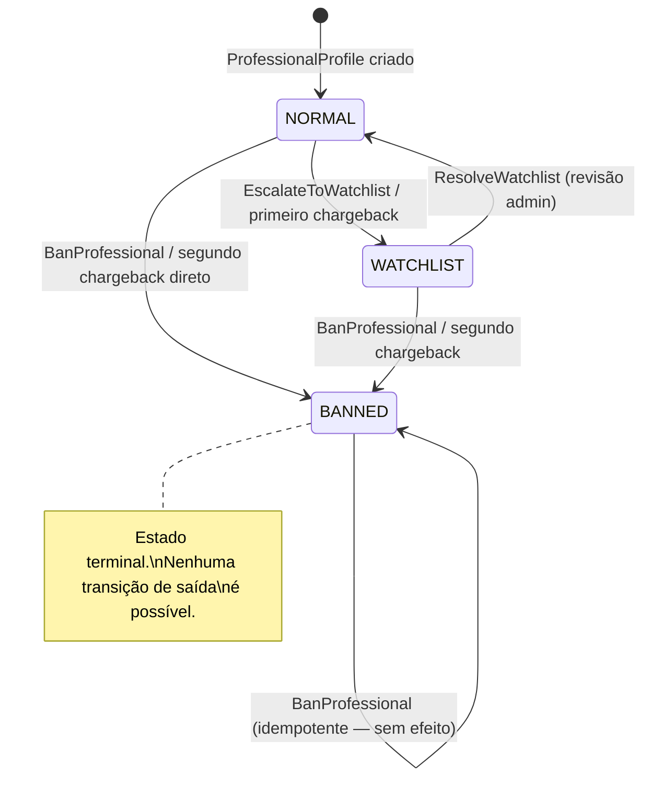
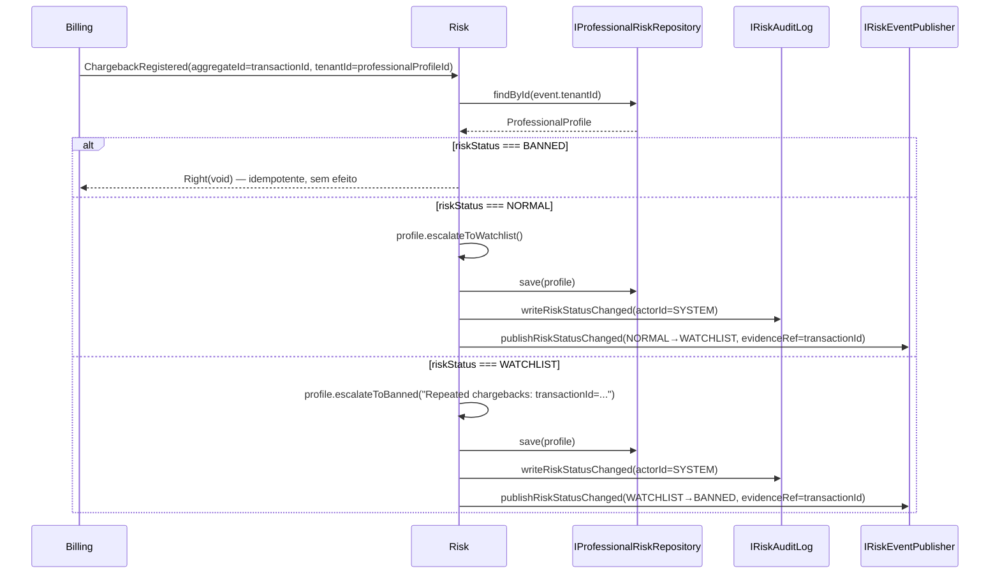

# Governança de Risco (Risk)

> **Contexto:** Risk | **Atualizado em:** 2026-02-28 | **Versão ADR baseline:** ADR-0022

O módulo Risk é responsável por classificar e evoluir o nível de risco financeiro e operacional de cada profissional cadastrado na plataforma. Ele mantém o `RiskStatus` do profissional — que pode ser `NORMAL`, `WATCHLIST` ou `BANNED` — e garante que toda mudança seja auditada, rastreável e propagada aos demais contextos via eventos de domínio. BANNED é um estado terminal e irreversível por design: uma vez atingido, nenhuma transição de saída é possível, sob qualquer circunstância.

---

## Visão Geral

### O que este módulo faz

O módulo Risk gerencia o ciclo de vida do `RiskStatus` de profissionais, aplicando escaladas automáticas (via chargebacks) e ações manuais de administradores (banimento direto, colocação em lista de monitoramento e resolução). Toda transição gera uma entrada no AuditLog e publica o evento `RiskStatusChanged` (v2), que os contextos de Billing, Scheduling e Platform consomem para aplicar restrições operacionais. O módulo não cria ou destrói perfis de profissionais — ele somente altera o campo `riskStatus` de um agregado existente, pertencente ao contexto Identity.

### O que este módulo NÃO faz

- **Não possui agregados próprios**: `ProfessionalProfile` é de propriedade do contexto Identity; o Risk opera sobre ele via porta de repositório cross-context.
- **Não suspende AccessGrants diretamente**: após publicar `RiskStatusChanged(BANNED)`, o contexto Billing reage e suspende os AccessGrants via consistência eventual.
- **Não aplica restrições de WATCHLIST diretamente**: restrições como redução de limites operacionais (ADR-0041 §2) são aplicadas pelos contextos Billing e Scheduling ao consumir `RiskStatusChanged`.
- **Não gerencia autenticação ou identidade**: isso é responsabilidade do contexto Identity.
- **Não rastreia chargebacks diretamente**: o evento `ChargebackRegistered` é produzido pelo contexto Billing e consumido aqui como gatilho de escalada.

### Módulos com os quais se relaciona

| Módulo   | Tipo de relação         | Como se comunica                                    |
| -------- | ----------------------- | --------------------------------------------------- |
| Identity | Lê e salva dados de     | Repositório cross-context (`IProfessionalRiskRepository`) — acessa `ProfessionalProfile` |
| Billing  | Consome eventos de      | Evento: `ChargebackRegistered` → aciona avaliação de risco |
| Billing  | Publica eventos para    | Evento: `RiskStatusChanged` → Billing suspende AccessGrants ao receber BANNED |
| Platform | Publica eventos para    | Evento: `RiskStatusChanged(BANNED)` → Platform suspende PlatformEntitlement |
| Scheduling | Publica eventos para  | Evento: `RiskStatusChanged` → Scheduling aplica restrições de WATCHLIST |

---

## Modelo de Domínio

### Agregado Operado (Cross-Context)

#### ProfessionalProfile (pertencente ao contexto Identity)

O Risk não possui um agregado próprio. Ele opera sobre o `ProfessionalProfile` do contexto Identity, acessado via porta de repositório cross-context (`IProfessionalRiskRepository`). Essa escolha foi deliberada: a porta está na camada de aplicação (não na de domínio) para evitar que o domínio Risk importe tipos do contexto Identity, mantendo o isolamento de bounded context (ADR-0001 §4, ADR-0022 Constraints).

O campo que o Risk gerencia no `ProfessionalProfile` é o `riskStatus`:

**Estados de RiskStatus possíveis:**

| Estado       | Descrição                                                                                    |
| ------------ | -------------------------------------------------------------------------------------------- |
| `NORMAL`     | Sem indicadores de risco. Profissional tem acesso pleno à plataforma.                        |
| `WATCHLIST`  | Indicadores de risco detectados. Monitoramento ativo; restrições operacionais são aplicadas. |
| `BANNED`     | Violação confirmada ou risco persistente. Suspensão operacional total e permanente.           |

**Transições de estado:**



**Regras de invariante:**

- `BANNED` é irreversível. Após atingido, nenhuma operação pode retornar o profissional a `NORMAL` ou `WATCHLIST`, nem mesmo por ação administrativa.
- Toda transição de `RiskStatus` exige uma justificativa (`reason`) não vazia, sem espaços em branco, com no máximo 500 caracteres.
- Toda transição gera um registro no AuditLog e publica `RiskStatusChanged`. Não existe transição silenciosa.
- Alterações de `RiskStatus` nunca modificam registros históricos de Execuções ou Transações (ADR-0022 Invariant 2).

**Operações do agregado (métodos de `ProfessionalProfile` usados pelo Risk):**

| Operação                          | O que faz                                      | Pré-condições                                                | Possíveis erros                  |
| --------------------------------- | ---------------------------------------------- | ------------------------------------------------------------ | -------------------------------- |
| `escalateToWatchlist()`           | NORMAL → WATCHLIST                              | `riskStatus === NORMAL`; perfil não pode estar DEACTIVATED  | `IDENTITY.INVALID_RISK_TRANSITION` |
| `escalateToBanned(reason)`        | NORMAL ou WATCHLIST → BANNED                   | `riskStatus !== BANNED`; perfil não pode estar DEACTIVATED  | `IDENTITY.INVALID_RISK_TRANSITION` |
| `resolveRisk()`                   | WATCHLIST → NORMAL                              | `riskStatus === WATCHLIST`                                   | `IDENTITY.INVALID_RISK_TRANSITION` |

> **Nota:** As operações acima são métodos do `ProfessionalProfile` (módulo Identity). O Risk as invoca e captura o resultado via `Either`. Se a transição falhar no agregado, o use case retorna `Left` sem salvar ou publicar nada.

---

### Erros de Domínio (próprios do contexto Risk)

| Código                          | Significado                                 | Quando ocorre                                                             |
| ------------------------------- | ------------------------------------------- | ------------------------------------------------------------------------- |
| `RISK.PROFESSIONAL_NOT_FOUND`   | Profissional não encontrado                 | `professionalProfileId` fornecido não existe no repositório               |
| `RISK.REASON_INVALID`           | Justificativa inválida                      | `reason` está vazia, é composta apenas por espaços, ou excede 500 caracteres |

---

## Funcionalidades e Casos de Uso

> Esta seção descreve **tudo que o sistema permite fazer** neste módulo.

---

### Escalada para Lista de Monitoramento

**O que é:** Coloca um profissional em monitoramento ativo quando sinais de risco são identificados mas ainda não confirmados — por exemplo, padrão suspeito de reembolsos ou primeira ocorrência de chargeback.

**Quem pode usar:** Administrador da plataforma (ação manual) ou sistema automatizado via chargeback.

**Como funciona (passo a passo):**

1. Valida o campo `reason`: deve ser não vazio, sem espaços em branco puros, com no máximo 500 caracteres (espaços nas bordas são removidos automaticamente).
2. Carrega o `ProfessionalProfile` pelo `professionalProfileId`. Se não encontrado, retorna `Left(RISK.PROFESSIONAL_NOT_FOUND)`.
3. Captura o `riskStatus` atual como `previousStatus` para o payload do evento.
4. Chama `profile.escalateToWatchlist()`. Se a transição falhar no agregado (ex.: perfil já está em `WATCHLIST` ou `BANNED`), retorna `Left`.
5. Persiste o perfil atualizado.
6. Grava entrada no AuditLog com `RISK_STATUS_CHANGED`, actorId, actorRole, previousStatus, newStatus, reason e timestamp UTC.
7. Publica `RiskStatusChanged` (v2) com `previousStatus=NORMAL`, `newStatus=WATCHLIST`, `reason` e `evidenceRef` (quando fornecido).

**Regras de negócio aplicadas:**

- ✅ Transição válida somente a partir de `NORMAL`.
- ✅ `reason` trimada antes de validar e incluir no evento.
- ❌ Perfil já em `WATCHLIST`: retorna `Left` (transição inválida no agregado).
- ❌ Perfil em `BANNED`: retorna `Left` (BANNED é terminal; `escalateToWatchlist` falha no agregado).
- ❌ `reason` vazia ou somente espaços: retorna `Left(RISK.REASON_INVALID)`.
- ❌ `reason` com mais de 500 caracteres: retorna `Left(RISK.REASON_INVALID)`.

**Resultado esperado:** `Right(void)` — nenhum dado de retorno (efeito colateral é a transição de estado).

**Efeitos colaterais:** Salva `ProfessionalProfile`; escreve AuditLog (`RISK_STATUS_CHANGED`); publica `RiskStatusChanged(WATCHLIST)`.

---

### Banimento de Profissional

**O que é:** Bane permanentemente um profissional da plataforma após violação confirmada, fraude ou abuso. `BANNED` é um estado terminal — nenhuma ação futura pode reverter esse status.

**Quem pode usar:** Administrador da plataforma (ação manual com `actorId` e `actorRole` humanos).

**Como funciona (passo a passo):**

1. Valida o campo `reason` (mesmo critério de 1–500 caracteres, com trim).
2. Carrega o `ProfessionalProfile`. Se não encontrado, retorna `Left(RISK.PROFESSIONAL_NOT_FOUND)`.
3. **Guarda de idempotência**: se o perfil já está em `BANNED`, retorna `Right(void)` sem salvar, auditar ou publicar nenhum evento. Essa proteção evita re-processamento em entregas duplicadas de eventos.
4. Captura `previousStatus` para o payload do evento.
5. Chama `profile.escalateToBanned(reason)`. Se a transição falhar no agregado (ex.: perfil em status `DEACTIVATED`), retorna `Left` sem salvar.
6. Persiste o perfil.
7. Grava AuditLog com actorId/actorRole do administrador, previousStatus, newStatus=BANNED.
8. Publica `RiskStatusChanged` (v2) com `newStatus=BANNED` e `evidenceRef` (ou `null` se não fornecido).

**Regras de negócio aplicadas:**

- ✅ Transição válida a partir de `NORMAL` ou `WATCHLIST`.
- ✅ Idempotente no estado `BANNED`: segunda chamada retorna sucesso sem efeitos.
- ✅ `evidenceRef` opcional: quando não fornecido no DTO, o evento carrega `evidenceRef: null`.
- ❌ Perfil `DEACTIVATED` com `NORMAL` riskStatus: `escalateToBanned` falha no agregado → retorna `Left`.
- ❌ `reason` inválida: retorna `Left(RISK.REASON_INVALID)` antes de carregar o perfil.

**Resultado esperado:** `Right(void)`.

**Efeitos colaterais:** Salva `ProfessionalProfile` com `riskStatus=BANNED`, `bannedAtUtc` e `bannedReason` preenchidos; escreve AuditLog; publica `RiskStatusChanged(BANNED)`. O contexto Billing reage a esse evento suspendendo AccessGrants (consistência eventual). O Platform reage suspendendo o PlatformEntitlement.

---

### Resolução de Lista de Monitoramento

**O que é:** Remove o profissional da lista de monitoramento após revisão administrativa bem-sucedida, retornando ao status `NORMAL`. Essa é uma ação exclusivamente manual — não existe resolução automática de WATCHLIST.

**Quem pode usar:** Administrador da plataforma.

**Como funciona (passo a passo):**

1. Valida `reason` (1–500 chars, trim).
2. Carrega o `ProfessionalProfile`. Se não encontrado, retorna `Left(RISK.PROFESSIONAL_NOT_FOUND)`.
3. Captura `previousStatus`.
4. Chama `profile.resolveRisk()`. Se o perfil não estiver em `WATCHLIST` (ex.: já em `NORMAL` ou `BANNED`), a transição falha no agregado → retorna `Left`.
5. Persiste o perfil.
6. Grava AuditLog.
7. Publica `RiskStatusChanged` (v2) com `previousStatus=WATCHLIST`, `newStatus=NORMAL`, `evidenceRef: null`. Resoluções administrativas nunca carregam referência de evidência externa.

**Regras de negócio aplicadas:**

- ✅ Transição válida somente a partir de `WATCHLIST`.
- ✅ `evidenceRef` é sempre `null` em resoluções administrativas — não há artefato externo referenciável.
- ❌ Perfil em `NORMAL`: retorna `Left` (nada a resolver).
- ❌ Perfil em `BANNED`: retorna `Left` (BANNED é terminal; `resolveRisk` falha no agregado).
- ❌ `reason` inválida: retorna `Left(RISK.REASON_INVALID)`.

**Resultado esperado:** `Right(void)`.

**Efeitos colaterais:** Salva `ProfessionalProfile` com `riskStatus=NORMAL`; escreve AuditLog; publica `RiskStatusChanged(NORMAL)`. Billing e Scheduling podem reativar restrições removidas.

---

### Avaliação de Risco por Chargeback (Automatizada)

**O que é:** Reação automatizada ao evento `ChargebackRegistered` do contexto Billing. Implementa escalada progressiva: primeiro chargeback leva o profissional a `WATCHLIST`; segundo chargeback (quando já em `WATCHLIST`) leva a `BANNED`. SYSTEM é o ator em todas as entradas de AuditLog geradas aqui.

**Quem pode usar:** Sistema (event handler automático — `actorId='SYSTEM'`).

**Como funciona (passo a passo):**



1. Extrai `professionalProfileId` de `event.tenantId` (convenção ADR-0009 §2).
2. Carrega o `ProfessionalProfile`. Se não encontrado, retorna `Left(RISK.PROFESSIONAL_NOT_FOUND)`.
3. **Guarda de idempotência**: se `riskStatus === BANNED`, retorna `Right(void)` sem efeitos.
4. Captura `previousStatus`; usa `event.aggregateId` (transactionId) como `evidenceRef`.
5. Se `NORMAL`: chama `escalateToWatchlist()` → NORMAL → WATCHLIST.
6. Se `WATCHLIST`: chama `escalateToBanned("Repeated chargebacks: transactionId=...")` → WATCHLIST → BANNED.
7. Persiste, grava AuditLog com `actorId='SYSTEM'`, `actorRole='SYSTEM'`, publica `RiskStatusChanged`.

**Regras de negócio aplicadas:**

- ✅ Escalada progressiva: primeiro chargeback → WATCHLIST; segundo → BANNED.
- ✅ Idempotente no estado `BANNED`: chargebacks adicionais são ignorados.
- ✅ `evidenceRef` = `event.aggregateId` (transactionId) — melhor referência disponível.
- ✅ Ator automático: `actorId='SYSTEM'`, `actorRole='SYSTEM'` (ADR-0027 §3).
- ❌ Perfil não encontrado via `event.tenantId`: retorna `Left(RISK.PROFESSIONAL_NOT_FOUND)`.
- ❌ Agregado em `DEACTIVATED` com `riskStatus=WATCHLIST`: `escalateToBanned` falha → retorna `Left` sem persistir.

**Resultado esperado:** `Right(void)`.

**Efeitos colaterais:** Salva `ProfessionalProfile`; escreve AuditLog (ator=SYSTEM); publica `RiskStatusChanged`.

---

## Regras de Negócio Consolidadas

| #  | Regra                                                                                                             | Onde é aplicada          | ADR       |
| -- | ----------------------------------------------------------------------------------------------------------------- | ------------------------ | --------- |
| 1  | `BANNED` é estado terminal. Nenhuma transição de saída é permitida em qualquer circunstância.                     | `ProfessionalProfile`    | ADR-0022  |
| 2  | `BanProfessional` é idempotente no estado `BANNED`: retorna sucesso sem salvar ou publicar.                        | Use Case `BanProfessional` | ADR-0022, ADR-0007 |
| 3  | `HandleChargebackRiskAssessment` é idempotente no estado `BANNED`: retorna sucesso sem efeitos.                    | Use Case `HandleChargeback` | ADR-0007 |
| 4  | Toda transição exige `reason` não vazia, após trim, com no máximo 500 caracteres.                                 | Todos os use cases       | ADR-0022 §5 |
| 5  | `reason` é trimada antes de validar e incluir no AuditLog e no evento.                                            | Todos os use cases       | ADR-0022 §5 |
| 6  | Ações automatizadas (chargeback) usam `actorId='SYSTEM'`, `actorRole='SYSTEM'` no AuditLog.                       | Use Case `HandleChargeback` | ADR-0027 §3 |
| 7  | Toda transição de RiskStatus emite `RiskStatusChanged` (v2) e grava `RISK_STATUS_CHANGED` no AuditLog.            | Todos os use cases       | ADR-0022 Invariant 3, ADR-0009 §4 |
| 8  | AuditLog é fire-and-forget: falha na gravação não reverte a operação de domínio.                                   | Todos os use cases       | ADR-0027 Constraints |
| 9  | Eventos são publicados pós-commit (depois de `repo.save`), nunca antes.                                            | Todos os use cases       | ADR-0009 §4 |
| 10 | `IProfessionalRiskRepository` fica na camada de aplicação (não no domínio) para evitar importação de Identity no domínio Risk. | Porta cross-context | ADR-0001 §4, ADR-0022 Constraints |
| 11 | Somente `ProfessionalProfile` é modificado por transação (uma agregado por transação).                             | Todos os use cases       | ADR-0003  |
| 12 | Suspensão de AccessGrants e PlatformEntitlement em `BANNED` é responsabilidade dos contextos Billing e Platform, via evento. | Arquitetura eventual | ADR-0003, ADR-0016 |
| 13 | `ResolveWatchlist` publica `evidenceRef: null` — resoluções administrativas não têm referência externa.            | Use Case `ResolveWatchlist` | ADR-0009 |
| 14 | Alterações de RiskStatus nunca modificam histórico de Execuções ou Transações.                                     | Invariante de domínio    | ADR-0022 Invariant 2, ADR-0005 |
| 15 | Histórico de auditoria de RiskStatus é retido permanentemente; LGPD não permite exclusão.                          | Infraestrutura           | ADR-0022 §7, ADR-0027 §7 |

---

## Eventos de Domínio

### Eventos Publicados por este Módulo

| Evento              | Versão | Quando é publicado                                     | O que contém                                                                     | Quem consome                             |
| ------------------- | ------ | ------------------------------------------------------ | -------------------------------------------------------------------------------- | ---------------------------------------- |
| `RiskStatusChanged` | v2     | Após toda transição bem-sucedida de `RiskStatus`       | `previousStatus`, `newStatus`, `reason`, `evidenceRef` (string ou null)          | Billing, Platform, Scheduling, Monitoring |

**Schema do payload (v2):**

```
previousStatus : string  — status anterior (NORMAL, WATCHLIST ou BANNED)
newStatus      : string  — novo status
reason         : string  — justificativa da transição (não vazia, ≤500 chars)
evidenceRef    : string | null — ID de evidência (transactionId, reportId) ou null
```

> **Nota de segurança (ADR-0037):** O payload não contém PII. `reason` é texto livre administrativo sem dados sensíveis. `evidenceRef` é sempre um ID de referência.

**Histórico de versões:**
- **v2 (atual):** `reason` obrigatório; `evidenceRef` adicionado; produtor corrigido para contexto Risk.
- **v1 (depreciado):** `reason` opcional; sem `evidenceRef`; produzido pelo contexto Identity.

### Eventos Consumidos por este Módulo

| Evento                | De qual módulo | O que faz ao receber                                                                                 |
| --------------------- | -------------- | ---------------------------------------------------------------------------------------------------- |
| `ChargebackRegistered` | Billing        | Aciona `HandleChargebackRiskAssessment`: NORMAL→WATCHLIST (1º chargeback) ou WATCHLIST→BANNED (2º+) |

---

## Infraestrutura e Persistência

### Dados armazenados

O módulo Risk não possui tabelas próprias. Ele persiste no mesmo schema que o contexto Identity, operando sobre a tabela `professional_profiles` via adaptador de repositório separado.

| Campos gerenciados pelo Risk em `professional_profiles` | O que representa |
| ------------------------------------------------------- | ---------------- |
| `risk_status`     | RiskStatus atual: NORMAL, WATCHLIST ou BANNED |
| `banned_at_utc`   | Timestamp UTC do banimento (preenchido ao atingir BANNED) |
| `banned_reason`   | Justificativa do banimento (preenchida ao atingir BANNED) |

### Dependências de infraestrutura

| Serviço / Sistema  | Para que é usado                               | ADR de referência |
| ------------------ | ---------------------------------------------- | ----------------- |
| PostgreSQL (Prisma) | Leitura e escrita de `ProfessionalProfile`    | ADR-0004          |
| Event Bus          | Publicação de `RiskStatusChanged`              | ADR-0009, ADR-0048 |
| AuditLog Store     | Gravação de `RISK_STATUS_CHANGED`              | ADR-0027          |

---

## Portas (Interfaces de Dependência)

### `IProfessionalRiskRepository`

Porta cross-context que acessa `ProfessionalProfile` (agregado do contexto Identity) para leitura e persistência de alterações de `riskStatus`. Localizada na camada de aplicação por design (ADR-0022 Constraints).

| Método                       | O que faz                                       |
| ---------------------------- | ----------------------------------------------- |
| `findById(profileId)`        | Carrega `ProfessionalProfile` por ID            |
| `save(profile)`              | Persiste o perfil com o novo `riskStatus`       |

### `IRiskEventPublisher`

| Método                                    | Evento publicado        |
| ----------------------------------------- | ----------------------- |
| `publishRiskStatusChanged(event)`         | `RiskStatusChanged` (v2) |

### `IRiskAuditLog`

| Método                                    | Entrada gravada               |
| ----------------------------------------- | ----------------------------- |
| `writeRiskStatusChanged(data)`            | `RISK_STATUS_CHANGED`         |

**Campos da entrada de auditoria:**

| Campo            | Descrição                                                          |
| ---------------- | ------------------------------------------------------------------ |
| `actorId`        | ID do admin, ou `'SYSTEM'` para ações automatizadas               |
| `actorRole`      | Papel do ator, ou `'SYSTEM'`                                      |
| `targetEntityId` | ID do `ProfessionalProfile` afetado                               |
| `tenantId`       | Mesmo valor de `targetEntityId` (profissional é o tenant do risco) |
| `previousStatus` | RiskStatus antes da transição                                      |
| `newStatus`      | RiskStatus após a transição                                        |
| `reason`         | Justificativa (trimada)                                            |
| `occurredAtUtc`  | Timestamp UTC da transição (ISO 8601)                              |

---

## Conformidade com ADRs

| ADR                                              | Status      | Observações                                                                       |
| ------------------------------------------------ | ----------- | --------------------------------------------------------------------------------- |
| ADR-0001 (Bounded Context Isolation)             | ✅ Conforme | `IProfessionalRiskRepository` na camada de aplicação; sem importação de Identity no domínio Risk |
| ADR-0003 (Uma agregado por transação)            | ✅ Conforme | Somente `ProfessionalProfile` é modificado por use case                           |
| ADR-0007 (Idempotência)                          | ✅ Conforme | `BanProfessional` e `HandleChargebackRiskAssessment` têm guarda no estado BANNED  |
| ADR-0009 (Contrato de Eventos de Domínio)        | ✅ Conforme | `RiskStatusChanged` v2 publicado pós-commit; schema versionado                    |
| ADR-0016 (Consistência Eventual)                 | ✅ Conforme | Restrições de BANNED aplicadas por Billing/Platform via evento                    |
| ADR-0022 (Financial Risk Governance)             | ✅ Conforme | Todas as transições seguem §2; BANNED terminal; evidenceRef no evento             |
| ADR-0027 (Auditoria e Rastreabilidade)           | ✅ Conforme | `RISK_STATUS_CHANGED` gravado em toda transição; ator SYSTEM para automações      |
| ADR-0037 (Dados Sensíveis — LGPD)               | ✅ Conforme | Payload do evento e contexto de erros usam somente IDs e comprimentos; sem PII   |
| ADR-0047 (Aggregate Root Definition)             | ✅ Conforme | Repositório cross-context opera exclusivamente sobre `ProfessionalProfile`        |
| ADR-0051 (DomainResult / Either)                 | ✅ Conforme | Todos os use cases retornam `DomainResult<void>` (Either)                         |

---

## Gaps e Melhorias Identificadas

| #  | Tipo               | Descrição                                                                                                                                                                    | Prioridade |
| -- | ------------------ | ---------------------------------------------------------------------------------------------------------------------------------------------------------------------------- | ---------- |
| 1  | 🔵 Informativa     | **`evidenceRef` usa transactionId** — `ChargebackRegistered` não expõe `chargebackId` separado; o `event.aggregateId` (transactionId) é a melhor referência disponível. Documentado no código como "billing package gap". Resolve quando Billing expuser chargebackId no evento. | Baixa |
| 2  | 🔵 Informativa     | **Gatilhos de risco não implementados** — ADR-0022 §5 lista quatro gatilhos: `ChargebackRegistered`, `PaymentFailed (repetido)`, `BookingCancelled (alta taxa)` e relatório administrativo. Apenas `ChargebackRegistered` tem handler implementado. Os demais são responsabilidade de iterações futuras. | Média |
| 3  | 🔵 Informativa     | **Ledger financeiro pós-MVP (ADR-0022 §6)** — quando o Ledger (ADR-0021) for ativado, profissionais com saldo negativo devem ser escalados automaticamente para WATCHLIST. Nenhum handler existe ainda para esse fluxo. | Baixa |
| 4  | 🔵 Informativa     | **Idempotência de event-ID** (ADR-0007 §6) — `HandleChargebackRiskAssessment` não verifica se o mesmo event-ID já foi processado. Dois eventos idênticos entregues duas vezes resultam em duas escaladas distintas (NORMAL→WATCHLIST e depois WATCHLIST→BANNED), o que é comportamentalmente correto mas pode surpreender. Idempotência por event-ID é uma preocupação da camada de infra (adaptador de event bus). | Baixa |

---

## Histórico de Atualizações

| Data       | O que mudou                     |
| ---------- | ------------------------------- |
| 2026-02-28 | Documentação inicial gerada     |
