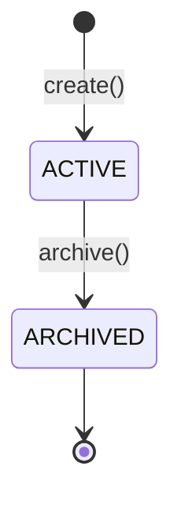
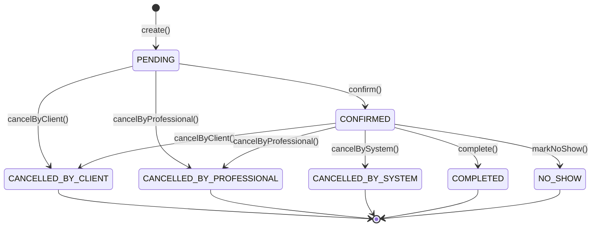

# Scheduling — Agendamentos e Disponibilidade

> **Contexto:** Scheduling | **Atualizado em:** 2026-02-26 | **Versão ADR baseline:** ADR-0051

O módulo Scheduling é responsável por toda a gestão de agendamentos entre profissionais e clientes na plataforma FitTrack. Ele controla a disponibilidade semanal do profissional, os tipos de sessão oferecidos, os agendamentos individuais e os padrões recorrentes. Este módulo não possui dependência direta do contexto de Billing — a autorização de acesso (AccessGrant) é resolvida pela camada externa e passada como parâmetro (padrão ACL).

---

## Visão Geral

### O que este módulo faz

O Scheduling gerencia o ciclo de vida completo de um agendamento: desde a definição de quando o profissional atende (disponibilidade semanal) e quais tipos de sessão oferece, passando pela criação de agendamentos individuais com verificação de conflitos e limites, até o suporte a padrões de recorrência semanal. Ele também aplica regras de segurança como bloqueio de profissionais banidos, verificação de validez do AccessGrant do cliente e prevenção de double-booking.

### O que este módulo NÃO faz

- **Não gerencia Billing ou pagamentos** — a criação de AccessGrants e cobrança ficam no módulo `billing`.
- **Não registra execuções** — quando uma sessão é completada, o registro da execução é de responsabilidade do módulo `execution`.
- **Não faz autenticação ou autorização JWT** — a verificação do token e a resolução do AccessGrant são feitas pela camada de API antes de chamar o use case.
- **Não calcula métricas** — o módulo `metrics` consome eventos publicados por este módulo.
- **Não gerencia clientes ou perfis** — esses são domínios de `identity`.

### Módulos com os quais se relaciona

| Módulo | Tipo de relação | Como se comunica |
|--------|-----------------|------------------|
| `billing` | Consumidor indireto — verifica AccessGrant | Parâmetro `AccessGrantValidationDTO` passado pela camada de API |
| `identity` | Consumidor indireto — verifica RiskStatus | Parâmetro `isBanned: boolean` passado pela camada de API |
| `execution` | Publica eventos para | Evento: `BookingCompleted` |
| `metrics` | Publica eventos para | Eventos de booking para analytics |
| `notifications` | Publica eventos para | `BookingConfirmed`, `BookingCancelled` etc. |

---

## Modelo de Domínio

### Agregados

#### Session

Uma Session representa um **tipo de serviço** que o profissional oferece — por exemplo, "Consulta Nutricional 60 min" ou "Treino Funcional 45 min". Sessions são referenciadas por ID em Bookings e RecurringSchedules (ADR-0047). Uma Session precisa estar ACTIVE para aceitar novos agendamentos. Arquivar uma Session impede novos agendamentos, mas não cancela os existentes.

**Estados possíveis:**

| Estado | Descrição |
|--------|-----------|
| `ACTIVE` | A session está disponível para receber novos agendamentos |
| `ARCHIVED` | A session foi desativada e não aceita novos agendamentos (estado terminal) |

**Transições de estado:**

**Regras de invariante:**

- Uma Session sempre é criada no estado `ACTIVE`.
- `ARCHIVED` é um estado terminal — não há como reativar uma session.
- O `professionalProfileId` é imutável após a criação (ADR-0025).

**Operações disponíveis:**

| Operação | O que faz | Quando pode ser chamada | Possíveis erros |
|----------|-----------|------------------------|-----------------|
| `Session.create()` | Cria nova session em ACTIVE | Sempre (sujeito a `isBanned`) | — |
| `session.archive()` | Transiciona ACTIVE → ARCHIVED | Somente se status for ACTIVE | `SCHEDULING.INVALID_BOOKING_TRANSITION` |

---

#### Booking

Um Booking representa um **agendamento concreto** entre um profissional e um cliente para uma Session específica em uma data/hora. É criado no estado PENDING e percorre um ciclo de vida bem definido. O `logicalDay` é computado uma única vez no timezone do cliente (ADR-0010) e nunca é recalculado.

**Estados possíveis:**

| Estado | Descrição |
|--------|-----------|
| `PENDING` | Agendamento criado, aguardando confirmação |
| `CONFIRMED` | Agendamento confirmado — sessão irá acontecer |
| `CANCELLED_BY_CLIENT` | Cancelado pelo cliente (terminal) |
| `CANCELLED_BY_PROFESSIONAL` | Cancelado pelo profissional (terminal) |
| `CANCELLED_BY_SYSTEM` | Cancelado automaticamente (ex: AccessGrant revogado) (terminal) |
| `COMPLETED` | Sessão realizada com sucesso, vinculada a uma Execution (terminal) |
| `NO_SHOW` | Cliente não compareceu à sessão confirmada (terminal) |

**Transições de estado:**

**Regras de invariante:**

- Um Booking sempre começa em `PENDING`.
- Estados terminais (`CANCELLED_*`, `COMPLETED`, `NO_SHOW`) não admitem nenhuma transição de saída.
- `CANCELLED_BY_SYSTEM` só pode ser aplicado a bookings no estado `CONFIRMED` (não em `PENDING`).
- O campo `logicalDay` é computado no momento da criação usando o timezone do cliente e é imutável (ADR-0010).
- O `professionalProfileId` é imutável e não nulo (ADR-0025).
- Ao completar um booking (`complete()`), o `executionId` deve ser informado — o booking registra a referência à Execution por ID (ADR-0047).

**Operações disponíveis:**

| Operação | O que faz | Quando pode ser chamada | Possíveis erros |
|----------|-----------|------------------------|-----------------|
| `Booking.create()` | Cria booking em PENDING | Sempre (sujeito às validações do use case) | — |
| `booking.confirm()` | PENDING → CONFIRMED | Somente em PENDING | `SCHEDULING.INVALID_BOOKING_TRANSITION` |
| `booking.cancelByClient(reason)` | PENDING/CONFIRMED → CANCELLED_BY_CLIENT | Em PENDING ou CONFIRMED | `SCHEDULING.INVALID_BOOKING_TRANSITION` |
| `booking.cancelByProfessional(reason)` | PENDING/CONFIRMED → CANCELLED_BY_PROFESSIONAL | Em PENDING ou CONFIRMED | `SCHEDULING.INVALID_BOOKING_TRANSITION` |
| `booking.cancelBySystem(reason)` | CONFIRMED → CANCELLED_BY_SYSTEM | Somente em CONFIRMED | `SCHEDULING.INVALID_BOOKING_TRANSITION` |
| `booking.complete(executionId)` | CONFIRMED → COMPLETED | Somente em CONFIRMED | `SCHEDULING.INVALID_BOOKING_TRANSITION` |
| `booking.markNoShow()` | CONFIRMED → NO_SHOW | Somente em CONFIRMED | `SCHEDULING.INVALID_BOOKING_TRANSITION` |

---

#### WorkingAvailability

WorkingAvailability define **quando um profissional está disponível** para receber bookings em um dia específico da semana. Um agregado por par `(professionalProfileId, dayOfWeek)`. Contém uma lista de janelas de horário (`TimeSlot`) não sobrepostas dentro do dia, sempre no timezone do profissional (ADR-0010 §7).

**Regras de invariante:**

- Um WorkingAvailability é identificado pela combinação `(professionalProfileId, dayOfWeek)`.
- Os TimeSlots dentro de um mesmo WorkingAvailability não podem se sobrepor.
- Os horários são armazenados no timezone do profissional (IANA).
- Não há estados — o agregado pode ser criado e ter seus slots substituídos a qualquer momento.

**Operações disponíveis:**

| Operação | O que faz | Quando pode ser chamada | Possíveis erros |
|----------|-----------|------------------------|-----------------|
| `WorkingAvailability.create()` | Cria disponibilidade com slots iniciais | Sempre (sujeito a `isBanned`) | `SCHEDULING.OVERLAPPING_TIME_SLOT` |
| `availability.replaceSlots(newSlots)` | Substitui todos os slots | Sempre | `SCHEDULING.OVERLAPPING_TIME_SLOT` |
| `availability.addSlot(slot)` | Adiciona um slot ao conjunto existente | Sempre | `SCHEDULING.OVERLAPPING_TIME_SLOT` |

---

#### RecurringSchedule

RecurringSchedule representa um **padrão semanal recorrente** para uma sessão entre profissional e cliente. Ao criar, o sistema gera automaticamente N ocorrências (`RecurringSession`) a partir da próxima data correspondente ao dia da semana definido, com incrementos semanais. Cada ocorrência pode eventualmente ser associada a um Booking (referência por ID).

**Entidade subordinada: RecurringSession**

`RecurringSession` é uma entidade subordinada de `RecurringSchedule` (ADR-0047). Cada instância representa uma ocorrência gerada no padrão recorrente. Ela guarda o `logicalDay`, `scheduledAtUtc`, `timezoneUsed` e o `bookingId` (null até ser associada a um Booking). Não é acessível por ID de fora do agregado.

**Regras de invariante:**

- Máximo de 52 sessões por RecurringSchedule (uma por semana durante um ano) — configurável.
- Profissionais em WATCHLIST têm limite reduzido a 12 sessões por schedule (ADR-0041).
- O `professionalProfileId` é imutável (ADR-0025).
- A Session referenciada deve estar ACTIVE no momento da criação.

---

### Value Objects

| Value Object | O que representa | Regras de validação |
|--------------|-----------------|---------------------|
| `SessionTitle` | Título de uma session | Entre 1 e 120 caracteres após trim |
| `DurationMinutes` | Duração em minutos inteiros | Inteiro positivo entre 1 e 480 (máximo 8 horas) |
| `TimeSlot` | Janela de tempo HH:mm–HH:mm | Formato HH:mm válido (00:00–23:59); `endTime` estritamente após `startTime`; não pode se sobrepor a outros slots do mesmo WorkingAvailability |

---

### Erros de Domínio

| Código | Significado | Quando ocorre |
|--------|-------------|---------------|
| `SCHEDULING.INVALID_BOOKING_TRANSITION` | Transição de estado inválida | Tentativa de transicionar Booking ou Session para um estado não permitido a partir do estado atual |
| `SCHEDULING.INVALID_DURATION` | Duração inválida | DurationMinutes fora do intervalo 1–480 ou não inteiro |
| `SCHEDULING.INVALID_TIME_SLOT` | Slot de horário inválido | Formato HH:mm inválido ou `startTime >= endTime` |
| `SCHEDULING.OVERLAPPING_TIME_SLOT` | Slots sobrepostos | Dois TimeSlots do mesmo WorkingAvailability se sobrepõem |
| `SCHEDULING.INVALID_SESSION_TITLE` | Título de session inválido | Título vazio ou com mais de 120 caracteres |
| `SCHEDULING.SESSION_NOT_FOUND` | Session não encontrada | Session com o ID fornecido não existe ou pertence a outro profissional (tenant isolation — ADR-0025) |
| `SCHEDULING.SESSION_NOT_ACTIVE` | Session inativa | Session existe mas está ARCHIVED, portanto não aceita novos bookings |
| `SCHEDULING.BOOKING_NOT_FOUND` | Booking não encontrado | Booking com o ID fornecido não existe ou pertence a outro profissional (ADR-0025) |
| `SCHEDULING.WORKING_AVAILABILITY_NOT_FOUND` | Disponibilidade não encontrada | WorkingAvailability não existe ou pertence a outro profissional (ADR-0025) |
| `SCHEDULING.RECURRING_SCHEDULE_NOT_FOUND` | Schedule recorrente não encontrado | RecurringSchedule não existe ou pertence a outro profissional |
| `SCHEDULING.DOUBLE_BOOKING` | Double-booking detectado | Já existe um booking PENDING ou CONFIRMED para a mesma session no mesmo dia lógico |
| `SCHEDULING.OPERATIONAL_LIMIT_EXCEEDED` | Limite operacional excedido | Número de bookings abertos por cliente ou sessões recorrentes por schedule atingiu o limite (ADR-0041) |
| `SCHEDULING.PROFESSIONAL_BANNED` | Profissional banido | Tentativa de criar ou modificar entidade com profissional em status BANNED (ADR-0022) |
| `SCHEDULING.RECURRING_SESSION_LIMIT_EXCEEDED` | Limite de sessões recorrentes | Alias para limite de sessões no RecurringSchedule |
| `SCHEDULING.INVALID_RECURRENCE_COUNT` | Contagem de recorrências inválida | `dayOfWeek` inválido na criação do RecurringSchedule |
| `SCHEDULING.SLOT_OUTSIDE_AVAILABILITY` | Slot fora da disponibilidade | (Reservado para uso futuro) |
| `SCHEDULING.ACCESS_GRANT_INVALID` | AccessGrant inválido | AccessGrant do cliente não existe, está expirado, suspenso, revogado ou sem sessões disponíveis (ADR-0046) |

---

## Funcionalidades e Casos de Uso

### 1. Criar Session (tipo de serviço)

**O que é:** Permite que o profissional cadastre um tipo de serviço que oferece, com título e duração. Sessions são a base sobre a qual os agendamentos são criados.

**Quem pode usar:** Profissional autenticado, não banido.

**Como funciona:**

1. O sistema verifica se o profissional está BANNED — se sim, retorna erro imediatamente.
2. Valida o título (1–120 caracteres após trim).
3. Valida a duração em minutos (inteiro, 1–480).
4. Cria a Session no estado `ACTIVE`.
5. Persiste no repositório.

**Regras de negócio:**

- ✅ Profissional deve estar ativo (não BANNED) para criar sessions.
- ✅ Título entre 1 e 120 caracteres.
- ✅ Duração entre 1 e 480 minutos (8 horas máximo).
- ❌ Profissional BANNED → `SCHEDULING.PROFESSIONAL_BANNED`
- ❌ Título inválido → `SCHEDULING.INVALID_SESSION_TITLE`
- ❌ Duração inválida → `SCHEDULING.INVALID_DURATION`

**Resultado esperado:** DTO com `sessionId`, `professionalProfileId`, `title`, `durationMinutes`, `status: ACTIVE` e `createdAtUtc`.

**Efeitos colaterais:** Nenhum evento publicado (criação de Session não é um evento de negócio relevante para contextos externos — ADR-0009 §6).

---

### 2. Criar Disponibilidade Semanal

**O que é:** Registra os horários em que o profissional atende em um determinado dia da semana. Define as janelas de tempo disponíveis para agendamentos.

**Quem pode usar:** Profissional autenticado, não banido.

**Como funciona:**

1. Verifica se o profissional está BANNED.
2. Valida o `dayOfWeek` (1 = Segunda a 7 = Domingo, ISO 8601).
3. Valida e cria cada `TimeSlot` fornecido (formato HH:mm, `end > start`).
4. Cria o `WorkingAvailability` com os slots, validando que não há sobreposições entre eles.
5. Persiste no repositório.

**Regras de negócio:**

- ✅ Um `WorkingAvailability` por par `(professionalProfileId, dayOfWeek)`.
- ✅ Todos os horários no timezone do profissional (ADR-0010 §7).
- ✅ Slots dentro do mesmo `WorkingAvailability` não podem se sobrepor.
- ❌ Profissional BANNED → `SCHEDULING.PROFESSIONAL_BANNED`
- ❌ `dayOfWeek` inválido → `SCHEDULING.INVALID_TIME_SLOT`
- ❌ Formato de horário inválido → `SCHEDULING.INVALID_TIME_SLOT`
- ❌ Slots sobrepostos → `SCHEDULING.OVERLAPPING_TIME_SLOT`

**Resultado esperado:** DTO com `workingAvailabilityId`, `dayOfWeek`, `timezoneUsed` e lista de slots (`startTime`, `endTime`).

**Efeitos colaterais:** Nenhum evento publicado.

---

### 3. Atualizar Disponibilidade Semanal

**O que é:** Substitui completamente os slots de horário de um `WorkingAvailability` existente. Operação de replace total (não patch).

**Quem pode usar:** Profissional autenticado, não banido.

**Como funciona:**

1. Verifica se o profissional está BANNED.
2. Valida o UUID do `workingAvailabilityId`.
3. Busca o `WorkingAvailability` pelo ID, verificando que pertence ao profissional (ADR-0025).
4. Valida e cria os novos `TimeSlots`.
5. Chama `replaceSlots()` no agregado, que valida ausência de sobreposições e atualiza o `updatedAtUtc`.
6. Persiste.

**Regras de negócio:**

- ✅ Tenant isolation: retorna NOT_FOUND para `workingAvailabilityId` de outro profissional (ADR-0025).
- ✅ A lista nova substitui completamente a lista anterior.
- ❌ Profissional BANNED → `SCHEDULING.PROFESSIONAL_BANNED`
- ❌ Disponibilidade não encontrada → `SCHEDULING.WORKING_AVAILABILITY_NOT_FOUND`
- ❌ Slots sobrepostos → `SCHEDULING.OVERLAPPING_TIME_SLOT`

**Resultado esperado:** DTO com `workingAvailabilityId`, lista de slots atualizada e `updatedAtUtc`.

**Efeitos colaterais:** Nenhum evento publicado.

---

### 4. Criar Agendamento (Booking)

**O que é:** Cria um agendamento de um cliente para uma sessão específica. Esta é a operação central do módulo — aplica todas as regras de negócio de agendamento: verificação de acesso, prevenção de conflitos e limites operacionais.

**Quem pode usar:** Camada de API que já resolveu o `AccessGrant` do cliente e o status de risco do profissional.

**Como funciona:**

1. Verifica se o profissional está BANNED (ADR-0022).
2. Verifica a validade do `AccessGrant` do cliente — 5 pontos de verificação (ADR-0046 §3):
   - AccessGrant existe para o par (clientId, professionalProfileId)
   - Status é ACTIVE (não SUSPENDED, EXPIRED ou REVOKED)
   - `clientId` bate com o do booking
   - `professionalProfileId` bate com o dono da session
   - Sessões disponíveis no allotment (ou allotment ilimitado)
3. Valida o UUID da `sessionId`.
4. Busca a Session — verifica existência e que pertence ao mesmo profissional (ADR-0025).
5. Verifica que a Session está ACTIVE.
6. Parseia `scheduledAtUtc` como UTC ISO 8601 (ADR-0010).
7. Computa o `logicalDay` no timezone do cliente (ADR-0010) — imutável após criação.
8. Verifica double-booking: não pode existir booking PENDING ou CONFIRMED para a mesma session no mesmo `logicalDay` (ADR-0006).
9. Verifica limite de bookings abertos por cliente (ADR-0041, padrão: 10, configurável).
10. Cria o Booking em estado `PENDING`.
11. Persiste.

**Regras de negócio:**

- ✅ Profissional não pode estar BANNED.
- ✅ AccessGrant deve ser válido em todos os 5 pontos (ADR-0046 §3).
- ✅ Session deve existir e pertencer ao mesmo profissional.
- ✅ Session deve estar ACTIVE.
- ✅ `scheduledAtUtc` deve ser UTC válido (ISO 8601 com sufixo Z).
- ✅ `logicalDay` computado uma única vez e imutável (ADR-0010).
- ✅ Sem double-booking: uma session por dia lógico (ADR-0006).
- ✅ Limite de bookings abertos por cliente respeitado (ADR-0041).
- ❌ Profissional BANNED → `SCHEDULING.PROFESSIONAL_BANNED`
- ❌ AccessGrant inválido → `SCHEDULING.ACCESS_GRANT_INVALID`
- ❌ UUID inválido → `ErrorCodes.INVALID_UUID` (do `@fittrack/core`)
- ❌ Session não encontrada / cross-tenant → `SCHEDULING.SESSION_NOT_FOUND`
- ❌ Session arquivada → `SCHEDULING.SESSION_NOT_ACTIVE`
- ❌ `scheduledAtUtc` não-UTC → `ErrorCodes.TEMPORAL_VIOLATION`
- ❌ Timezone inválido → `ErrorCodes.INVALID_TIMEZONE`
- ❌ Double-booking → `SCHEDULING.DOUBLE_BOOKING`
- ❌ Limite excedido → `SCHEDULING.OPERATIONAL_LIMIT_EXCEEDED`

**Resultado esperado:** DTO com `bookingId`, `professionalProfileId`, `clientId`, `sessionId`, `status: PENDING`, `scheduledAtUtc`, `logicalDay`, `timezoneUsed` e `createdAtUtc`.

**Efeitos colaterais:** O Booking é criado em PENDING — não é publicado `BookingConfirmed` aqui. O evento `BookingConfirmed` será publicado quando a transição PENDING → CONFIRMED ocorrer (use case pendente de implementação — ver Gaps).

> **Nota de arquitetura:** O módulo Scheduling não importa o módulo Billing diretamente (ADR-0029). O `AccessGrant` é resolvido pela camada de API e passado como `AccessGrantValidationDTO`. Este padrão espelha o `isBanned: boolean` para RiskStatus e mantém o isolamento de contexto.

---

### 5. Cancelar Agendamento

**O que é:** Cancela um booking existente, seja pelo cliente ou pelo profissional. Aplica a transição de estado correspondente.

**Quem pode usar:** Profissional ou cliente autenticado (a distinção é feita pelo campo `cancelledBy`).

**Como funciona:**

1. Valida o UUID do `bookingId`.
2. Busca o booking pelo ID e `professionalProfileId` — tenant isolation (ADR-0025).
3. Se `cancelledBy === 'CLIENT'`: chama `booking.cancelByClient(reason)` → CANCELLED_BY_CLIENT.
4. Se `cancelledBy === 'PROFESSIONAL'`: chama `booking.cancelByProfessional(reason)` → CANCELLED_BY_PROFESSIONAL.
5. Valida que a transição é permitida (PENDING ou CONFIRMED podem ser cancelados).
6. Persiste o booking atualizado.

**Regras de negócio:**

- ✅ Tenant isolation: cross-tenant retorna NOT_FOUND, nunca FORBIDDEN (ADR-0025).
- ✅ Apenas bookings em PENDING ou CONFIRMED podem ser cancelados — estados terminais não.
- ✅ O motivo do cancelamento (`reason`) é obrigatório.
- ❌ UUID inválido → `ErrorCodes.INVALID_UUID`
- ❌ Booking não encontrado / cross-tenant → `SCHEDULING.BOOKING_NOT_FOUND`
- ❌ Booking em estado terminal → `SCHEDULING.INVALID_BOOKING_TRANSITION`

**Resultado esperado:** DTO com `bookingId`, `status` (CANCELLED_BY_CLIENT ou CANCELLED_BY_PROFESSIONAL), `cancelledBy`, `cancellationReason` e `cancelledAtUtc`.

**Efeitos colaterais:** Evento `BookingCancelled` está definido e previsto para ser publicado após o save (conforme declarado no código do use case), mas o port `ISchedulingEventPublisher` ainda não foi implementado (ver Gaps).

---

### 6. Criar Schedule Recorrente

**O que é:** Cria um padrão de sessões semanais entre profissional e cliente para um dia da semana fixo. O sistema gera automaticamente N ocorrências com datas calculadas a partir da próxima ocorrência do dia indicado.

**Quem pode usar:** Profissional autenticado, não banido.

**Como funciona:**

1. Verifica se o profissional está BANNED.
2. Valida o `dayOfWeek` (1–7, ISO 8601).
3. Valida `recurrenceCount`: inteiro positivo dentro do limite configurado (52 normal, 12 para WATCHLIST — ADR-0041).
4. Valida o UUID da `sessionId`.
5. Busca a Session — verifica existência e tenant.
6. Verifica que a Session está ACTIVE.
7. Cria o agregado `RecurringSchedule`.
8. Para cada ocorrência i de 0 a N-1:
   - Calcula a data `baseDate + i * 7 dias`.
   - Constrói o `scheduledAtUtc` combinando a data com o `startTime` no formato HH:mm.
   - Computa o `logicalDay` no timezone do profissional.
   - Chama `schedule.addSession()` para criar a `RecurringSession` interna.
9. Persiste o `RecurringSchedule` com todas as sessões geradas.

**Regras de negócio:**

- ✅ Profissional BANNED não pode criar schedules.
- ✅ Session deve existir e estar ACTIVE.
- ✅ Limite de recorrência respeitado: 52 para NORMAL, 12 para WATCHLIST (ADR-0041).
- ✅ `logicalDay` de cada ocorrência calculado no timezone do profissional (ADR-0010).
- ✅ Tenant isolation em todas as verificações (ADR-0025).
- ❌ Profissional BANNED → `SCHEDULING.PROFESSIONAL_BANNED`
- ❌ `dayOfWeek` inválido → `SCHEDULING.INVALID_RECURRENCE_COUNT`
- ❌ `recurrenceCount` fora do limite → `SCHEDULING.OPERATIONAL_LIMIT_EXCEEDED`
- ❌ Session não encontrada → `SCHEDULING.SESSION_NOT_FOUND`
- ❌ Session inativa → `SCHEDULING.SESSION_NOT_ACTIVE`

**Resultado esperado:** DTO com `recurringScheduleId`, `professionalProfileId`, `clientId`, `sessionId`, `dayOfWeek`, `startTime`, `sessionCount` e `createdAtUtc`.

**Efeitos colaterais:** Evento `RecurringScheduleCreated` está definido e previsto para ser publicado, mas o port `ISchedulingEventPublisher` ainda não foi implementado (ver Gaps).

---

## Regras de Negócio Consolidadas

| # | Regra | Onde é aplicada | ADR |
|---|-------|-----------------|-----|
| 1 | Profissional BANNED não pode criar nem modificar nenhuma entidade | Todos os use cases | ADR-0022 |
| 2 | Cross-tenant retorna NOT_FOUND (404), nunca FORBIDDEN (403) | Todos os repositórios e use cases | ADR-0025 |
| 3 | `professionalProfileId` é imutável após criação em todos os agregados | Todos os agregados | ADR-0025 |
| 4 | AccessGrant deve passar verificação de 5 pontos para criar um booking | `CreateBooking` | ADR-0046 §3 |
| 5 | `logicalDay` é computado no momento da criação e nunca recalculado | `Booking.create()`, `RecurringSchedule.addSession()` | ADR-0010 |
| 6 | `scheduledAtUtc` deve ser UTC estrito (ISO 8601, sufixo Z) | `CreateBooking` | ADR-0010 |
| 7 | TimeSlots dentro de um WorkingAvailability não podem se sobrepor | `WorkingAvailability.create()`, `replaceSlots()`, `addSlot()` | — |
| 8 | Sem double-booking: máximo um booking PENDING/CONFIRMED por (sessionId, logicalDay) | `CreateBooking` | ADR-0006 |
| 9 | Limite de 10 bookings abertos por cliente (configurável) | `CreateBooking` | ADR-0041 |
| 10 | Limite de 52 sessões por RecurringSchedule (12 para WATCHLIST, configurável) | `CreateRecurringSchedule` | ADR-0041 |
| 11 | Session deve estar ACTIVE para aceitar novos bookings ou integrar schedules | `CreateBooking`, `CreateRecurringSchedule` | ADR-0008 |
| 12 | Estados terminais de Booking não admitem transições de saída | `Booking` aggregate | ADR-0008 |
| 13 | Agregados não publicam eventos — apenas UseCases (pós-commit) | Todos os agregados | ADR-0009 |
| 14 | Cross-context: Scheduling não importa Billing diretamente | `CreateBooking` — usa `AccessGrantValidationDTO` | ADR-0029 |
| 15 | Limites operacionais são verificados antes de qualquer transação de domínio | `CreateBooking`, `CreateRecurringSchedule` | ADR-0041 |

---

## Eventos de Domínio

### Eventos Publicados por este Módulo

> **Status atual:** Todos os eventos estão definidos como classes TypeScript e exportados no `index.ts`. O port `ISchedulingEventPublisher` ainda não foi implementado — os eventos são previstos pelo ADR mas ainda não são despachados em produção (ver Gaps).

| Evento | Quando é publicado | O que contém | Quem consome (previsto) |
|--------|-------------------|--------------|------------------------|
| `BookingConfirmed` | Quando booking transiciona PENDING → CONFIRMED | `sessionId`, `clientId`, `professionalProfileId`, `logicalDay` | Notifications, Analytics |
| `BookingCancelled` | Quando booking é cancelado por cliente ou profissional | `reason`, `cancelledBy` | Notifications, Analytics |
| `BookingCancelledBySystem` | Quando booking é cancelado automaticamente (AccessGrant revogado) | `reason` | Notifications, Risk |
| `BookingCompleted` | Quando booking é completado com executionId | `executionId` | Execution (confirmação), Metrics |
| `BookingNoShow` | Quando cliente não comparece à sessão confirmada | — (payload vazio) | Analytics, Risk |
| `RecurringScheduleCreated` | Quando um padrão recorrente é criado com sucesso | `sessionId`, `clientId`, `dayOfWeek`, `sessionCount` | Analytics |

### Eventos Consumidos por este Módulo

Este módulo não consome eventos de outros contextos diretamente. A integração com Billing (AccessGrant) é feita de forma síncrona via parâmetro `AccessGrantValidationDTO`, e a integração com Identity (RiskStatus) via parâmetro `isBanned: boolean`.

---

## Infraestrutura e Persistência

### Dados armazenados

| Tabela/Coleção | O que armazena | Campos principais |
|----------------|----------------|-------------------|
| `sessions` | Sessions (tipos de serviço) | `id`, `professionalProfileId`, `title`, `duration_minutes`, `status`, `archived_at_utc` |
| `bookings` | Agendamentos individuais | `id`, `professional_profile_id`, `client_id`, `session_id`, `status`, `scheduled_at_utc`, `logical_day`, `timezone_used`, `cancelled_by`, `cancellation_reason`, `cancelled_at_utc`, `completed_at_utc`, `execution_id`, `version` |
| `working_availabilities` | Disponibilidade semanal | `id`, `professional_profile_id`, `day_of_week`, `timezone_used`, `slots` (JSONB), `version` |
| `recurring_schedules` | Padrões recorrentes | `id`, `professional_profile_id`, `client_id`, `session_id`, `day_of_week`, `start_time`, `timezone_used` |
| `recurring_sessions` | Ocorrências geradas | `id`, `recurring_schedule_id`, `logical_day`, `scheduled_at_utc`, `timezone_used`, `booking_id` |

> **Nota:** Bookings usam otimistic locking via campo `version` (ADR-0006). Double-booking também é prevenido por partial unique index no banco de dados.

### Integrações externas

Nenhuma integração com serviços externos neste módulo.

---

## Conformidade com ADRs

| ADR | Status | Observações |
|-----|--------|-------------|
| ADR-0009 (Pureza de Agregados / Dispatch por UseCase) | ✅ Conforme | Nenhum agregado chama `addDomainEvent()`. Nenhum side effect externo em aggregates. Nenhum `throw` no domain layer. |
| ADR-0010 (Política Temporal) | ✅ Conforme | `logicalDay` calculado no timezone correto e imutável. `scheduledAtUtc` validado como UTC estrito. Disponibilidade usa timezone do profissional. |
| ADR-0022 (BANNED — estado terminal) | ✅ Conforme | BANNED bloqueia todos os use cases de criação/modificação. Nenhuma transição de saída do BANNED. |
| ADR-0025 (Isolamento de Tenant) | ✅ Conforme | Todas as queries incluem `professionalProfileId`. Cross-tenant retorna 404. |
| ADR-0029 (Isolamento de Bounded Context) | ✅ Conforme | Scheduling não importa módulos de Billing ou Identity diretamente. Acesso via parâmetros (ACL pattern). |
| ADR-0041 (Limites Operacionais) | ✅ Conforme | Limites de bookings abertos e sessões recorrentes configuráveis via constructor. Verificados antes da transação de domínio. |
| ADR-0046 (AccessGrant Lifecycle) | ✅ Conforme | Verificação dos 5 pontos implementada via `AccessGrantValidationDTO`. |
| ADR-0047 (Aggregate Root) | ✅ Conforme | `RecurringSession` é entidade subordinada acessível apenas pelo agregado. Referências cross-aggregate por ID. |
| ADR-0051 (Domain Error Handling) | ✅ Conforme | Todos os métodos de domínio retornam `DomainResult<T>`. Nenhum `throw` no domain layer. Códigos centralizados em `SchedulingErrorCodes`. |
| ADR-0006 (Concurrency Control) | ✅ Conforme | Booking usa otimistic locking via campo `version`. Double-booking prevenido em domain layer. |

---

## Gaps e Melhorias Identificadas

| # | Tipo | Descrição | Prioridade |
|---|------|-----------|------------|
| 1 | 🟡 Melhoria | **`Session.archive()` usa `InvalidBookingTransitionError`**: o agregado `Session` importa e reutiliza `InvalidBookingTransitionError` para seu próprio método `archive()`. O erro retornado tem código `SCHEDULING.INVALID_BOOKING_TRANSITION`, que semanticamente se refere a transições de **Booking**, não de **Session**. Seria mais preciso ter `InvalidSessionTransitionError` com código `SCHEDULING.INVALID_SESSION_TRANSITION`. Os testes atualmente assertam `INVALID_BOOKING_TRANSITION` para operações de session archive, o que pode causar confusão na leitura. | Baixa |
| 2 | 🔵 Infra pendente | **`ISchedulingEventPublisher` não implementado**: 6 eventos estão definidos (`BookingConfirmed`, `BookingCancelled`, `BookingCancelledBySystem`, `BookingCompleted`, `BookingNoShow`, `RecurringScheduleCreated`) e exportados no `index.ts`, mas nenhum use case os despacha. Falta criar: port `ISchedulingEventPublisher`, stub de teste `InMemorySchedulingEventPublisherStub`, e injetar dispatch em `CancelBooking` e `CreateRecurringSchedule`. Este é o mesmo gap resolvido para o módulo `billing` na sprint anterior. | Média |
| 3 | 🔵 Use cases ausentes | **Transições de Booking sem use case**: os métodos `confirm()`, `complete()`, `markNoShow()` e `cancelBySystem()` existem no agregado `Booking` e são cobertos por testes de domínio, mas não há use cases de aplicação correspondentes. Isso significa que nenhum desses estados pode ser atingido via API no momento. Em particular, `BookingConfirmed` nunca pode ser publicado porque não há `ConfirmBooking` use case. | Alta |
| 4 | 🔵 Informativa | **`throw` defensivo em `CancelBooking`**: na linha 49 do `cancel-booking.ts`, há um `throw new Error(...)` como guarda de invariante após o método `cancelByClient/cancelByProfessional`. Está marcado com `/* v8 ignore next 2 */`. Na prática, nunca deve disparar pois o aggregate garante que esses campos são preenchidos após uma transição de cancelamento bem-sucedida. Não é uma violação real, mas é um ponto de atenção. | Baixa |

---

## Histórico de Atualizações

| Data | O que mudou |
|------|-------------|
| 2026-02-26 | Documentação inicial gerada — análise completa de conformidade com ADRs, modelo de domínio, 6 use cases documentados, 6 eventos identificados, 4 gaps registrados |
