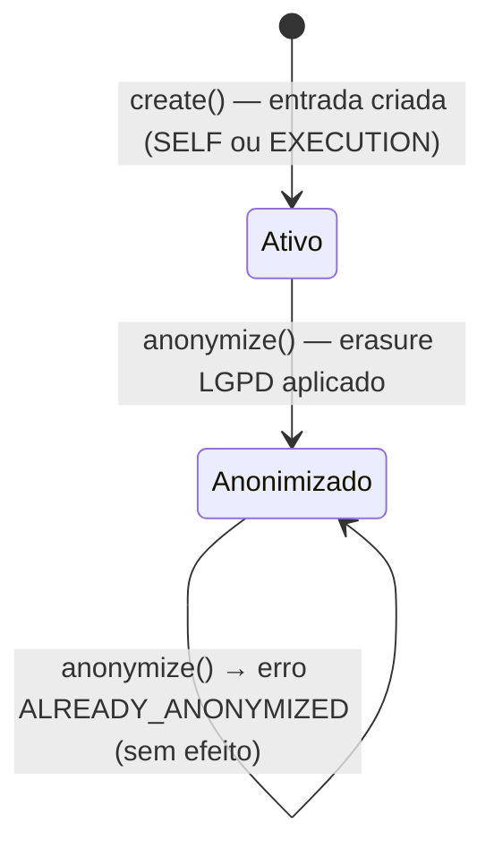

# Self Log

> **Contexto:** Self Log / Registro Pessoal de Atividades | **Atualizado em:** 2026-02-28 | **Versão ADR baseline:** ADR-0051

O módulo Self Log é responsável por registrar e gerenciar o histórico pessoal de atividades de clientes. Ele opera como um **diário de atividades** onde os dados podem ser inseridos manualmente pelo próprio cliente ("Modo Pessoal") ou projetados automaticamente a partir de execuções confirmadas realizadas sob prescrição profissional. É o ponto central de rastreamento de treinos e atividades no nível do cliente — sem ser, ele mesmo, uma fonte de verdade para regras de negócio críticas.

---

## Visão Geral

### O que este módulo faz

O Self Log permite que clientes registrem suas atividades físicas com dados como valor medido (ex.: 30 repetições, 73,5 kg), unidade de medida e uma nota textual descritiva. Ele também funciona como **read model** do contexto de Execução: cada vez que uma execução confirmada é registrada no sistema, o Self Log cria automaticamente uma entrada espelhada, oferecendo ao cliente uma visão consolidada de todas as suas atividades — sejam elas livres (registradas por conta própria) ou estruturadas (prescritas pelo profissional).

O módulo também cumpre as exigências da **LGPD**: ao receber uma solicitação de exclusão de dados, anonimiza os campos de saúde (valor, unidade e nota) da entrada, preservando a estrutura do registro para fins de auditoria e consistência de projeções.

### O que este módulo NÃO faz

- **Não valida ou gerencia AccessGrants** — a autorização de acesso do cliente é responsabilidade do módulo Billing/Platform.
- **Não deriva métricas** — cálculo de métricas de desempenho é responsabilidade do módulo Metrics (ADR-0014, ADR-0043).
- **Não altera registros de Execução** — as entradas source=EXECUTION são projeções de leitura; o Self Log nunca modifica o módulo de Execução (ADR-0005).
- **Não gerencia prescrições ou entregáveis** — referencia um Deliverable apenas por ID (cross-aggregate ref por ID, ADR-0047).
- **Não publica dados de saúde em eventos** — os payloads de eventos contêm apenas IDs e metadados (ADR-0037).

### Módulos com os quais se relaciona

| Módulo | Tipo de relação | Como se comunica |
|--------|-----------------|------------------|
| Execution | Consome eventos de | Evento: `ExecutionRecorded` (via ACL `ExecutionRecordedPayload`) |
| Analytics / Dashboard | Publica eventos para | Evento: `SelfLogRecorded` |
| LGPD Audit Log | Publica eventos para | Evento: `SelfLogAnonymized` |
| Catalog / Deliverables | Usa dados de | Cross-aggregate ref por ID (`deliverableId`) |

---

## Modelo de Domínio

### Agregados

#### SelfLogEntry

Um `SelfLogEntry` representa um único registro de atividade física de um cliente. É a unidade central do módulo: pode ser criado manualmente pelo próprio cliente ou projetado automaticamente a partir de uma execução confirmada.

O agregado é **imutável após a criação**: correções são representadas como novos registros com `correctedEntryId` apontando para o registro substituído — o mesmo padrão de compensação usado pelo módulo de Execução (ADR-0005 §4).

**Estados possíveis:**

| Estado | Descrição |
|--------|-----------|
| Ativo | Entrada com dados de saúde intactos. `deletedAtUtc` é null. |
| Anonimizado | Dados de saúde (value, unit, note) foram apagados por solicitação LGPD. `deletedAtUtc` preenchido. A estrutura do registro é mantida para fins de auditoria. |

**Transições de estado:**



**Regras de invariante:**

- `value`, quando informado, deve ser um número finito e maior ou igual a zero (ex.: 0 reps é válido; -1 kg ou Infinity são inválidos).
- `unit`, quando informado, deve ter entre 1 e 30 caracteres após remoção de espaços em branco.
- `correctedEntryId`, quando informado, deve ser um UUIDv4 válido.
- Após anonimização, `anonymize()` chamado novamente retorna erro — a operação é protegida contra dupla execução; `deletedAtUtc` não é sobrescrito.
- `professionalProfileId` é sempre obrigatório, mesmo para entradas SELF: toda entrada pertence ao contexto de um profissional (Personal Mode Entitlement).

**Operações disponíveis:**

| Operação | O que faz | Quando pode ser chamada | Possíveis erros |
|----------|-----------|------------------------|-----------------|
| `create()` | Cria um novo SelfLogEntry validando invariantes de value, unit e correctedEntryId | Sempre pelo application layer | `SELF_LOG.INVALID_ENTRY` |
| `reconstitute()` | Reconstitui a partir da persistência sem validação | Apenas pelo repositório | — |
| `anonymize(deletedAtUtc)` | Apaga value, unit e note (LGPD erasure); define `deletedAtUtc` | Apenas se a entrada ainda não foi anonimizada | `SELF_LOG.ALREADY_ANONYMIZED` |

---

### Value Objects

| Value Object | O que representa | Regras de validação |
|--------------|------------------|---------------------|
| `EntrySource` | Discrimina a origem da entrada: SELF (registro manual) ou EXECUTION (projetado) | SELF → `sourceId` deve ser null; EXECUTION → `sourceId` deve ser UUIDv4 válido (ID da Execução de origem) |
| `SelfLogNote` | Nota textual livre escrita pelo cliente sobre a atividade | 1 a 500 caracteres após remoção de espaços. Não pode ser vazia nem conter apenas espaços em branco. |

---

### Erros de Domínio

| Código | Significado | Quando ocorre |
|--------|-------------|---------------|
| `SELF_LOG.INVALID_ENTRY` | Invariante de entrada violado | `value` negativo, infinito ou NaN; `unit` vazia ou > 30 chars; `correctedEntryId` não é UUIDv4; `note` vazia ou > 500 chars; `occurredAtUtc` ou `timezoneUsed` inválidos |
| `SELF_LOG.INVALID_SOURCE` | Invariante de origem violado | `sourceType=EXECUTION` fornecido com `executionId` vazio ou que não é UUIDv4 válido |
| `SELF_LOG.ALREADY_ANONYMIZED` | Tentativa de anonimizar novamente | `anonymize()` chamado em uma entrada que já possui `deletedAtUtc` definido |
| `SELF_LOG.ENTRY_NOT_FOUND` | Entrada não encontrada | ID inexistente ou acesso cross-tenant (retorna semântica 404, não 403, por ADR-0025) |

---

## Funcionalidades e Casos de Uso

> Esta seção descreve **tudo que o sistema permite fazer** neste módulo.

### Registrar Atividade Manualmente (Modo Pessoal)

**O que é:** Permite que um cliente registre uma atividade física de forma livre, sem estar vinculado a uma prescrição do profissional. É o "diário pessoal" do cliente — útil para registrar caminhadas, treinos improvisados, peso corporal, etc.

**Quem pode usar:** Cliente autenticado no contexto do seu profissional (via Personal Mode).

**Como funciona (passo a passo):**

1. O sistema recebe o horário UTC da atividade (`occurredAtUtc`) e o fuso horário do cliente (`timezoneUsed`).
2. Calcula o `logicalDay` (data no calendário do cliente, usando o fuso horário informado) — calculado uma única vez e nunca recomputado (ADR-0010).
3. Constrói o value object `SelfLogNote` se uma nota foi fornecida, validando tamanho (1–500 chars).
4. Cria o agregado `SelfLogEntry` com source=SELF, validando os campos opcionais (value, unit, correctedEntryId).
5. Persiste a entrada no repositório (uma única transação, ADR-0003).
6. Publica o evento `SelfLogRecorded` pós-commit, **sem dados de saúde** no payload (ADR-0037).

**Regras de negócio aplicadas:**

- ✅ `occurredAtUtc` deve ser uma data/hora ISO 8601 UTC válida (ex.: `"2026-02-22T10:00:00.000Z"`).
- ✅ `timezoneUsed` deve ser um identificador IANA de timezone válido (ex.: `America/Sao_Paulo`).
- ✅ `value`, se informado, deve ser ≥ 0 e finito (números inteiros ou decimais são aceitos — ex.: 73.5 kg).
- ✅ `unit`, se informado, deve ter 1–30 caracteres após trim.
- ✅ `note`, se informada, deve ter 1–500 caracteres após trim.
- ✅ `correctedEntryId`, se informado, deve ser um UUIDv4 válido identificando a entrada que está sendo corrigida.
- ❌ Qualquer violação das regras acima retorna `SELF_LOG.INVALID_ENTRY`.

**Resultado esperado:** `{ selfLogEntryId: string }` — UUIDv4 da nova entrada criada.

**Efeitos colaterais:** Evento `SelfLogRecorded` publicado com `sourceType=SELF`. Módulos de Analytics e Dashboard são notificados para atualizar projeções de histórico.

---

### Projetar Execução no Self Log (Projeção Automática)

**O que é:** Quando um cliente realiza uma atividade prescrita pelo profissional e ela é confirmada como Execução, o Self Log cria automaticamente uma entrada espelhada. Isso unifica a visão de atividades do cliente — ele vê tanto os treinos livres quanto os prescritos em um único histórico consolidado.

**Quem pode usar:** Sistema interno — disparado pelo evento `ExecutionRecorded` do módulo de Execução (eventual consistency, ADR-0016; target ≤5 min).

**Como funciona (passo a passo):**

1. O handler recebe o payload do evento `ExecutionRecorded`, mapeado via contrato ACL interno (`ExecutionRecordedPayload`) — sem importação direta do módulo de Execução (ADR-0001).
2. **Verifica idempotência**: busca se já existe uma entrada com aquele `executionId` como `sourceId`. Se já existir, encerra sem efeito colateral (ADR-0007 — proteção contra reentrega de eventos).
3. Valida os campos temporais (`occurredAtUtc`, `logicalDay`) do payload.
4. Cria um `EntrySource` do tipo EXECUTION com o `executionId` como referência cruzada (ID only, ADR-0047).
5. Cria o agregado `SelfLogEntry` com source=EXECUTION, copiando os campos temporais e o `deliverableId`.
6. Persiste a entrada em transação própria e independente da Execução (ADR-0003, ADR-0047).
7. Publica `SelfLogRecorded` com `sourceType=EXECUTION` e `sourceId=executionId`.

**Regras de negócio aplicadas:**

- ✅ Idempotente: chamadas duplicadas com o mesmo `executionId` são ignoradas com segurança — a entrada existente não é alterada.
- ✅ O Self Log nunca altera o registro de Execução (não-autoritativo — ADR-0005).
- ✅ Nenhum dado de saúde (value, unit, note) é copiado da Execução nesta projeção — métricas derivadas são responsabilidade do módulo Metrics (ADR-0014, ADR-0043).
- ❌ `occurredAtUtc` ou `logicalDay` inválidos no payload → `SELF_LOG.INVALID_ENTRY`.
- ❌ `executionId` não UUIDv4 → `SELF_LOG.INVALID_SOURCE`.

**Resultado esperado:** `Right<void>` — sem retorno de dados ao chamador. A entrada projetada passa a existir no repositório.

**Efeitos colaterais:** Evento `SelfLogRecorded` publicado com `sourceType=EXECUTION` e `sourceId=executionId`. Nenhum evento duplicado é publicado em chamadas idempotentes.

---

### Anonimizar Entrada do Self Log (Erasure LGPD)

**O que é:** Atende a solicitações de exclusão de dados pessoais previstas na LGPD. Em vez de deletar fisicamente o registro — o que quebraria a consistência de projeções e trilhas de auditoria — o sistema apaga apenas os campos de saúde (valor, unidade e nota), preservando a estrutura identificativa do registro.

**Quem pode usar:** Sistema interno — acionado por um processo formal de erasure LGPD (ex.: solicitação do titular dos dados, operação administrativa).

**Como funciona (passo a passo):**

1. Valida o `deletedAtUtc` recebido (deve ser ISO 8601 UTC válido).
2. Carrega a entrada pelo ID, com **escopo de tenant obrigatório** (`professionalProfileId`). Se não encontrada ou se pertencer a outro tenant, retorna `SELF_LOG.ENTRY_NOT_FOUND` com semântica 404 (ADR-0025).
3. Chama `entry.anonymize(deletedAtUtc)` — o agregado verifica se já foi anonimizado e protege contra dupla execução.
4. Persiste a entrada atualizada (value=null, unit=null, note=null, deletedAtUtc preenchido).
5. Publica `SelfLogAnonymizedEvent` **sem dados de saúde** no payload.

**Regras de negócio aplicadas:**

- ✅ Entrada de outro tenant retorna `SELF_LOG.ENTRY_NOT_FOUND` — nunca `403` (ADR-0025 §4).
- ✅ Tentativa de anonimizar uma entrada já anonimizada retorna `SELF_LOG.ALREADY_ANONYMIZED`; o evento não é publicado novamente.
- ✅ O evento publicado contém apenas IDs — nenhum dado de saúde vaza no payload (ADR-0037).
- ✅ Entradas com source=EXECUTION também podem ser anonimizadas; a Execução original não é afetada (ADR-0005).
- ❌ `deletedAtUtc` inválido → `SELF_LOG.INVALID_ENTRY`.

**Resultado esperado:** `Right<void>`. A entrada permanece na base de dados com `value=null`, `unit=null`, `note=null` e `deletedAtUtc` preenchido.

**Efeitos colaterais:** Evento `SelfLogAnonymized` publicado. Módulos consumidores (LGPD audit log, Analytics) removem caches de saúde associados à entrada anonimizada.

---

## Regras de Negócio Consolidadas

| # | Regra | Onde é aplicada | ADR |
|---|-------|-----------------|-----|
| 1 | `value` deve ser finito e ≥ 0 quando informado | Agregado `SelfLogEntry.create()` | — |
| 2 | `unit` deve ter 1–30 chars após trim quando informado | Agregado `SelfLogEntry.create()` | — |
| 3 | `correctedEntryId` deve ser UUIDv4 válido quando informado | Agregado `SelfLogEntry.create()` | ADR-0047 |
| 4 | `logicalDay` calculado uma única vez a partir de `occurredAtUtc` + timezone; nunca recomputado | Use Case `RecordSelfLogEntry` | ADR-0010 |
| 5 | source=EXECUTION exige `executionId` UUIDv4 válido como `sourceId` | Value Object `EntrySource` | ADR-0047 |
| 6 | source=SELF sempre tem `sourceId=null` | Value Object `EntrySource` | ADR-0047 |
| 7 | `anonymize()` protege contra dupla execução; `deletedAtUtc` não é sobrescrito | Agregado `SelfLogEntry.anonymize()` | ADR-0037 |
| 8 | Toda query ao repositório inclui `professionalProfileId`; acesso cross-tenant retorna null (404) | Repositório `ISelfLogEntryRepository` | ADR-0025 |
| 9 | Projeção EXECUTION é idempotente — `findBySourceExecutionId` antes de criar | Use Case `ProjectExecutionToSelfLog` | ADR-0007 |
| 10 | Eventos de domínio não contêm dados de saúde (value, unit, note) | Eventos `SelfLogRecorded`, `SelfLogAnonymized` | ADR-0037 |
| 11 | Eventos publicados post-commit pela camada application; o agregado não coleta eventos | Todos os use cases | ADR-0009, ADR-0047 |
| 12 | Self Log é não-autoritativo: nunca altera registros do módulo de Execução | Módulo completo | ADR-0005, ADR-0014 |
| 13 | Uma única transação por use case, cobrindo um único agregado | Todos os use cases | ADR-0003 |
| 14 | `note` deve ter 1–500 chars após trim | Value Object `SelfLogNote` | — |

---

## Eventos de Domínio

### Eventos Publicados por este Módulo

| Evento | Quando é publicado | O que contém | Quem consome |
|--------|-------------------|--------------|--------------|
| `SelfLogRecorded` | Após `RecordSelfLogEntry` ou `ProjectExecutionToSelfLog` | `selfLogEntryId`, `clientId`, `professionalProfileId`, `logicalDay`, `sourceType`, `sourceId`, `correctedEntryId` | Analytics, Dashboard (read models) |
| `SelfLogAnonymized` | Após `AnonymizeSelfLogEntry` | `selfLogEntryId`, `clientId`, `professionalProfileId` | LGPD audit log, Analytics (remoção de cache de saúde) |

> Nenhum payload de evento contém dados de saúde (value, unit, note) — ADR-0037.

### Eventos Consumidos por este Módulo

| Evento | De qual módulo | O que faz ao receber |
|--------|---------------|---------------------|
| `ExecutionRecorded` | Execution | Executa `ProjectExecutionToSelfLog` para criar entrada espelhada source=EXECUTION (eventual consistency ≤5 min, ADR-0016) |

---

## API / Interface

> O módulo Self Log não expõe uma API REST diretamente — ele é consumido por um controller HTTP ou por handlers de evento na camada de infraestrutura. As interfaces públicas são os Use Cases exportados pelo `index.ts`.

### RecordSelfLogEntry

- **Tipo:** Use Case (invocado por controller HTTP — ex.: `POST /api/v1/self-log/entries`)
- **Autenticação:** Bearer token obrigatório (cliente autenticado)
- **Autorização:** Cliente autenticado no contexto do `professionalProfileId`

**Dados de entrada (`RecordSelfLogEntryInputDTO`):**

```
clientId:              string  — UUIDv4 do cliente (obrigatório)
professionalProfileId: string  — UUIDv4 do profissional / tenant (obrigatório)
occurredAtUtc:         string  — ISO 8601 UTC, ex.: "2026-02-22T10:00:00.000Z" (obrigatório)
timezoneUsed:          string  — IANA timezone, ex.: "America/Sao_Paulo" (obrigatório)
note:                  string? — 1–500 chars (opcional)
value:                 number? — ≥ 0, finito (opcional)
unit:                  string? — 1–30 chars (opcional)
correctedEntryId:      string? — UUIDv4 da entrada corrigida (opcional)
```

**Dados de saída (sucesso):**

```
selfLogEntryId: string — UUIDv4 da entrada criada
```

**Possíveis erros:**

| Código HTTP | Código de erro | Quando ocorre |
|-------------|----------------|---------------|
| 400 | `SELF_LOG.INVALID_ENTRY` | Campo inválido: data/hora inválida, timezone inválida, value negativo, unit muito longa, note vazia ou muito longa |

---

### AnonymizeSelfLogEntry

- **Tipo:** Use Case (invocado por processo LGPD interno — ex.: `DELETE /api/v1/self-log/entries/:id`)
- **Autenticação:** Bearer token obrigatório (admin ou processo interno)

**Dados de entrada (`AnonymizeSelfLogEntryInputDTO`):**

```
selfLogEntryId:        string — UUIDv4 da entrada a anonimizar (obrigatório)
professionalProfileId: string — UUIDv4 do tenant para escopo da busca (obrigatório)
deletedAtUtc:          string — ISO 8601 UTC do momento do erasure (obrigatório)
```

**Dados de saída (sucesso):** `void` (204 No Content)

**Possíveis erros:**

| Código HTTP | Código de erro | Quando ocorre |
|-------------|----------------|---------------|
| 400 | `SELF_LOG.INVALID_ENTRY` | `deletedAtUtc` inválido |
| 404 | `SELF_LOG.ENTRY_NOT_FOUND` | Entrada não encontrada ou pertence a outro tenant |
| 409 | `SELF_LOG.ALREADY_ANONYMIZED` | Entrada já foi anonimizada anteriormente |

---

### ProjectExecutionToSelfLog

- **Tipo:** Use Case (handler de evento — disparado pelo `ExecutionRecorded` event)
- **Chamado por:** Infraestrutura de eventos (event bus / outbox) — não exposto via HTTP

**Dados de entrada (`ExecutionRecordedPayload` — contrato ACL):**

```
executionId:           string       — UUIDv4 da Execução de origem
clientId:              string       — UUIDv4 do cliente
professionalProfileId: string       — UUIDv4 do tenant
deliverableId:         string|null  — UUIDv4 do Deliverable (ou null para execução não estruturada)
logicalDay:            string       — YYYY-MM-DD (data no calendário do cliente)
occurredAtUtc:         string       — ISO 8601 UTC
timezoneUsed:          string       — IANA timezone
status:                string       — status da Execução (ex.: "CONFIRMED")
```

**Dados de saída (sucesso):** `void`

**Possíveis erros:**

| Código de erro | Quando ocorre |
|----------------|---------------|
| `SELF_LOG.INVALID_ENTRY` | Campos temporais inválidos no payload (`occurredAtUtc` ou `logicalDay`) |
| `SELF_LOG.INVALID_SOURCE` | `executionId` não é UUIDv4 válido |

---

## Infraestrutura e Persistência

### Dados armazenados

| Tabela/Coleção | O que armazena | Campos principais |
|----------------|----------------|-------------------|
| `self_log_entries` | Todos os registros de atividade dos clientes, incluindo os já anonimizados | `id`, `client_id`, `professional_profile_id`, `source_type`, `source_id`, `deliverable_id`, `note`, `value`, `unit`, `occurred_at_utc`, `logical_day`, `timezone_used`, `created_at_utc`, `corrected_entry_id`, `deleted_at_utc`, `version` |

> **Índices obrigatórios (ADR-0036):**
> - `(client_id, logical_day, professional_profile_id)` — queries por dia específico do cliente
> - `(source_id, professional_profile_id)` — verificação de idempotência da projeção EXECUTION
> - `(client_id, professional_profile_id)` — histórico completo para LGPD data subject access

### Integrações externas

| Serviço | Para que é usado | ADR de referência |
|---------|-----------------|-------------------|
| Event Bus (outbox / in-process dispatcher) | Publicação de `SelfLogRecorded` e `SelfLogAnonymized` | ADR-0009, ADR-0016, ADR-0048 |

---

## Conformidade com ADRs

| ADR | Status | Observações |
|-----|--------|-------------|
| ADR-0003 (Uma transação por agregado) | ✅ Conforme | Cada use case persiste apenas `SelfLogEntry` em sua transação |
| ADR-0005 (Execution imutável) | ✅ Conforme | Self Log é não-autoritativo; projeções EXECUTION nunca alteram o módulo de Execução |
| ADR-0007 (Idempotência) | ✅ Conforme | `ProjectExecutionToSelfLog` verifica `findBySourceExecutionId` antes de criar nova entrada |
| ADR-0009 (Contrato de eventos de domínio) | ✅ Conforme | Use cases constroem e publicam eventos post-commit; o agregado não coleta eventos |
| ADR-0010 (Política temporal canônica) | ✅ Conforme | `logicalDay` calculado uma única vez a partir de `occurredAtUtc` + timezone; imutável |
| ADR-0014 (Projeções e read models) | ✅ Conforme | source=EXECUTION é projeção não-autoritativa abaixo do módulo Metrics na hierarquia de derivação |
| ADR-0016 (Eventual consistency) | ✅ Conforme | Projeção via evento em transação independente; target ≤5 min |
| ADR-0025 (Multi-tenancy e isolamento) | ✅ Conforme | `professionalProfileId` obrigatório em todas as queries do repositório; cross-tenant → null (404) |
| ADR-0037 (Dados sensíveis e LGPD) | ✅ Conforme | Dados de saúde ausentes de logs e eventos; `anonymize()` implementado com preservação estrutural |
| ADR-0047 (Aggregate root canônico) | ✅ Conforme | Refs cross-aggregate por ID apenas; use cases despacham eventos; um agregado por transação |
| ADR-0051 (Domain error handling) | ✅ Conforme | `DomainResult<T>` (Either) usado em todas as operações falíveis do domínio e application layer |

---

## Gaps e Melhorias Identificadas

| # | Tipo | Descrição | Prioridade |
|---|------|-----------|------------|
| 1 | 🟡 Funcionalidade ausente | Quando uma Execução é corrigida via `ExecutionCorrectionRecorded`, não há handler que atualize a projeção correspondente no Self Log. Uma entrada source=EXECUTION pode ficar desatualizada após uma correção de Execução. O próprio código do módulo documenta isso explicitamente: *"a separate handler must be implemented to update the projection"*. | Média |

---

## Histórico de Atualizações

| Data | O que mudou |
|------|-------------|
| 2026-02-28 | Documentação inicial gerada após adr-check e aplicação de fixes |
